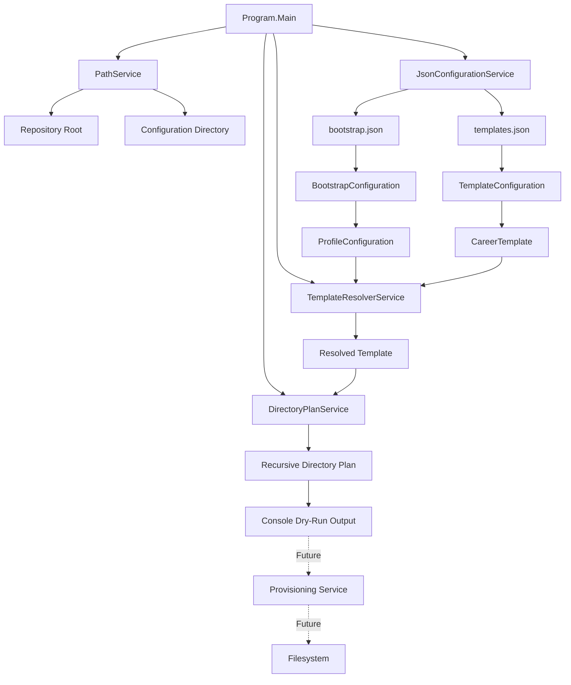

# CareerOS.Bootstrap Architecture

## Purpose

This document provides the architectural overview for `CareerOS.Bootstrap`.

It describes:

- The purpose of the application
- The primary architectural principles
- The major layers and components
- How configuration drives behavior
- How current implementation is separated from future functionality
- How detailed architecture documentation is organized

This file is intentionally high level.

Detailed implementation state, future-state architecture, component responsibilities, and data flow are maintained in separate documents.

---

## Architectural Objective

`CareerOS.Bootstrap` is designed to provide a safe, repeatable, configuration-driven way to provision standardized CareerOS environments.

The application should allow CareerOS structures to be defined independently from application source code so that:

- Multiple users can be supported
- Multiple career templates can coexist
- Directory structures can evolve without recompiling the application
- Existing structures can be preserved safely
- Planned changes can be reviewed before execution
- Future automation can build on a stable configuration model

The long-term objective is not simply directory creation.

The intended architecture supports a broader provisioning lifecycle:

```text
Configuration
      |
      v
Validation
      |
      v
Profile Resolution
      |
      v
Template Resolution
      |
      v
Directory Planning
      |
      v
Dry Run / Review
      |
      v
Provisioning
      |
      v
Logging / Reporting
      |
      v
Verification
```

Only part of this lifecycle is implemented today.

---

## Current Architectural Principles

### 1. Configuration over hard-coding

Profile names, directory names, template relationships, and nested directory structures should be defined in configuration rather than embedded directly in C# logic.

Current configuration files:

```text
Configuration/
├── bootstrap.json
└── templates.json
```

`bootstrap.json` defines **who** is being provisioned.

`templates.json` defines **what structure** should be provisioned.

---

### 2. Separation of concerns

Each service should have one primary responsibility.

Current examples:

```text
PathService
    -> Path discovery

JsonConfigurationService
    -> JSON loading and deserialization

TemplateResolverService
    -> Template lookup

DirectoryPlanService
    -> Read-only directory planning
```

Filesystem modification is intentionally not part of the current planning service.

---

### 3. Safe before destructive

The application should understand proposed changes before modifying the filesystem.

The current architecture therefore separates:

```text
Plan
```

from:

```text
Execute
```

The current application supports planning only.

Future provisioning logic must preserve this separation.

---

### 4. Idempotent behavior

Repeated execution should eventually be safe.

The intended provisioning model is:

```text
Missing directory
    -> Create

Existing directory
    -> Preserve

Unexpected condition
    -> Report / fail safely
```

Repeated execution should not:

- Delete user content
- Recreate valid structures unnecessarily
- Overwrite unrelated user files
- Damage existing CareerOS environments

---

### 5. Recursive directory modeling

CareerOS structures are hierarchical.

A directory may contain directories, which may contain additional directories.

The architecture therefore uses a recursive model:

```text
DirectoryNode
├── Name
└── Children[]
    └── DirectoryNode
```

This allows deeply nested structures without requiring new application code for each level.

---

### 6. Multi-profile scalability

The bootstrapper must not be tied to one person.

Profiles are defined independently from templates.

Example concept:

```text
Chris
    -> CareerProfessional

Katie
    -> HealthcareProfessional
```

Future profiles can reuse existing templates or reference newly added templates.

Adding a profile should not require changes to core provisioning logic.

---

### 7. Portability

Application logic should avoid machine-specific assumptions.

The current architecture already avoids hard-coding:

- Windows usernames
- Development-machine user folders
- Repository drive letters
- Absolute repository paths

Repository discovery is handled dynamically through `PathService`.

Future CareerOS destination roots should also be configurable.

---

## Current High-Level Architecture



Solid arrows represent currently implemented application flow.

Dashed arrows represent planned functionality.

---

## Current Layering

The current application can be viewed as four logical layers.

### Entry / orchestration

```text
Program
```

Responsibilities:

- Initialize services
- Coordinate execution
- Handle top-level errors
- Produce console output
- Return process exit codes

---

### Configuration

```text
bootstrap.json
templates.json
```

and:

```text
BootstrapConfiguration
ProfileConfiguration
TemplateConfiguration
CareerTemplate
DirectoryNode
```

Responsibilities:

- Describe profiles
- Describe templates
- Represent nested directory structures

---

### Application services

```text
PathService
JsonConfigurationService
TemplateResolverService
DirectoryPlanService
```

Responsibilities:

- Discover required paths
- Load configuration
- Resolve template relationships
- Build provisioning plans

---

### Output

Current output:

```text
Console dry-run plan
```

Future output is expected to include:

- Structured summaries
- File logs
- Provisioning results
- Validation results
- Error reports

---

## Current vs. Future Architecture

The project explicitly distinguishes between implemented and planned functionality.

### Currently implemented

```text
Repository discovery
Configuration discovery
JSON loading
Profile deserialization
Template deserialization
Template resolution
Recursive directory traversal
Dry-run plan generation
Console output
Top-level error handling
```

### Planned

```text
Configuration validation
Configurable installation root
Command-line parsing
True --dry-run CLI mode
Filesystem provisioning
Existing-directory detection
Provisioning result models
Structured logging
Execution summaries
Unit tests
Integration tests
CI validation
Release packaging
Optional Git initialization
Backup / rollback capabilities where appropriate
```

Planned features should not be represented as currently available.

---

## Architecture Documentation Map

Detailed architecture is divided into focused documents.

### Current State

See:

```text
CURRENT_STATE.md
```

Purpose:

- Exact implementation today
- Current services
- Current models
- Current execution behavior
- Current limitations

---

### Future State

See:

```text
FUTURE_STATE.md
```

Purpose:

- Target application architecture
- Planned services
- Planned CLI behavior
- Provisioning workflow
- Logging
- Testing
- CI/CD and release direction

---

### Components

See:

```text
COMPONENTS.md
```

Purpose:

- Class responsibilities
- Service responsibilities
- Model responsibilities
- Relationships between components

---

### Data Flow

See:

```text
DATA_FLOW.md
```

Purpose:

- How JSON becomes C# objects
- How profiles resolve templates
- How directory trees become plans
- How future provisioning will consume those plans

---

## Architecture Decision Records

Major architectural decisions will be recorded separately.

Planned ADR directory:

```text
Documentation/
└── Architecture/
    └── Decisions/
```

Example ADRs:

```text
ADR-001-explicit-main-entry-point.md
ADR-002-json-driven-configuration.md
ADR-003-recursive-directory-model.md
ADR-004-separate-planning-from-provisioning.md
ADR-005-dynamic-repository-root-discovery.md
ADR-006-multi-profile-template-model.md
```

Each ADR should document:

- Context
- Decision
- Alternatives considered
- Consequences
- Status

This allows future developers to understand not only what the architecture is, but why it became that way.

---

## Architecture Quality Goals

The architecture should prioritize:

- Safety
- Readability
- Maintainability
- Testability
- Portability
- Extensibility
- Traceability
- Predictable behavior
- Clear error handling

Performance is important where appropriate, but this application is primarily a provisioning and orchestration tool rather than a high-throughput runtime service.

Clarity and safety therefore take priority over unnecessary optimization.

---

## Testing Impact

The architecture intentionally separates services so behavior can be tested independently.

Examples:

```text
TemplateResolverService
    -> unit test template matching

DirectoryPlanService
    -> unit test recursive traversal

JsonConfigurationService
    -> unit test configuration loading

PathService
    -> unit test path discovery where practical
```

Future filesystem behavior should be isolated behind a dedicated provisioning service so filesystem tests do not require changing planning logic.

---

## Documentation as Part of the Architecture

Documentation is treated as a maintained project artifact rather than an afterthought.

The repository should enable a reviewer to answer:

1. What problem does the project solve?
2. What exists today?
3. What is planned?
4. How does configuration drive behavior?
5. Why were major design decisions made?
6. How is the system tested?
7. How does a requirement map to implementation?
8. How can the project be safely extended?

Documentation should evolve alongside implementation.

---

## Architecture Evolution

The architecture is expected to evolve incrementally.

Changes should generally follow:

```text
Requirement
    |
    v
Architectural impact review
    |
    v
Implementation
    |
    v
Testing
    |
    v
Documentation update
    |
    v
Pull request / review
    |
    v
Merge to main
```

Significant architectural changes should receive an ADR.

---

## Branching and Stability

The `main` branch represents the known-good validated baseline.

Feature, documentation, testing, bug-fix, and refactoring work should normally occur on dedicated branches.

Examples:

```text
docs/documentation-v1
feat/filesystem-provisioning
test/unit-testing-foundation
fix/template-resolution
refactor/program-orchestration
```

Changes should reach `main` only after:

- Build validation
- Relevant testing
- Review
- Documentation updates where needed

---

## Summary

`CareerOS.Bootstrap` currently implements the safe, read-only foundation of a configuration-driven provisioning system.

Its present architecture establishes:

- Multi-profile configuration
- Reusable templates
- Recursive directory modeling
- Dynamic path discovery
- Read-only provisioning plans
- Separation between planning and execution

Future development will build on this foundation rather than bypassing it.

The key architectural rule is:

> Understand, validate, and plan changes before modifying the user's environment.
