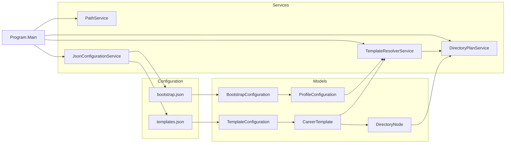
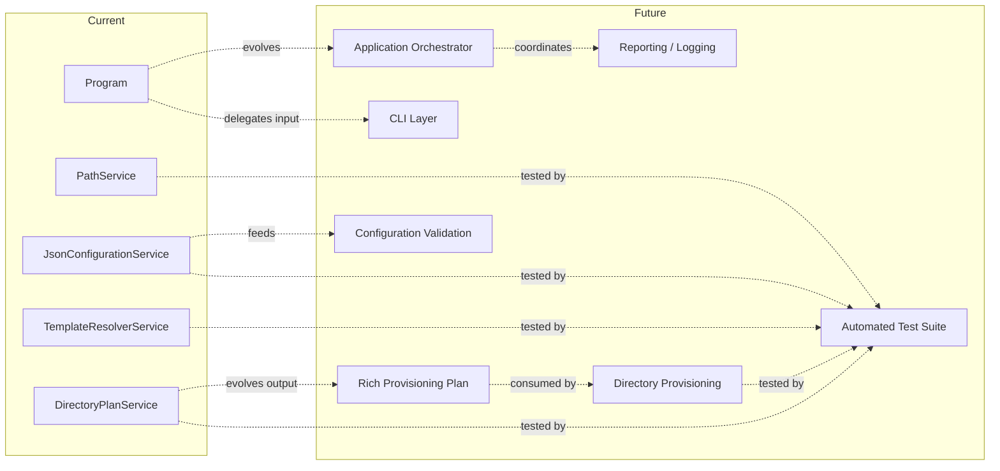

# CareerOS.Bootstrap — Components

## Purpose

This document defines the responsibilities and relationships of the major components in `CareerOS.Bootstrap`.

It focuses on **component ownership and boundaries** rather than repeating the complete application flow. Current components are distinguished from conceptual future components so planned architecture is not mistaken for implemented functionality.

Related documents:

- `ARCHITECTURE.md` — architectural overview and principles
- `CURRENT_STATE.md` — functionality implemented today
- `FUTURE_STATE.md` — planned architectural direction
- `DATA_FLOW.md` — movement of configuration and planning data through the system

---

## Component Map

The current implementation consists of an application entry point, configuration models, application services, and repository-level JSON configuration.



---

## Responsibility Rules

The component model follows several boundaries.

### Entry point coordinates; services perform focused work

`Program` should coordinate application execution without becoming the permanent home for configuration, validation, planning, provisioning, or logging logic.

### Models represent data; they do not orchestrate behavior

Configuration models describe profiles, templates, and directory trees. They should remain simple unless requirements justify domain behavior within them.

### Planning does not provision

`DirectoryPlanService` determines intended paths. Filesystem creation belongs to a separate future component.

### Configuration defines structure

Profile-specific and template-specific directory structures should not be hard-coded into services.

### Dependencies should flow toward focused abstractions

As the application grows, new components should be introduced because they own a distinct responsibility, not merely to increase the number of classes.

---

# Current Components

## `Program`

**Status:** Implemented

**Location:**

```text
CareerOS.Bootstrap/Program.cs
```

### Responsibility

`Program` is the application entry and orchestration boundary.

It currently coordinates the full dry-run workflow.

### Current responsibilities

- Provide the explicit `Main(string[] args)` entry point
- Instantiate services
- Discover repository/configuration paths
- Load configuration
- Invoke centralized configuration validation
- Validate the current preview destination root
- Iterate configured profiles
- Resolve each profile's template
- Request a directory plan
- Validate planned-path containment
- Display dry-run output or actionable validation failures
- Handle exceptions reaching the application boundary
- Return a process exit code

### Should not become responsible for

- JSON parsing details
- Template search logic
- Recursive directory traversal
- Validation-rule implementation details
- Filesystem provisioning
- Long-term logging implementation
- Complex CLI parsing

As these capabilities are introduced, they should remain in focused components.

### Current relationships

```text
Program
├── PathService
├── JsonConfigurationService
├── ConfigurationValidationService
├── TemplateResolverService
└── DirectoryPlanService
```

### Future direction

If orchestration becomes sufficiently complex, `Program` may delegate execution to an application runner/orchestrator while remaining a thin process entry point.

---

## `PathService`

**Status:** Implemented

**Location:**

```text
CareerOS.Bootstrap/Services/PathService.cs
```

### Responsibility

Discover repository-level paths without embedding the current machine's absolute repository location into application logic.

### Current behavior

The service starts from the application's runtime location and walks upward until it finds:

```text
CareerOS.Bootstrap.sln
```

That location is treated as the repository root.

It also resolves the repository-level:

```text
Configuration/
```

directory.

### Current methods

```text
FindRepositoryRoot()
GetConfigurationDirectory()
```

### Inputs

Primarily runtime/environment path information.

### Outputs

Repository and configuration directory paths.

### Failure behavior

Fails when the expected repository structure cannot be discovered.

### Boundary

`PathService` should locate or resolve paths. It should not deserialize configuration or create CareerOS directories.

### Future considerations

Packaged execution may not contain the solution file, so repository-root discovery and installed-runtime path resolution may eventually become separate concerns.

---

## `JsonConfigurationService`

**Status:** Implemented

**Location:**

```text
CareerOS.Bootstrap/Services/JsonConfigurationService.cs
```

### Responsibility

Load repository JSON configuration and convert it into strongly typed application models.

### Current methods

```text
LoadBootstrapConfiguration(path)
LoadTemplateConfiguration(path)
```

### Current responsibilities

- Verify configuration files exist
- Read JSON content
- Deserialize bootstrap configuration
- Deserialize template configuration
- Use case-insensitive property matching
- Permit trailing commas
- Skip JSON comments
- Surface configuration-loading failures

### Technology

```text
System.Text.Json
```

### Inputs

Paths to configuration files.

### Outputs

```text
BootstrapConfiguration
TemplateConfiguration
```

### Boundary

The service is responsible for **loading/deserialization**, not comprehensive semantic validation.

Semantic checks such as duplicate profile destinations, missing template
references, recursive filesystem-name validation, destination-root safety, and
planned-path containment belong to `ConfigurationValidationService`.

---

## `ConfigurationValidationService`

**Status:** Implemented

**Location:**

```text
CareerOS.Bootstrap/Services/ConfigurationValidationService.cs
```

### Responsibility

Provide the centralized M3 validation boundary for configuration consistency,
filesystem naming safety, destination-root validity, and planned-path
containment.

### Current public methods

```text
Validate(bootstrapConfiguration, templateConfiguration)
ValidateDestinationRoot(destinationRoot)
ValidatePlannedPaths(destinationRoot, plannedPaths)
```

### Current responsibilities

- Validate required profile and template values
- Reject empty required profile/template collections
- Reject duplicate profile names and destination directories
- Reject duplicate template names
- Reject missing template references
- Validate recursive `DirectoryNode` names
- Reject invalid and reserved Windows filesystem names
- Reject duplicate sibling directory names
- Require fully qualified destination roots and planned paths
- Ensure planned paths remain at or beneath the approved destination root
- Reject parent-traversal and sibling-prefix escapes
- Aggregate blocking validation failures
- Perform validation without creating filesystem entries

### Outputs

```text
ValidationResult
├── Errors[]
└── Warnings[]
```

### Semantics

`ValidationError` is blocking. `ValidationWarning` is non-blocking.
`ValidationResult.IsValid` is false only when one or more errors exist.
Validation codes, messages, and property locations are preserved where practical.

### Boundary

The service does not deserialize JSON, build directory plans, inspect existing
filesystem object state for provisioning decisions, or provision directories.
Schema-version rejection remains deferred until an explicit schema-version
contract exists.

---

## `TemplateResolverService`

**Status:** Implemented

**Location:**

```text
CareerOS.Bootstrap/Services/TemplateResolverService.cs
```

### Responsibility

Resolve a profile's configured template name to the corresponding reusable `CareerTemplate`.

### Current method

```text
ResolveTemplate(configuration, templateName)
```

### Inputs

- `TemplateConfiguration`
- Requested template name

### Output

A resolved `CareerTemplate`.

### Matching behavior

Template names are matched case-insensitively using ordinal comparison semantics.

### Failure behavior

A missing template causes resolution to fail rather than silently selecting another template.

### Boundary

The resolver should answer:

> Which configured template does this profile reference?

It should not:

- Build directory paths
- Create directories
- Load JSON files
- Select arbitrary fallback templates without an explicit requirement

---

## `DirectoryPlanService`

**Status:** Implemented

**Location:**

```text
CareerOS.Bootstrap/Services/DirectoryPlanService.cs
```

### Responsibility

Convert a profile and resolved template into a complete, read-only directory plan.

### Current public method

```text
BuildPlan(basePath, profile, template)
```

### Current recursive helper

```text
AddDirectoryNode(parentPath, node, paths)
```

### Inputs

- Base preview path
- `ProfileConfiguration`
- Resolved `CareerTemplate`

### Output

A collection of planned directory paths.

### Current behavior

1. Build the profile root path.
2. Process each top-level directory node.
3. Combine the parent path and directory-node name.
4. Add the resulting path to the plan.
5. Recursively process every child node.

### Recursive relationship

```text
DirectoryNode
    |
    +--> Add path
    |
    +--> Children
            |
            +--> DirectoryNode
                    |
                    +--> Children ...
```

### Safety boundary

This service does not provision the filesystem.

It must remain possible to generate and inspect a plan without causing filesystem changes.

### Future direction

The service may eventually return a richer `ProvisioningPlan` instead of raw path strings. If that occurs, recursive planning behavior should remain independently testable.

---

# Current Configuration Models

## `BootstrapConfiguration`

**Status:** Implemented

**Location:**

```text
CareerOS.Bootstrap/Models/BootstrapConfiguration.cs
```

### Responsibility

Represent the root of bootstrap/profile configuration loaded from `bootstrap.json`.

### Conceptual structure

```text
BootstrapConfiguration
└── Profiles[]
```

### Boundary

This model represents configuration data. It should not load files or provision directories.

---

## `ProfileConfiguration`

**Status:** Implemented

**Location:**

```text
CareerOS.Bootstrap/Models/ProfileConfiguration.cs
```

### Responsibility

Represent one configured CareerOS profile.

### Current properties

```text
Name
Directory
Template
```

### Meaning

- `Name` — human-readable profile identity
- `Directory` — profile destination directory name used during planning
- `Template` — name of the reusable template assigned to the profile

### Architectural importance

A profile references a template rather than duplicating the complete directory tree. This enables multiple profiles to share or independently select reusable structures.

---

## `TemplateConfiguration`

**Status:** Implemented

**Location:**

```text
CareerOS.Bootstrap/Models/TemplateConfiguration.cs
```

### Responsibility

Represent the root of reusable template configuration loaded from `templates.json`.

### Conceptual structure

```text
TemplateConfiguration
└── Templates[]
```

The same source file currently also contains the `CareerTemplate` model.

This is acceptable in the current implementation. A future refactor may separate model files if doing so improves maintainability.

---

## `CareerTemplate`

**Status:** Implemented

### Responsibility

Represent one reusable CareerOS directory template.

### Current properties

```text
Name
Directories[]
```

### Relationship

```text
CareerTemplate
└── DirectoryNode[]
```

### Boundary

A template describes desired structure. It does not determine which profile should use it and does not perform provisioning.

---

## `DirectoryNode`

**Status:** Implemented

**Location:**

```text
CareerOS.Bootstrap/Models/DirectoryNode.cs
```

### Responsibility

Represent one directory and its nested child directories.

### Current properties

```text
Name
Children[]
```

### Recursive design

```text
DirectoryNode
├── Name
└── Children[]
    ├── DirectoryNode
    └── DirectoryNode
        └── Children[]
```

This recursive structure removes the need for fixed-depth directory models such as separate parent/child/grandchild types.

### Boundary

`DirectoryNode` represents structure. Recursive traversal behavior currently belongs to `DirectoryPlanService`.

---

## `ValidationResult`

**Status:** Implemented

**Location:**

```text
CareerOS.Bootstrap/Models/ValidationResult.cs
```

### Responsibility

Represent aggregated validation state.

`IsValid` remains true when only warnings exist and becomes false when one or
more blocking errors are added.

---

## `ValidationError`

**Status:** Implemented

**Location:**

```text
CareerOS.Bootstrap/Models/ValidationError.cs
```

Represents one blocking validation condition using `Code`, `Message`, and
optional `PropertyName`.

---

## `ValidationWarning`

**Status:** Implemented

**Location:**

```text
CareerOS.Bootstrap/Models/ValidationWarning.cs
```

Represents one non-blocking validation condition using the same structured
code/message/property-location shape.

---

# Repository Configuration Components

## `bootstrap.json`

**Status:** Implemented

**Location:**

```text
Configuration/bootstrap.json
```

### Responsibility

Declare CareerOS profiles and associate each profile with a reusable template.

### Current role

The file provides profile-level configuration without requiring changes to C# source code when another compatible profile is introduced.

---

## `templates.json`

**Status:** Implemented

**Location:**

```text
Configuration/templates.json
```

### Responsibility

Declare reusable CareerOS directory structures.

### Current role

The file contains the current Career Professional and Healthcare Professional templates and demonstrates recursive nested directories.

### Architectural relationship

```text
bootstrap.json
     |
     | Template name
     v
templates.json
     |
     v
CareerTemplate
     |
     v
DirectoryNode tree
```

---

# Component Interaction

The current runtime relationships can be summarized as:

```text
Program
  |
  +--> PathService
  |      |
  |      +--> Repository Root
  |      +--> Configuration Directory
  |
  +--> JsonConfigurationService
  |      |
  |      +--> BootstrapConfiguration
  |      +--> TemplateConfiguration
  |
  +--> TemplateResolverService
  |      |
  |      +--> CareerTemplate
  |
  +--> DirectoryPlanService
         |
         +--> Planned Paths
```

Models carry data between these responsibilities.

---

# Planned Components

The following components are architectural candidates documented in `FUTURE_STATE.md`. They are **not currently implemented** unless later documentation explicitly changes their status.

## Application runner / orchestrator

**Status:** Planned / conceptual

Potential responsibility:

Move growing workflow coordination out of `Program` while keeping the process entry point small.

Possible responsibilities include validation, selection, planning, execution-mode routing, provisioning, reporting, and exit-result coordination.

The abstraction should be introduced only when application complexity justifies it.

---

## Command-line options/parser

**Status:** Planned / conceptual

Potential responsibility:

Translate CLI input such as profile selection, destination root, dry-run mode, help, and version requests into a validated execution request.

It should not contain provisioning logic.

---

## `ProvisioningPlan`

**Status:** Planned / conceptual

Potential responsibility:

Represent the complete validated set of intended filesystem actions.

This may eventually replace a simple list of path strings as the primary output of planning.

A richer plan could distinguish actions such as:

```text
Create
Exists
Skip
Invalid
Conflict
```

---

## `ProvisioningAction`

**Status:** Planned / conceptual

Potential responsibility:

Represent one intended change or observation within a `ProvisioningPlan`.

Potential data includes target path, desired state, current state, action type, and reason.

---

## `DirectoryProvisioningService`

**Status:** Planned / conceptual

Potential responsibility:

Apply a validated provisioning plan to the filesystem.

Expected boundary:

```text
Plan first
Execute second
```

This service should not independently reinterpret configuration in a way that can diverge from dry-run planning.

---

## `ProvisioningResult`

**Status:** Planned / conceptual

Potential responsibility:

Represent the outcome of executing a provisioning plan, including created, preserved, skipped, warning, and failed actions.

---

## Reporting / logging component

**Status:** Planned / conceptual

Potential responsibility:

Provide consistent human-readable and potentially structured reporting for dry-run and provisioning execution.

The specific logging abstraction or third-party library has not been selected.

---

# Current Testing Components

The implemented test project mirrors current component responsibilities.

```text
CareerOS.Bootstrap.Tests/
├── Fixtures/
│   ├── TemporaryDirectoryFixture.cs
│   └── TemporaryDirectoryFixtureTests.cs
│
├── Integration/
│   └── BootstrapPlanningWorkflowTests.cs
│
├── Models/
│   └── ValidationResultTests.cs
│
└── Services/
    ├── ConfigurationValidationServiceTests.cs
    ├── DirectoryPlanServiceTests.cs
    ├── JsonConfigurationServiceTests.cs
    ├── PathServiceTests.cs
    └── TemplateResolverServiceTests.cs
```

At the current M3 implementation checkpoint the suite contains 161 passing
xUnit tests with zero failures.

Future provisioning components should receive focused tests only when those
production capabilities are implemented.

---

# Component Boundary Example

A future provisioning request should ideally pass through components without mixing responsibilities:

```text
CLI
 |
 v
Execution Request
 |
 v
Configuration Loader
 |
 v
Configuration Models
 |
 v
Validator
 |
 v
Validated Configuration
 |
 v
Template Resolver
 |
 v
Resolved Template
 |
 v
Planner
 |
 v
Provisioning Plan
 |
 +--------------------+
 |                    |
 v                    v
Dry-Run Reporter   Provisioner
                       |
                       v
                   Filesystem
                       |
                       v
                 Provisioning Result
                       |
                       v
                    Reporter
```

This structure makes it possible to test planning without writing files and to test provisioning against controlled temporary filesystems.

---

# Dependency Direction

The architecture should avoid circular dependencies between responsibilities.

A desirable conceptual dependency direction is:

```text
Entry / CLI
    |
    v
Application Coordination
    |
    +--> Configuration / Validation
    +--> Resolution / Planning
    +--> Provisioning
    +--> Reporting

Models / Result Types
    ^
    |
Used by focused services
```

Services should not depend on `Program`.

Configuration models should not depend on console output.

Planning should not depend on provisioning side effects.

---

# Component Design Guidelines

When adding or modifying components:

1. Give each component a clear primary responsibility.
2. Prefer explicit dependencies over hidden global state.
3. Keep machine-specific values out of business logic.
4. Keep configuration-driven values out of source code where appropriate.
5. Separate pure/read-only planning from side effects.
6. Return actionable errors rather than silently correcting invalid intent.
7. Design filesystem behavior for safe repeat execution.
8. Add abstractions when they solve a real boundary or testing problem.
9. Avoid speculative classes that exist only because they appear in future documentation.
10. Update component documentation when responsibilities materially change.

---

# Current-to-Future Evolution



Dashed relationships describe planned evolution rather than implemented dependencies.

---

# Documentation Ownership

Component documentation should remain synchronized with source changes.

When a component is added, removed, renamed, or given a materially different responsibility:

- Update this document.
- Update `CURRENT_STATE.md` if the change is implemented.
- Update `FUTURE_STATE.md` if the target architecture changes.
- Update `DATA_FLOW.md` if information flow changes.
- Add or revise an ADR when the change represents a significant architectural decision.
- Update requirements and traceability where applicable.
- Update tests to reflect the supported behavior.

---

## Summary

The current CareerOS.Bootstrap component architecture is intentionally small:

```text
Program
  + PathService
  + JsonConfigurationService
  + TemplateResolverService
  + DirectoryPlanService

Configuration Models
  + BootstrapConfiguration
  + ProfileConfiguration
  + TemplateConfiguration
  + CareerTemplate
  + DirectoryNode
```

This foundation already separates path discovery, configuration loading, template resolution, and recursive planning.

Future components should extend those boundaries rather than collapse them. In particular, configuration validation, richer planning, filesystem provisioning, reporting, and automated testing should remain distinct responsibilities.

The central component rule remains:

> A component should own a clear responsibility, and filesystem side effects should remain separated from the logic that determines intent.
