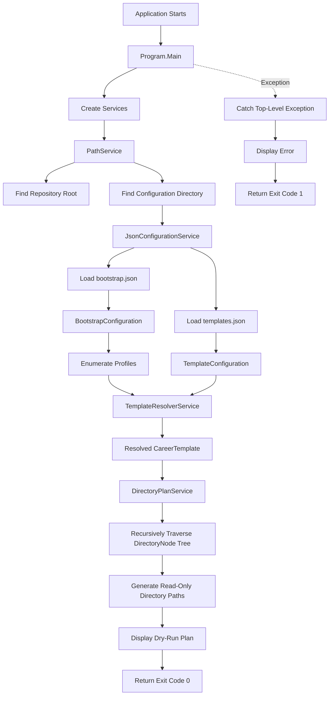

# CareerOS.Bootstrap — Current State

## Purpose

This document describes the **implemented state of CareerOS.Bootstrap as it exists today**.

It is intentionally limited to functionality currently present in the codebase.

Planned or target functionality is documented separately in:

```text
FUTURE_STATE.md
```

This distinction prevents future plans from being mistaken for working features.

---

## Current Status

**Application Type:** .NET Console Application
**Target Framework:** .NET 8
**Language:** C#
**Configuration Format:** JSON
**Primary Branch:** `main`
**Current Development Branch:** `docs/documentation-v1`

The application currently operates as a **read-only directory planning utility**.

It can:

- Discover its repository root
- Locate repository-level configuration
- Load CareerOS profile configuration
- Load reusable directory templates
- Resolve profiles to templates
- Recursively traverse nested directory structures
- Generate complete directory provisioning plans
- Display those plans to the console
- Exit successfully or report top-level failures

It does **not currently create or modify CareerOS directories**.

---

## Current Execution Flow

The application currently follows this sequence:



No filesystem provisioning occurs after the directory plan is generated.

---

## Repository Layout

The current repository contains:

```text
CareerOS.Bootstrap/
│
├── .github/
│   └── copilot-instructions.md
│
├── CareerOS.Bootstrap/
│   ├── Models/
│   │   ├── BootstrapConfiguration.cs
│   │   ├── DirectoryNode.cs
│   │   ├── ProfileConfiguration.cs
│   │   └── TemplateConfiguration.cs
│   │
│   ├── Services/
│   │   ├── DirectoryPlanService.cs
│   │   ├── JsonConfigurationService.cs
│   │   ├── PathService.cs
│   │   └── TemplateResolverService.cs
│   │
│   ├── CareerOS.Bootstrap.csproj
│   └── Program.cs
│
├── Configuration/
│   ├── bootstrap.json
│   └── templates.json
│
├── Documentation/
│   ├── Architecture/
│   ├── Development/
│   ├── Diagrams/
│   ├── References/
│   ├── Requirements/
│   └── Roadmap/
│
├── .gitignore
├── CHANGELOG.md
├── CareerOS.Bootstrap.sln
├── LICENSE
└── README.md
```

The documentation hierarchy is currently being established on the `docs/documentation-v1` branch.

---

## Application Entry Point

The application uses an explicit entry point:

```csharp
private static int Main(string[] args)
```

Top-level statements are intentionally not used.

`Main()` currently:

1. Instantiates application services.
2. Locates repository and configuration paths.
3. Loads JSON configuration.
4. Resolves each profile's assigned template.
5. Builds a recursive directory plan.
6. Displays the plan.
7. Returns an exit code.

### Exit Codes

Current behavior:

```text
0 = Successful execution
1 = Unhandled application-level failure
```

No additional exit-code taxonomy has been implemented.

---

## Current Services

### `PathService`

**Implemented**

Purpose:

> Locate repository-level resources without hard-coding the development machine's absolute path.

Current responsibilities:

- Begin from `AppContext.BaseDirectory`
- Walk upward through parent directories
- Detect the repository root by locating:

```text
CareerOS.Bootstrap.sln
```

- Return the discovered repository root
- Locate the repository-level:

```text
Configuration
```

directory
- Fail if required paths cannot be found

Current methods:

```text
FindRepositoryRoot()
GetConfigurationDirectory()
```

### Current limitation

Repository-root detection depends on the solution filename:

```text
CareerOS.Bootstrap.sln
```

This is suitable for the current development model but may require refinement for packaged/distributed execution.

---

### `JsonConfigurationService`

**Implemented**

Purpose:

> Load JSON configuration files and deserialize them into application models.

Current responsibilities:

- Verify that the requested configuration file exists
- Read the complete JSON file
- Deserialize bootstrap configuration
- Deserialize template configuration
- Support case-insensitive JSON property matching
- Allow trailing commas
- Skip JSON comments
- Throw an actionable exception when loading fails

Current methods:

```text
LoadBootstrapConfiguration(path)
LoadTemplateConfiguration(path)
```

Current JSON implementation uses:

```text
System.Text.Json
```

No external JSON library is currently required.

---

### `TemplateResolverService`

**Implemented**

Purpose:

> Resolve the template referenced by a CareerOS profile.

Current responsibilities:

- Receive a `TemplateConfiguration`
- Receive a requested template name
- Search available templates
- Match template names case-insensitively
- Return the matching `CareerTemplate`
- Fail safely if a template cannot be found

Current method:

```text
ResolveTemplate(configuration, templateName)
```

Template comparison currently uses:

```text
StringComparison.OrdinalIgnoreCase
```

---

### `DirectoryPlanService`

**Implemented**

Purpose:

> Generate the complete directory path plan for a profile without modifying the filesystem.

Current responsibilities:

- Receive a base preview path
- Receive a profile
- Receive a resolved template
- Generate the profile root
- Traverse every top-level template directory
- Recursively traverse child `DirectoryNode` instances
- Return every resulting directory path

Current public method:

```text
BuildPlan(basePath, profile, template)
```

Current recursive helper:

```text
AddDirectoryNode(parentPath, node, paths)
```

### Safety characteristic

`DirectoryPlanService` does **not** call:

```csharp
Directory.CreateDirectory(...)
```

and does not perform filesystem writes.

This is intentional.

---

## Current Models

### `BootstrapConfiguration`

Represents the root structure of:

```text
bootstrap.json
```

Current structure:

```text
BootstrapConfiguration
└── Profiles[]
```

---

### `ProfileConfiguration`

Represents one CareerOS profile.

Current properties:

```text
Name
Directory
Template
```

Conceptually:

```text
Profile
├── Name
├── Destination Directory Name
└── Assigned Template Name
```

The profile does not contain its own duplicated directory tree.

Instead, it references a reusable template.

---

### `TemplateConfiguration`

Represents the root structure of:

```text
templates.json
```

Current structure:

```text
TemplateConfiguration
└── Templates[]
```

The same source file also currently defines:

```text
CareerTemplate
```

---

### `CareerTemplate`

Represents one reusable CareerOS directory template.

Current properties:

```text
Name
Directories[]
```

---

### `DirectoryNode`

Represents one directory within a reusable template.

Current properties:

```text
Name
Children[]
```

The model is recursive:

```text
DirectoryNode
└── Children[]
    └── DirectoryNode
        └── Children[]
            └── DirectoryNode
```

No fixed nesting depth is imposed by the model itself.

---

## Current Configuration

### `bootstrap.json`

Currently defines two CareerOS profiles used to validate multi-profile behavior.

The profiles reference separate reusable templates.

Current conceptual relationship:

```text
Chris
  -> CareerProfessional

Katie
  -> HealthcareProfessional
```

The profile names themselves are configuration data and are not hard-coded into core application services.

---

### `templates.json`

Currently defines:

```text
CareerProfessional
HealthcareProfessional
```

Both templates currently contain equivalent high-level structures but remain separate so they can evolve independently.

The configured directory tree currently includes nested resume directories.

Example:

```text
Resume
├── Master
├── RC
└── Archived
```

This structure verifies recursive `DirectoryNode.Children` processing.

---

## Current Dry-Run Behavior

The application currently creates a temporary **logical preview root** in memory by combining the repository path with:

```text
_Preview
```

Conceptually:

```text
Repository Root
└── _Preview
    ├── CareerOS_Chris
    └── CareerOS_Katie
```

This path is used only to construct readable planned paths.

The application does **not** create `_Preview` on disk.

No call to:

```text
Directory.CreateDirectory
```

currently exists in the planning workflow.

---

## Current Validation

Validation currently occurs at several points.

### File validation

`JsonConfigurationService` confirms configuration files exist before attempting deserialization.

### Null validation

Selected service inputs use:

```text
ArgumentNullException.ThrowIfNull(...)
```

where appropriate.

### Empty-value validation

Current code rejects selected empty values including:

- Empty template names
- Empty base paths
- Empty profile directory names
- Empty directory-node names

### Template validation

A profile referencing a nonexistent template causes template resolution to fail before planning continues.

---

## Validation Not Yet Implemented

There is currently **no dedicated configuration-validation service**.

The application does not yet perform comprehensive validation for issues such as:

- Duplicate profile names
- Duplicate profile directory names
- Duplicate template names
- Illegal filesystem characters
- Reserved Windows directory names
- Circular semantic configuration
- Empty template collections
- Empty profile collections
- Conflicting destination paths
- Unsupported schema versions
- Duplicate sibling directory nodes

These are future requirements.

---

## Current Error Handling

Top-level execution is wrapped in:

```text
try / catch
```

When execution succeeds:

```text
return 0
```

When an exception reaches the application boundary:

- Console text changes to red
- A failure message is shown
- The exception message is shown
- Console color is reset
- The application returns:

```text
1
```

There is currently:

- No structured error model
- No log file
- No error code taxonomy
- No retry behavior
- No centralized logging abstraction

---

## Current Console Output

The application currently reports:

- Application title
- Repository path
- Configuration path
- Dry-run status
- Profile name
- Resolved template
- Planned directories
- Directory count
- Successful completion

The application explicitly states:

```text
DRY RUN
No directories will be created.
```

This protects users from mistaking current planning behavior for filesystem execution.

---

## Current Verified Behavior

Manual runtime testing has confirmed:

- The solution builds successfully.
- Repository discovery succeeds from the current build output directory.
- Configuration discovery succeeds.
- `bootstrap.json` loads successfully.
- `templates.json` loads successfully.
- Both configured profiles deserialize successfully.
- Both profile template references resolve successfully.
- Recursive directory traversal succeeds.
- Nested resume directories appear in the plan.
- Each current profile produces **12 planned directories**.
- No planned directory is physically created during dry-run execution.
- Successful execution returns normally.

---

## Current Source-Control State

The repository uses Git.

Primary stable branch:

```text
main
```

Current documentation development branch:

```text
docs/documentation-v1
```

Initial validated implementation commit:

```text
ae95344
feat: implement multi-profile dry-run scaffolding
```

`main` is intended to represent a known-good baseline.

New functionality and documentation should normally be developed on dedicated branches and merged after review.

---

## Current GitHub State

The local repository is connected to the GitHub remote:

```text
origin
```

The initial implementation has been pushed successfully.

The local `main` branch tracks:

```text
origin/main
```

Repository-specific GitHub Copilot instructions are maintained at:

```text
.github/copilot-instructions.md
```

---

## Current Documentation State

The repository-root:

```text
README.md
```

has been expanded into the project's primary introduction and navigation document.

The formal documentation hierarchy is being created under:

```text
Documentation/
```

Current architecture documentation includes or is being prepared for:

```text
ARCHITECTURE.md
CURRENT_STATE.md
FUTURE_STATE.md
COMPONENTS.md
DATA_FLOW.md
```

Requirements, development standards, diagrams, references, and roadmap documentation will follow.

---

## Current Testing State

Automated tests have **not yet been implemented**.

Current verification is manual:

```text
Modify
  |
  v
dotnet build
  |
  v
dotnet run
  |
  v
Inspect console behavior
```

A dedicated unit-test project is planned.

Current behavior should not be described as automatically tested until that test project exists and executes successfully.

---

## Current Dependencies

CareerOS.Bootstrap currently relies primarily on the .NET runtime and standard library.

Current notable framework APIs include:

```text
System.IO
System.Text.Json
System.Collections.Generic
System.Linq
```

No third-party NuGet dependency is currently required for the implemented architecture described in this document.

---

## Current Platform Assumptions

Development is currently occurring on Windows.

Windows-specific considerations include:

- Path formatting
- PowerShell development commands
- Visual Studio 2022
- Windows filesystem naming rules planned for future validation

The architecture is not currently documented as cross-platform compatible.

No cross-platform validation has been performed.

---

## Current Security Characteristics

The application currently:

- Does not collect credentials
- Does not call external APIs
- Does not write CareerOS filesystem content
- Does not store secrets
- Does not access a database
- Does not transmit profile information over a network

Configuration currently resides locally in repository JSON files.

Security requirements may change as future capabilities are introduced.

---

## Current Known Limitations

The current implementation does not yet provide:

- Actual directory creation
- A configurable CareerOS destination root
- CLI argument parsing
- A true `--dry-run` command-line switch
- Profile selection from the command line
- Configuration schema validation
- Comprehensive path validation
- Existing-directory inspection
- File logging
- Structured logging
- Unit tests
- Integration tests
- CI/CD
- Release packaging
- Versioned executable distribution
- Rollback
- Backup
- Automatic Git initialization
- Interactive menus
- GUI functionality
- Database integration
- Remote configuration
- Cloud synchronization

These limitations are intentional at the current development stage.

---

## Current Safety Boundary

The most important current boundary is:

> CareerOS.Bootstrap may calculate and display intended directory paths, but it may not modify the target CareerOS filesystem.

Any future feature crossing this boundary should require:

1. Defined requirements.
2. Architecture review.
3. Input validation.
4. Dry-run validation.
5. Unit-test coverage where practical.
6. Filesystem-focused integration testing.
7. Documentation updates.
8. Review before merge into `main`.

---

## Definition of Current-State Completion

The present dry-run foundation can be considered successful because the application can currently perform:

```text
Discover
  |
  v
Load
  |
  v
Deserialize
  |
  v
Resolve
  |
  v
Traverse
  |
  v
Plan
  |
  v
Display
```

without performing:

```text
Create
Modify
Delete
Overwrite
```

That separation establishes the safe foundation required for future provisioning functionality.

---

## Next Architectural Step

The next major development stages are expected to include:

1. Documentation foundation completion.
2. Requirements and user-story definition.
3. Automated testing foundation.
4. Configuration validation.
5. Safe filesystem provisioning.

Those stages are future work and are described in greater detail in:

```text
FUTURE_STATE.md
```

and the project roadmap.

---

## Summary

CareerOS.Bootstrap currently provides a validated, configuration-driven, multi-profile, recursive **directory planning engine**.

It successfully transforms:

```text
JSON Configuration
        |
        v
Profile + Template Models
        |
        v
Resolved Template
        |
        v
Recursive Directory Tree
        |
        v
Dry-Run Provisioning Plan
```

while maintaining a strict read-only boundary against the CareerOS filesystem.

That boundary defines the current stable architectural state.
