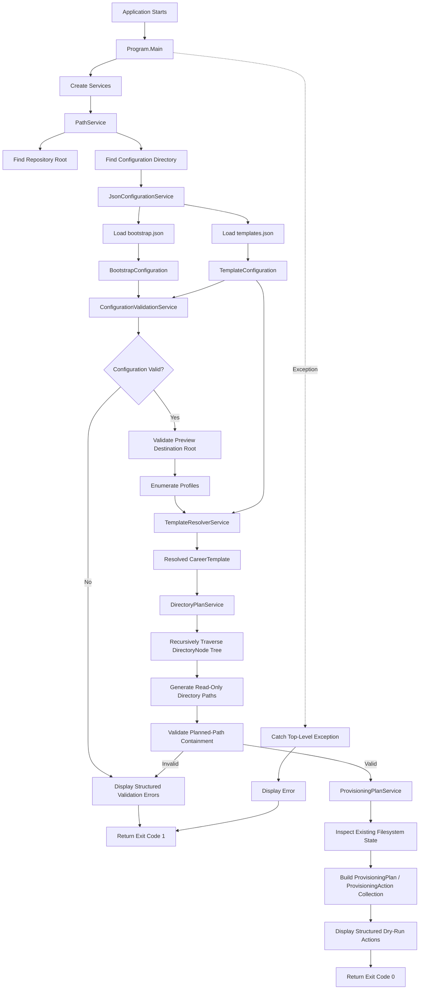

# CareerOS.Bootstrap — Current State

## Purpose

This document describes the **implemented state of CareerOS.Bootstrap as it exists today**.

It is intentionally limited to functionality currently present in the codebase.

Planned or target functionality is documented separately in:

```text
FUTURE_STATE.md
```

This distinction prevents future plans from being mistaken for working features.

---

## Current Status

**Application Type:** .NET Console Application
**Target Framework:** .NET 8
**Language:** C#
**Configuration Format:** JSON
**Primary Branch:** `main`
**Current Development Branch:** `feat/rich-provisioning-plan`
**Current Implementation Checkpoint:** `b5b26d3` — `feat: integrate structured provisioning plan into dry run`

The application currently operates as a **read-only validated planning and filesystem-state classification utility**.

It can:

- Discover its repository root
- Locate repository-level configuration
- Load CareerOS profile configuration
- Load reusable directory templates
- Validate loaded profile/template configuration centrally
- Reject duplicate, missing-reference, invalid-name, and reserved-name configuration
- Validate the current preview destination root
- Resolve profiles to templates
- Recursively traverse nested directory structures
- Generate complete read-only directory path plans
- Validate planned paths remain beneath the approved preview root
- Inspect current filesystem state without modifying it
- Build structured `ProvisioningPlan` / `ProvisioningAction` results
- Classify validated targets as `CREATE`, `PRESERVE`, `CONFLICT`, or `REJECT`
- Display structured dry-run actions with current state, desired state, reason, and warnings
- Return actionable validation failures or top-level failures

It does **not currently create, modify, move, or delete CareerOS directories or files**.

---

## Current Execution Flow

The application currently follows this sequence:



The M4 boundary remains read-only: filesystem APIs are used for observation/classification only. No provisioning write
occurs after the structured plan is generated.

---

## Repository Layout

The current repository contains:

```text
CareerOS.Bootstrap/
│
├── .github/
│   └── copilot-instructions.md
│
├── CareerOS.Bootstrap/
│   ├── Models/
│   │   ├── BootstrapConfiguration.cs
│   │   ├── DirectoryNode.cs
│   │   ├── ProfileConfiguration.cs
│   │   ├── TemplateConfiguration.cs
│   │   ├── ValidationError.cs
│   │   ├── ValidationResult.cs
│   │   └── ValidationWarning.cs
│   │
│   ├── Services/
│   │   ├── ConfigurationValidationService.cs
│   │   ├── DirectoryPlanService.cs
│   │   ├── JsonConfigurationService.cs
│   │   ├── PathService.cs
│   │   └── TemplateResolverService.cs
│   │
│   ├── CareerOS.Bootstrap.csproj
│   └── Program.cs
│
├── Configuration/
│   ├── bootstrap.json
│   └── templates.json
│
├── Documentation/
│   ├── Architecture/
│   ├── Development/
│   ├── Diagrams/
│   ├── References/
│   ├── Requirements/
│   └── Roadmap/
│
├── .gitignore
├── CHANGELOG.md
├── CareerOS.Bootstrap.sln
├── LICENSE
└── README.md
```

The documentation baseline and automated-testing foundation are merged into `main`; M3 validation documentation is being synchronized on `feat/comprehensive-validation`.

---

## Application Entry Point

The application uses an explicit entry point:

```csharp
private static int Main(string[] args)
```

Top-level statements are intentionally not used.

`Main()` currently:

1. Instantiates application services.
2. Locates repository and configuration paths.
3. Loads JSON configuration.
4. Validates configuration and rejects blocking errors.
5. Validates the current preview destination root.
6. Resolves each profile's assigned template.
7. Builds a recursive directory plan.
8. Validates planned-path containment.
9. Displays the validated plan.
10. Returns an exit code.

### Exit Codes

Current behavior:

```text
0 = Successful execution
1 = Unhandled application-level failure
```

No additional exit-code taxonomy has been implemented.

---

## Current Services

### `PathService`

**Implemented**

Purpose:

> Locate repository-level resources without hard-coding the development machine's absolute path.

Current responsibilities:

- Begin from `AppContext.BaseDirectory`
- Walk upward through parent directories
- Detect the repository root by locating:

```text
CareerOS.Bootstrap.sln
```

- Return the discovered repository root
- Locate the repository-level:

```text
Configuration
```

directory
- Fail if required paths cannot be found

Current methods:

```text
FindRepositoryRoot()
GetConfigurationDirectory()
```

### Current limitation

Repository-root detection depends on the solution filename:

```text
CareerOS.Bootstrap.sln
```

This is suitable for the current development model but may require refinement for packaged/distributed execution.

---

### `JsonConfigurationService`

**Implemented**

Purpose:

> Load JSON configuration files and deserialize them into application models.

Current responsibilities:

- Verify that the requested configuration file exists
- Read the complete JSON file
- Deserialize bootstrap configuration
- Deserialize template configuration
- Support case-insensitive JSON property matching
- Allow trailing commas
- Skip JSON comments
- Throw an actionable exception when loading fails

Current methods:

```text
LoadBootstrapConfiguration(path)
LoadTemplateConfiguration(path)
```

Current JSON implementation uses:

```text
System.Text.Json
```

No external JSON library is currently required.

---

### `ConfigurationValidationService`

**Implemented**

Purpose:

> Provide the centralized safety boundary for configuration consistency,
> filesystem naming rules, destination-root validation, and planned-path
> containment.

Current responsibilities include:

- Validate required profile and template values
- Reject empty required profile/template collections
- Reject duplicate profile names and destination directories
- Reject duplicate template names
- Reject missing template references
- Validate recursive `DirectoryNode` names
- Reject invalid/reserved Windows filesystem names
- Reject duplicate sibling directory names
- Validate fully qualified destination roots
- Validate planned paths are fully qualified and remain beneath the approved root
- Reject parent-traversal and sibling-prefix escape paths
- Aggregate blocking validation errors

Current public methods:

```text
Validate(bootstrapConfiguration, templateConfiguration)
ValidateDestinationRoot(destinationRoot)
ValidatePlannedPaths(destinationRoot, plannedPaths)
```

Validation itself performs no provisioning writes.

---

### `TemplateResolverService`

**Implemented**

Purpose:

> Resolve the template referenced by a CareerOS profile.

Current responsibilities:

- Receive a `TemplateConfiguration`
- Receive a requested template name
- Search available templates
- Match template names case-insensitively
- Return the matching `CareerTemplate`
- Fail safely if a template cannot be found

Current method:

```text
ResolveTemplate(configuration, templateName)
```

Template comparison currently uses:

```text
StringComparison.OrdinalIgnoreCase
```

---

### `DirectoryPlanService`

**Implemented**

Purpose:

> Generate the complete directory path plan for a profile without modifying the filesystem.

Current responsibilities:

- Receive a base preview path
- Receive a profile
- Receive a resolved template
- Generate the profile root
- Traverse every top-level template directory
- Recursively traverse child `DirectoryNode` instances
- Return every resulting directory path

Current public method:

```text
BuildPlan(basePath, profile, template)
```

Current recursive helper:

```text
AddDirectoryNode(parentPath, node, paths)
```

### Safety characteristic

`DirectoryPlanService` does **not** call:

```csharp
Directory.CreateDirectory(...)
```

and does not perform filesystem writes.

This is intentional.

---

### `ProvisioningPlanService`

Current responsibility:

```text
Validated planned paths
        |
        v
Read-only filesystem observation
        |
        v
ProvisioningAction classification
        |
        v
ProvisioningPlan
```

Current classifications are:

```text
Missing target             -> CREATE
Existing directory         -> PRESERVE
Existing file              -> CONFLICT
Invalid direct input       -> REJECT
```

The service performs no provisioning writes.

---

## Current Models

### `BootstrapConfiguration`

Represents the root structure of:

```text
bootstrap.json
```

Current structure:

```text
BootstrapConfiguration
└── Profiles[]
```

---

### `ProfileConfiguration`

Represents one CareerOS profile.

Current properties:

```text
Name
Directory
Template
```

Conceptually:

```text
Profile
├── Name
├── Destination Directory Name
└── Assigned Template Name
```

The profile does not contain its own duplicated directory tree.

Instead, it references a reusable template.

---

### `TemplateConfiguration`

Represents the root structure of:

```text
templates.json
```

Current structure:

```text
TemplateConfiguration
└── Templates[]
```

The same source file also currently defines:

```text
CareerTemplate
```

---

### `CareerTemplate`

Represents one reusable CareerOS directory template.

Current properties:

```text
Name
Directories[]
```

---

### `DirectoryNode`

Represents one directory within a reusable template.

Current properties:

```text
Name
Children[]
```

The model is recursive:

```text
DirectoryNode
└── Children[]
    └── DirectoryNode
        └── Children[]
            └── DirectoryNode
```

No fixed nesting depth is imposed by the model itself.

---

### `ProvisioningPlan`

Represents the ordered collection of M4 structured provisioning actions.

### `ProvisioningAction`

Represents target path, desired state, observed current state, action classification, reason, and optional warnings.

### Provisioning enums

The current model defines:

```text
ProvisioningDesiredState
ProvisioningCurrentState
ProvisioningActionType
```

`ProvisioningActionType` currently includes `Create`, `Preserve`, `Skip`, `Conflict`, and `Reject`; the M4 classifier
currently emits all except `Skip`.

---

## Current Configuration

### `bootstrap.json`

Currently defines two CareerOS profiles used to validate multi-profile behavior.

The profiles reference separate reusable templates.

Current conceptual relationship:

```text
Chris
  -> CareerProfessional

Katie
  -> HealthcareProfessional
```

The profile names themselves are configuration data and are not hard-coded into core application services.

---

### `templates.json`

Currently defines:

```text
CareerProfessional
HealthcareProfessional
```

Both templates currently contain equivalent high-level structures but remain separate so they can evolve independently.

The configured directory tree currently includes nested resume directories.

Example:

```text
Resume
├── Master
├── RC
└── Archived
```

This structure verifies recursive `DirectoryNode.Children` processing.

---

## Current Dry-Run Behavior

The application currently creates a temporary **logical preview root** in memory by combining the repository path with:

```text
_Preview
```

Conceptually:

```text
Repository Root
└── _Preview
    ├── CareerOS_Chris
    └── CareerOS_Katie
```

This path is used only to construct readable planned paths.

The application does **not** create `_Preview` on disk.

No call to:

```text
Directory.CreateDirectory
```

currently exists in the planning workflow.

---

## Current Validation

Validation now has a centralized implementation boundary.

### Configuration validation

`ConfigurationValidationService.Validate(...)` checks the loaded
`BootstrapConfiguration` and `TemplateConfiguration` before template
resolution/planning proceeds.

Implemented rules include:

- Required profile name, directory, and template values
- Required template names
- Empty profile/template collections
- Duplicate profile names
- Duplicate profile destination directories
- Duplicate template names
- Missing template references
- Invalid/reserved Windows filesystem names
- Empty directory-node names
- Duplicate sibling directory names
- Recursive nested directory validation

### Destination-root validation

`ValidateDestinationRoot(...)` requires a fully qualified path and rejects
invalid or reserved path segments. The target does not need to exist, and
validation does not create it.

### Planned-path containment

`ValidatePlannedPaths(...)` verifies that every planned path is fully
qualified and remains at or beneath the approved destination root.

Current containment checks reject:

- Relative planned paths
- Parent-traversal escapes
- Sibling-prefix escapes
- Paths outside the approved root

### Structured validation result

Validation produces:

```text
ValidationResult
├── Errors[]
└── Warnings[]
```

`ValidationError` is blocking. `ValidationWarning` is non-blocking.
`ValidationResult.IsValid` becomes false only when one or more errors exist.

Validation errors retain stable codes, human-readable messages, and property
locations where practical.

### Deliberately deferred validation

The following remain future concerns rather than current M3 behavior:

- Unsupported schema-version rejection, because explicit schema versioning does not yet exist
- Existing-filesystem-object conflict inspection
- Reparse/symbolic-link safety inspection for write-capable provisioning
- Explicit profile-selection/request validation
- Explicit provisioning-intent validation

---

## Current Error Handling

Top-level execution is wrapped in:

```text
try / catch
```

When execution succeeds:

```text
return 0
```

When an exception reaches the application boundary:

- Console text changes to red
- A failure message is shown
- The exception message is shown
- Console color is reset
- The application returns:

```text
1
```

Current validation failures use structured validation models and stable
validation codes before being rendered to the console.

There is still currently:

- No persistent log file
- No general application-wide error-code taxonomy beyond validation codes
- No retry behavior
- No centralized logging abstraction
- No write-capable provisioning execution result model

---

## Current Automated Verification

The solution includes `CareerOS.Bootstrap.Tests`, using xUnit on .NET 8.

At the current M4 implementation checkpoint:

```text
192 total
192 passed
0 failed
0 skipped

TEST-001 through TEST-023
```

M3 validation behavior remains covered, and M4 adds provisioning-plan model, read-only classification, and workflow-integration coverage through:

```text
ConfigurationValidationServiceTests
ValidationResultTests
BootstrapPlanningWorkflowTests
```

The automated suite verifies centralized configuration validation, recursive
filesystem-name validation, destination-root safety, planned-path containment,
structured error/warning semantics, and validation-first workflow behavior.

---

## Current Console Output

The application currently reports:

- Application title
- Repository path
- Configuration path
- Dry-run status
- Profile name
- Resolved template
- Planned directories
- Directory count
- Successful completion

The application explicitly states:

```text
DRY RUN
No directories will be created.
```

This protects users from mistaking current planning behavior for filesystem execution.

---

## Current Verified Behavior

Manual runtime testing has confirmed:

- The solution builds successfully.
- Repository discovery succeeds from the current build output directory.
- Configuration discovery succeeds.
- `bootstrap.json` loads successfully.
- `templates.json` loads successfully.
- Both configured profiles deserialize successfully.
- Both profile template references resolve successfully.
- Recursive directory traversal succeeds.
- Nested resume directories appear in the plan.
- Each current profile produces **12 planned directories**.
- No planned directory is physically created during dry-run execution.
- Successful execution returns normally.

---

## Current Source-Control State

The repository uses Git.

Primary stable branch:

```text
main
```

Current documentation development branch:

```text
docs/documentation-v1
```

Initial validated implementation commit:

```text
ae95344
feat: implement multi-profile dry-run scaffolding
```

`main` is intended to represent a known-good baseline.

New functionality and documentation should normally be developed on dedicated branches and merged after review.

---

## Current GitHub State

The local repository is connected to the GitHub remote:

```text
origin
```

The initial implementation has been pushed successfully.

The local `main` branch tracks:

```text
origin/main
```

Repository-specific GitHub Copilot instructions are maintained at:

```text
.github/copilot-instructions.md
```

---

## Current Documentation State

The repository-root:

```text
README.md
```

has been expanded into the project's primary introduction and navigation document.

The formal documentation hierarchy is being created under:

```text
Documentation/
```

Current architecture documentation includes or is being prepared for:

```text
ARCHITECTURE.md
CURRENT_STATE.md
FUTURE_STATE.md
COMPONENTS.md
DATA_FLOW.md
```

Requirements, development standards, diagrams, references, and roadmap documentation will follow.

---

## Current Testing State

Automated tests have **not yet been implemented**.

Current verification is manual:

```text
Modify
  |
  v
dotnet build
  |
  v
dotnet run
  |
  v
Inspect console behavior
```

A dedicated unit-test project is planned.

Current behavior should not be described as automatically tested until that test project exists and executes successfully.

---

## Current Dependencies

CareerOS.Bootstrap currently relies primarily on the .NET runtime and standard library.

Current notable framework APIs include:

```text
System.IO
System.Text.Json
System.Collections.Generic
System.Linq
```

No third-party NuGet dependency is currently required for the implemented architecture described in this document.

---

## Current Platform Assumptions

Development is currently occurring on Windows.

Windows-specific considerations include:

- Path formatting
- PowerShell development commands
- Visual Studio 2022
- Windows filesystem naming rules planned for future validation

The architecture is not currently documented as cross-platform compatible.

No cross-platform validation has been performed.

---

## Current Security Characteristics

The application currently:

- Does not collect credentials
- Does not call external APIs
- Does not write CareerOS filesystem content
- Does not store secrets
- Does not access a database
- Does not transmit profile information over a network

Configuration currently resides locally in repository JSON files.

Security requirements may change as future capabilities are introduced.

---

## Current Known Limitations

The current implementation does not yet provide:

- Actual directory creation
- A configurable CareerOS destination root
- CLI argument parsing
- A true `--dry-run` command-line switch
- Profile selection from the command line
- Configuration schema validation
- Comprehensive path validation
- Existing-directory inspection
- File logging
- Structured logging
- Unit tests
- Integration tests
- CI/CD
- Release packaging
- Versioned executable distribution
- Rollback
- Backup
- Automatic Git initialization
- Interactive menus
- GUI functionality
- Database integration
- Remote configuration
- Cloud synchronization

These limitations are intentional at the current development stage.

---

## Current Safety Boundary

The most important current boundary is:

> CareerOS.Bootstrap may calculate and display intended directory paths, but it may not modify the target CareerOS filesystem.

Any future feature crossing this boundary should require:

1. Defined requirements.
2. Architecture review.
3. Input validation.
4. Dry-run validation.
5. Unit-test coverage where practical.
6. Filesystem-focused integration testing.
7. Documentation updates.
8. Review before merge into `main`.

---

## Definition of Current-State Completion

The present dry-run foundation can be considered successful because the application can currently perform:

```text
Discover
  |
  v
Load
  |
  v
Deserialize
  |
  v
Resolve
  |
  v
Traverse
  |
  v
Plan
  |
  v
Display
```

without performing:

```text
Create
Modify
Delete
Overwrite
```

That separation now includes the M4 structured provisioning-plan boundary and establishes the safe foundation required for future write-capable provisioning.

---

## Next Architectural Step

The next architectural step is **M4 documentation synchronization and closeout**, followed by M5 write-capable
filesystem provisioning.

M5 should consume the validated `ProvisioningPlan` rather than reinterpret profile/template configuration. Before any
write, it should revalidate relevant filesystem state, preserve existing valid directories, reject conflicts safely,
and produce explicit execution outcomes.

The current M4 plan/classification layer must remain independently testable and read-only.

---

## Summary

CareerOS.Bootstrap currently provides a validated, configuration-driven, multi-profile, recursive **directory planning engine**.

It successfully transforms:

```text
JSON Configuration
        |
        v
Profile + Template Models
        |
        v
Resolved Template
        |
        v
Recursive Directory Tree
        |
        v
Dry-Run Provisioning Plan
```

while maintaining a strict read-only boundary against the CareerOS filesystem.

That boundary defines the current stable architectural state.
