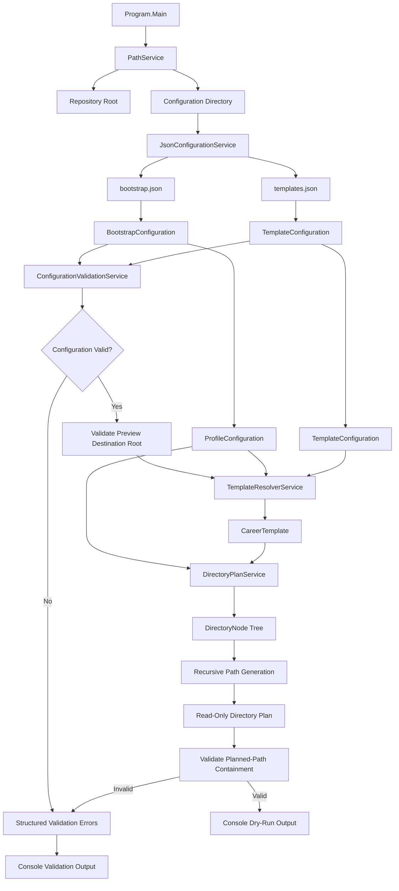
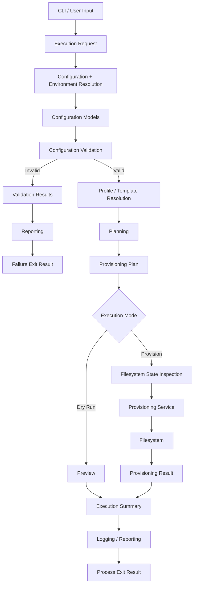

# CareerOS.Bootstrap --- Data Flow

------------------------------------------------------------------------

## Purpose

This document describes how data currently moves through
`CareerOS.Bootstrap` and how that flow is expected to evolve as the
application gains validation and filesystem provisioning capabilities.

It complements:

-   `ARCHITECTURE.md` --- architectural overview and principles
-   `CURRENT_STATE.md` --- functionality implemented today
-   `FUTURE_STATE.md` --- planned target architecture
-   `COMPONENTS.md` --- component responsibilities and boundaries

Current and future flows are deliberately separated so planned behavior
is not mistaken for implemented functionality.

------------------------------------------------------------------------

## Current Data Sources

The current application uses two repository-level JSON configuration
files:

```text
Configuration/
├── bootstrap.json
└── templates.json
```

`bootstrap.json` provides profile configuration.

`templates.json` provides reusable directory-template configuration.

These files are the primary structured inputs to the current planning
workflow.

------------------------------------------------------------------------

## Current End-to-End Flow



The current flow ends at validated console output. No generated plan is
currently passed to a filesystem provisioning component.

------------------------------------------------------------------------

## Phase 1 --- Path Discovery

Execution begins in `Program.Main()`.

`PathService` discovers the repository root by walking upward from the
application's runtime location until it finds:

```text
CareerOS.Bootstrap.sln
```

From the repository root, the application determines the location of:

```text
Configuration/
```

Conceptually:

```text
AppContext.BaseDirectory
        |
        v
Walk Parent Directories
        |
        v
CareerOS.Bootstrap.sln Found
        |
        v
Repository Root
        |
        v
Configuration Directory
```

This prevents the current development workflow from depending on a
hard-coded drive letter, Windows username, or absolute repository path.

------------------------------------------------------------------------

## Phase 2 --- Configuration Loading

The discovered configuration directory provides the paths to:

```text
bootstrap.json
templates.json
```

`JsonConfigurationService` reads those files and converts JSON data into
strongly typed C# models.

### Profile flow

```text
bootstrap.json
      |
      v
JsonConfigurationService
      |
      v
BootstrapConfiguration
      |
      v
Profiles[]
      |
      v
ProfileConfiguration
```

A profile currently provides:

```text
Name
Directory
Template
```

### Template flow

```text
templates.json
      |
      v
JsonConfigurationService
      |
      v
TemplateConfiguration
      |
      v
Templates[]
      |
      v
CareerTemplate
      |
      v
Directories[]
```

The JSON files remain the source of profile/template structure rather
than C# hard-coded directory definitions.

------------------------------------------------------------------------

## Phase 3 --- Centralized Validation

After both configuration files are loaded, the deserialized models pass through
`ConfigurationValidationService`.

```text
BootstrapConfiguration
        +
TemplateConfiguration
        |
        v
ConfigurationValidationService.Validate(...)
        |
        +--> ValidationError(s)
        |
        +--> ValidationWarning(s)
        |
        v
ValidationResult.IsValid
```

Blocking configuration errors stop the normal workflow before template
resolution/planning.

Current configuration checks include required values, empty collections,
duplicates, missing template references, recursive directory-name validation,
reserved filesystem names, and duplicate sibling directories.

The application then validates the logical `_Preview` destination root:

```text
Repository Root
      |
      v
_Preview
      |
      v
ValidateDestinationRoot(...)
```

This stage is read-only. The destination does not need to exist and validation
does not create it.

------------------------------------------------------------------------

## Phase 4 --- Profile-to-Template Resolution

Each profile contains a template name.

Conceptually:

```text
ProfileConfiguration.Template
            |
            v
TemplateResolverService
            |
            +------ TemplateConfiguration.Templates[]
            |
            v
Matching CareerTemplate
```

Template matching is currently case-insensitive.

Example relationship:

```text
Chris
  |
  +--> CareerProfessional

Katie
  |
  +--> HealthcareProfessional
```

The names shown above are configuration data. Core planning services do
not require person-specific logic.

If a requested template cannot be resolved, processing fails rather than
silently selecting a different template.

------------------------------------------------------------------------

## Phase 5 --- Recursive Directory Traversal

A resolved `CareerTemplate` contains top-level directory nodes.

Each `DirectoryNode` can contain child nodes:

```text
DirectoryNode
├── Name
└── Children[]
    └── DirectoryNode
```

This creates a recursive tree.

Example:

```text
Resume
├── Master
├── RC
└── Archived
```

`DirectoryPlanService` walks this structure recursively.

Conceptually:

```text
CareerTemplate
      |
      v
Directories[]
      |
      v
DirectoryNode
      |
      +--> Build current path
      |
      +--> Add path to plan
      |
      +--> For each child
              |
              v
          Repeat recursively
```

The same traversal mechanism can therefore process nested structures
without a separate implementation for each depth level.

------------------------------------------------------------------------

## Phase 6 --- Path Construction

The current planner receives:

-   A base preview path
-   A `ProfileConfiguration`
-   A resolved `CareerTemplate`

It combines these inputs into planned directory paths.

Conceptually:

```text
Base Preview Path
        +
Profile Directory
        +
Template DirectoryNode
        |
        v
Planned Directory Path
```

For nested nodes:

```text
Parent Planned Path
        +
Child DirectoryNode.Name
        |
        v
Child Planned Path
```

The resulting collection represents what the directory structure would
look like if provisioning were later performed.

------------------------------------------------------------------------

## Phase 7 --- Planned-Path Containment Validation

After `DirectoryPlanService` returns the planned path collection, the workflow
validates every path against the approved destination root.

```text
Approved Destination Root
        +
Planned Paths[]
        |
        v
ValidatePlannedPaths(...)
        |
        +--> Valid: continue to preview
        |
        +--> Invalid: structured validation failure
```

Current containment checks require fully qualified paths and reject parent
traversal, sibling-prefix escapes, and paths outside the approved root.

This stage also performs no filesystem writes.

------------------------------------------------------------------------

## Phase 8 --- Structured Provisioning-Plan Classification

After planned-path containment succeeds, the validated path collection flows into `ProvisioningPlanService`.

```text
Validated planned paths
        |
        v
ProvisioningPlanService
        |
        +--> Directory.Exists(...)
        |
        +--> File.Exists(...)
        |
        v
ProvisioningAction[]
        |
        v
ProvisioningPlan
```

For each validated path the current observed-state mapping is:

```text
Missing target
    -> CurrentState.Missing
    -> ActionType.Create

Existing directory
    -> CurrentState.Directory
    -> ActionType.Preserve

Existing file
    -> CurrentState.File
    -> ActionType.Conflict

Invalid direct service input
    -> CurrentState.Invalid
    -> ActionType.Reject
```

This phase is **read-only**. Filesystem state is observed for planning/classification; no target is created, modified,
moved, or deleted.

The structured plan preserves the desired-path traversal order produced by `DirectoryPlanService`.

---

## Current Preview Boundary

The current application uses a logical `_Preview` location for readable
path planning.

Conceptually:

```text
Repository Root
└── _Preview
    └── Profile Directory
        └── Planned Template Structure
```

The `_Preview` tree is not created on disk by the current planning
workflow.

The important current boundary is:

```text
Configuration
     |
     v
Models
     |
     v
Centralized Validation
     |
     v
Resolution
     |
     v
Planning
     |
     v
Path Containment Validation
     |
     v
Validated Strings / Paths
     |
     v
Console

--------- SAFETY BOUNDARY ---------

Filesystem Modification
     X
```

Current planning data now crosses into the read-only M4 provisioning-plan classification boundary, but not into a write-capable provisioning
service.

------------------------------------------------------------------------

## Current Output Flow

Validated directory paths return to the orchestration layer and are displayed
to the console.

```text
DirectoryPlanService
        |
        v
Planned Paths
        |
        v
ConfigurationValidationService.ValidatePlannedPaths(...)
        |
        v
Validated Planned Paths
        |
        v
Program.Main
        |
        v
Console Output
```

Blocking validation failures are rendered as structured codes/messages rather
than being presented as successful dry-run output.

The console remains the terminal consumer of current planning data.

------------------------------------------------------------------------

## Current Error Flow

Failures can originate from:

```text
Path Discovery
Configuration File Access
JSON Deserialization
Centralized Configuration Validation
Destination-Root Validation
Template Resolution
Planning
Planned-Path Containment Validation
```

Ordinary semantic validation failures use `ValidationResult` rather than
exceptions:

```text
Validation Failure
      |
      v
ValidationResult.Errors
      |
      v
Program.Main
      |
      +--> Display code / property / message
      |
      +--> Return exit code 1
```

Unexpected exceptions reaching the application boundary are still handled by
the top-level `Program.Main()` catch block.

Successful execution returns exit code `0`.

Persistent logging and a general structured execution-result pipeline remain
future work.

------------------------------------------------------------------------

## Current Data Transformation Summary

The most important current transformation is:

```text
JSON Text
   |
   v
Strongly Typed Configuration Models
   |
   v
Structured Configuration Validation
   |
   v
Profile + Resolved Template
   |
   v
Recursive Directory Nodes
   |
   v
Planned Path Collection
   |
   v
Path Containment Validation
   |
   v
Human-Readable Console Output
```

No database, remote API, network service, or cloud system participates
in the current data flow.

------------------------------------------------------------------------

## Future Data Flow

The planned architecture extends the existing pipeline rather than
replacing its core configuration-driven model.



Everything in this section is target-state direction unless and until it
is reflected in `CURRENT_STATE.md`.

------------------------------------------------------------------------

## Future Input Flow

Future execution may combine several input sources:

```text
Command-Line Options
        |
        +------------------+
        |                  |
        v                  v
Execution Settings   Configuration Files
        |                  |
        +---------+--------+
                  |
                  v
         Resolved Execution Request
```

Potential inputs may include:

```text
--dry-run
--profile
--root
--template
--config
```

Exact command-line syntax and precedence rules are not finalized.

If multiple sources can specify the same setting, precedence must be
documented and validated before implementation.

------------------------------------------------------------------------

## Current Validation Data Flow

A dedicated validation stage now exists before normal resolution/planning and
before any future provisioning boundary.

```text
Configuration Models
        |
        v
ConfigurationValidationService
        |
        +--> ValidationError(s)   [blocking]
        |
        +--> ValidationWarning(s) [non-blocking]
        |
        v
ValidationResult.IsValid
```

Current structured validation data carries:

```text
Code
Message
PropertyName
```

Destination-root and planned-path validation reuse the same result contract.

Future reporting may add richer resolution guidance or broader execution-result
models, but M3 does not require a second validation representation.

Explicit schema-version validation remains deferred until configuration
versioning exists.

------------------------------------------------------------------------

## Current Structured Provisioning Plan Flow

M4 implements the richer plan representation previously described as future architecture.

```text
DirectoryPlanService
        |
        v
Validated planned paths
        |
        v
ProvisioningPlanService
        |
        v
ProvisioningPlan
        |
        +--> ProvisioningAction
        |       +--> TargetPath
        |       +--> DesiredState
        |       +--> CurrentState
        |       +--> ActionType
        |       +--> Reason
        |       +--> Warnings
        |
        v
Structured dry-run console output
```

`ProvisioningPlanService` observes filesystem state and classifies intent. It does not perform write-capable
provisioning. The plan is the current M4 contract that future execution should consume.

---

## Future Filesystem State Flow

Actual provisioning will require comparing desired state with current
state.

```text
Desired Directory
        |
        v
Inspect Filesystem
        |
        +--> Missing --------> CREATE
        |
        +--> Exists ---------> PRESERVE
        |
        +--> Conflict -------> REPORT / STOP
        |
        +--> Invalid --------> REJECT
```

The provisioning service should receive already resolved and validated
intent rather than making profile/template decisions itself.

------------------------------------------------------------------------

## Future Provisioning Result Flow

Filesystem execution should return structured results.

Conceptually:

```text
ProvisioningPlan
       |
       v
DirectoryProvisioningService
       |
       v
Filesystem Operations
       |
       v
ProvisioningResult
       |
       +--> Created
       +--> Existing
       +--> Skipped
       +--> Warning
       +--> Failed
       |
       v
ExecutionSummary
```

A structured result will support console output, logging, testing, and
future automation more reliably than parsing free-form text.

------------------------------------------------------------------------

## Future Logging and Reporting Flow

Logging/reporting should consume application results rather than control
business behavior.

```text
Validation Results
Planning Results
Provisioning Results
Application Errors
        |
        v
Reporting / Logging
        |
        +--> Console Summary
        +--> Structured Log
        +--> Process Exit Result
```

Logging should not become the source of truth for provisioning state.

The source of truth should remain validated application state and
verified filesystem results.

------------------------------------------------------------------------

## Future Idempotency Flow

The target architecture should support repeated execution:

```text
Desired State
     |
     v
Inspect Current State
     |
     v
Compare
     |
     +--> Already Correct --> Preserve
     |
     +--> Missing ---------> Create
     |
     +--> Conflict --------> Report
     |
     v
Verify Result
```

This allows the same configuration to be safely applied again without
treating existing valid directories as failures.

------------------------------------------------------------------------

## Future Test Data Flow

Automated tests should verify data transformations at component
boundaries.

### Unit tests

```text
Controlled Input
      |
      v
Single Component
      |
      v
Observed Result
      |
      v
Assertion
```

Examples include template resolution and recursive plan generation.

### Filesystem integration tests

```text
Test Configuration
      |
      v
Temporary Filesystem Root
      |
      v
Provisioning Workflow
      |
      v
Filesystem State
      |
      v
Assertions
      |
      v
Cleanup
```

Tests should never use a real CareerOS user environment as an automated
fixture.

------------------------------------------------------------------------

## Data Ownership and Responsibility

The intended ownership model is:

  Data                          Primary Owner / Source
  ----------------------------- ---------------------------
  Profile definitions           `bootstrap.json`
  Template definitions          `templates.json`
  Deserialized profile state    Configuration models
  Configuration validation     `ConfigurationValidationService`
  Validation results            Validation models
  Template matching             `TemplateResolverService`
  Directory planning            `DirectoryPlanService`
  Current provisioning actions  `ProvisioningPlanService` / `ProvisioningPlan`
  Future filesystem execution   Provisioning service
  Future execution results      Result/summary models
  Presentation                  Console/reporting layer

This separation helps prevent one component from accumulating unrelated
responsibilities.

------------------------------------------------------------------------

## Data Flow Invariants

The following principles should remain true as the architecture evolves:

1. Configuration is loaded before dependent behavior executes.
2. Loaded configuration passes centralized semantic validation before normal template resolution/planning.
3. A profile must resolve to a valid template before its directory structure is planned.
4. Directory hierarchy is derived from the recursive template model.
5. Planned paths must remain beneath the approved destination root.
6. Planning and validation remain separate from filesystem modification.
7. Invalid configuration or unsafe planned paths must not reach destructive execution.
8. Dry-run and provisioning should share the same validated intent.
9. Existing valid user content should be preserved.
10. Filesystem results should be verified rather than assumed.
11. Presentation and logging should report application results rather than define business behavior.
12. Planned behavior must not be documented as implemented until it exists in the codebase.

------------------------------------------------------------------------

## Current-to-Future Evolution

```text
CURRENT

JSON
 |
 v
Configuration Models
 |
 v
Centralized Validation
 |
 v
Template Resolution
 |
 v
Directory Planning
 |
 v
Path Containment Validation
 |
 v
Console Preview


FUTURE

CLI + JSON + Environment
          |
          v
Resolved Execution Request
          |
          v
Validation
          |
          v
Profile / Template Resolution
          |
          v
Structured Provisioning Plan
          |
          +---------> Dry-Run Preview
          |
          v
Filesystem Inspection
          |
          v
Provisioning
          |
          v
Verification
          |
          v
Structured Result
          |
          v
Reporting / Logging
```

The future architecture should preserve the understandable linear flow
of the current implementation while adding explicit safety and
observability stages.

------------------------------------------------------------------------

## Relationship to Requirements and Testing

As requirements documentation is established, significant data flows
should become traceable to:

```text
User Story
   |
   v
Requirement
   |
   v
Data / Component Flow
   |
   v
Implementation
   |
   v
Test
```

For example, a future requirement for idempotent provisioning should
trace to:

-   Filesystem-state inspection
-   Provisioning-plan action classification
-   Provisioning behavior
-   Repeat-execution integration tests

This relationship will be captured in the Requirements documentation
rather than duplicated in this file.

------------------------------------------------------------------------

## Summary

The current CareerOS.Bootstrap data flow is intentionally simple:

```text
Discover
  |
  v
Load
  |
  v
Deserialize
  |
  v
Resolve
  |
  v
Traverse
  |
  v
Plan
  |
  v
Display
```

The target flow extends that foundation:

```text
Input
  |
  v
Load
  |
  v
Validate
  |
  v
Resolve
  |
  v
Plan
  |
  v
Preview or Provision
  |
  v
Verify
  |
  v
Report
```

The central architectural boundary remains the separation between
**describing/planning desired state** and **changing actual filesystem
state**.

That boundary is essential to the project's safety, testability, and
future scalability.
