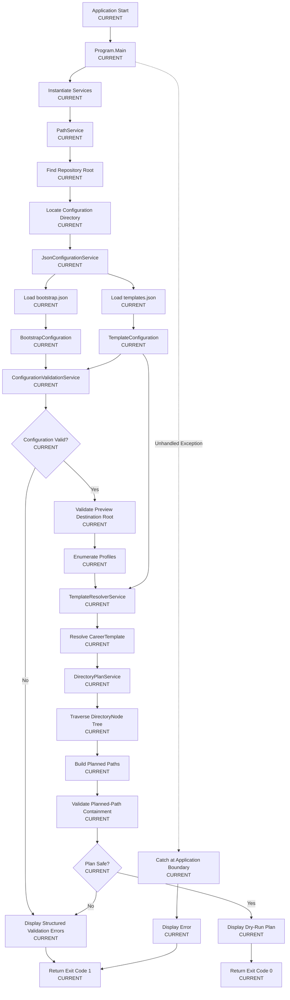
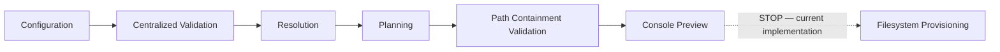
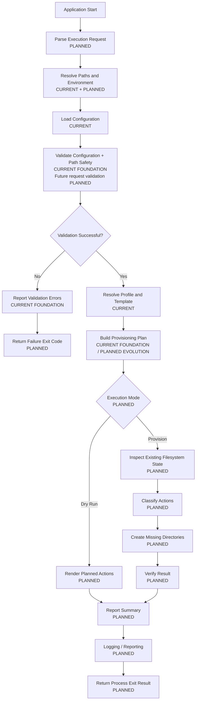
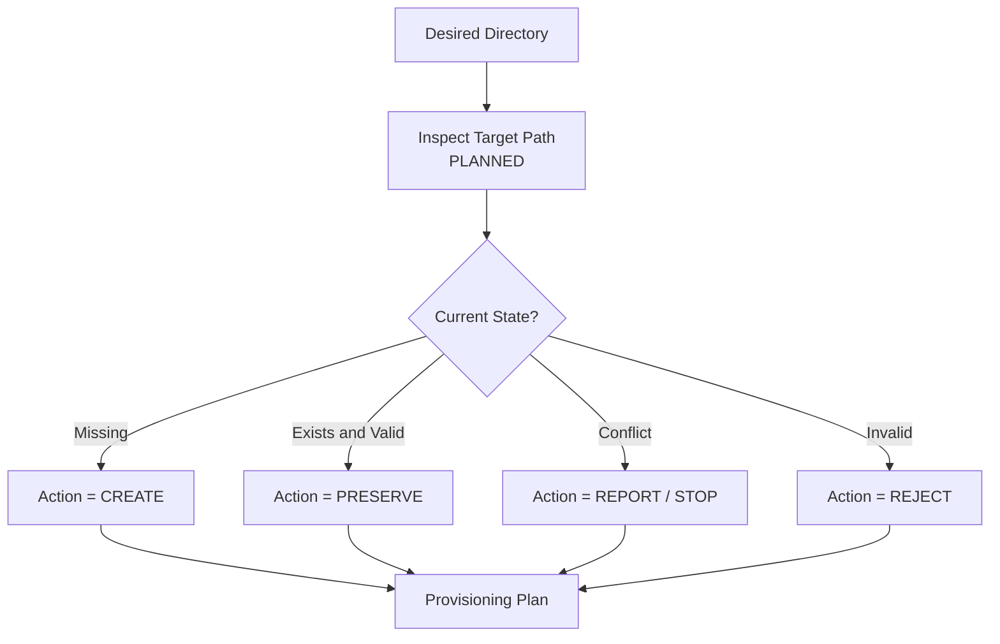
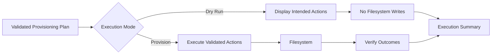
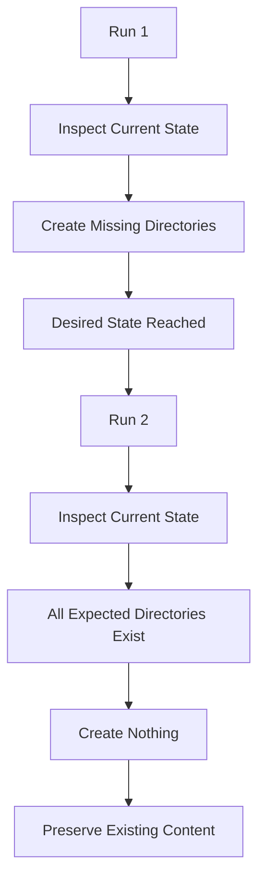
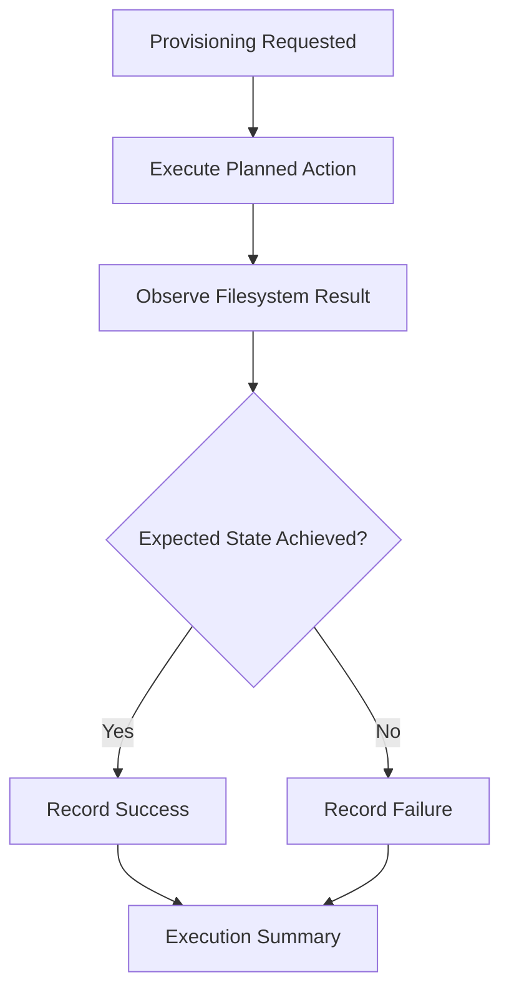

# CareerOS.Bootstrap — Bootstrap Process Flow

## Purpose

This document visualizes the end-to-end execution flow for `CareerOS.Bootstrap`.

It distinguishes the **current implemented validation-first dry-run workflow** from the **planned provisioning workflow** so future functionality is not confused with present behavior.

---

## Status Legend

- **CURRENT** — implemented today.
- **PLANNED** — defined target behavior, not yet implemented.
- **FUTURE** — longer-term capability outside the current execution path.

---

# Current Bootstrap Process Flow



The current process stops after validating and displaying the read-only plan.

No CareerOS directory provisioning occurs.

---

# Current Safety Boundary



The current workflow is validation-first and intentionally read-only. Blocking
configuration or path-safety failures stop before the future provisioning
boundary.

---

# Current Execution Sequence

```text
Start
  |
  v
Discover Repository
  |
  v
Discover Configuration
  |
  v
Load JSON
  |
  v
Deserialize Models
  |
  v
Validate Configuration
  |
  v
Validate Preview Destination Root
  |
  v
Resolve Profile Template
  |
  v
Traverse Recursive Directory Tree
  |
  v
Build Planned Paths
  |
  v
Validate Planned-Path Containment
  |
  v
Display Dry-Run Output
  |
  v
Exit
```

---

# Planned Bootstrap Process Flow



---

# Planned Decision Flow

The future workflow introduces explicit gates before filesystem modification.

```text
Input
  |
  v
Configuration Loaded?
  |
  +-- No --> Fail
  |
  v
Configuration Valid?
  |
  +-- No --> Fail
  |
  v
Profile / Template Resolved?
  |
  +-- No --> Fail
  |
  v
Plan Valid?
  |
  +-- No --> Fail
  |
  v
Dry Run?
  |
  +-- Yes --> Preview Only
  |
  v
Explicit Provisioning Requested?
  |
  +-- No --> Stop Safely
  |
  v
Provision
  |
  v
Verify
  |
  v
Report
```

---

# Planned Existing-State Evaluation



This classification is central to future idempotent provisioning.

---

# Planned Dry-Run vs Provisioning Branch



Dry-run and provisioning should consume the same validated plan wherever practical.

---

# Planned Idempotent Repeat Execution



The second execution should converge on the same desired structure without duplicate or destructive behavior.

---

# Error Handling Flow

## Current

```text
Exception
  |
  v
Program.Main catch
  |
  +--> Display Error
  |
  +--> Exit Code 1
```

## Planned

```text
Validation Error
Provisioning Error
Filesystem Error
Unexpected Error
        |
        v
Structured Result / Error Category
        |
        v
Reporting / Logging
        |
        v
Defined Exit Code
```

Future error taxonomy remains to be finalized.

---

# Planned Verification Flow



Provisioning outcomes should be verified or reliably observed rather than assumed.

---

# Process Responsibilities

| Process Stage | Current Owner | Status |
| --- | --- | --- |
| Application entry | `Program.Main()` | CURRENT |
| Repository discovery | `PathService` | CURRENT |
| Configuration loading | `JsonConfigurationService` | CURRENT |
| Configuration validation | `ConfigurationValidationService` | CURRENT |
| Destination-root validation | `ConfigurationValidationService` | CURRENT |
| Profile/template resolution | `TemplateResolverService` | CURRENT |
| Recursive directory planning | `DirectoryPlanService` | CURRENT |
| Planned-path containment validation | `ConfigurationValidationService` | CURRENT |
| Console preview | `Program.Main()` | CURRENT |
| CLI request parsing | Future CLI layer | PLANNED |
| Existing-state inspection | Future provisioning layer | PLANNED |
| Filesystem provisioning | Future provisioning service | PLANNED |
| Verification | Future provisioning workflow | PLANNED |
| Structured logging/reporting | Future reporting layer | PLANNED |

---

# Process Invariants

The bootstrap lifecycle should preserve these rules:

1. Configuration must load before dependent behavior executes.
2. Blocking validation errors must prevent provisioning.
3. A profile must resolve to a valid template before planning.
4. Planning must remain independently executable.
5. Dry-run must perform no provisioning writes.
6. Actual provisioning must require explicit execution intent.
7. Existing valid content should be preserved.
8. Repeated provisioning should be idempotent.
9. Filesystem outcomes should be verified.
10. Errors must not be silently reported as success.

---

# Relationship to Existing Documentation

```text
SYSTEM_CONTEXT.md
    |
    v
COMPONENT_DIAGRAM.md
    |
    v
BOOTSTRAP_PROCESS_FLOW.md
    |
    +--> DATA_FLOW_DIAGRAM.md
    |
    +--> FUTURE_STATE_DIAGRAM.md
```

Related detailed documentation:

```text
Documentation/Architecture/CURRENT_STATE.md
Documentation/Architecture/FUTURE_STATE.md
Documentation/Architecture/DATA_FLOW.md
Documentation/Development/TESTING_STRATEGY.md
Documentation/Requirements/TRACEABILITY.md
```

---

# Summary

The current bootstrap process is:

```text
Discover
  |
  v
Load
  |
  v
Resolve
  |
  v
Plan
  |
  v
Preview
```

The planned process extends this to:

```text
Input
  |
  v
Load
  |
  v
Validate
  |
  v
Resolve
  |
  v
Plan
  |
  v
Preview or Provision
  |
  v
Verify
  |
  v
Report
```

The most important process rule remains:

> **No filesystem modification should occur until the application understands, validates, and explicitly approves the intended change.**
