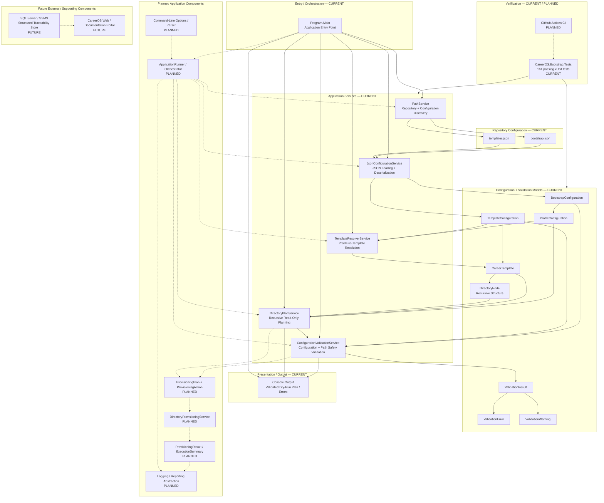
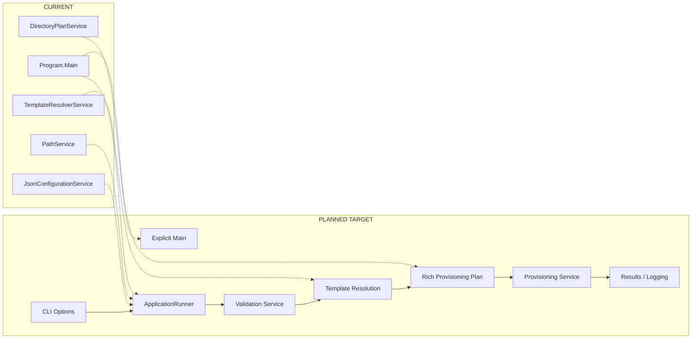

# CareerOS.Bootstrap — Component Diagram

## Purpose

This document provides a component-level view of `CareerOS.Bootstrap`, showing the current application components, their primary relationships, and the planned/future components that may extend the architecture.

The diagram is intentionally aligned with the existing Architecture, Requirements, Development, and System Context documentation.

Status labels:

- **CURRENT** — implemented today.
- **PLANNED** — defined direction, not yet fully implemented.
- **FUTURE** — longer-term extension outside the current implementation commitment.

---

## Component Diagram



Solid lines represent current implemented relationships.

Dashed lines represent planned or future relationships.

---

## Current Component Responsibilities

### `Program.Main` — CURRENT

Primary responsibilities:

- Start application execution.
- Instantiate and coordinate current services.
- Discover required repository/configuration paths.
- Load configuration.
- Validate configuration before normal resolution/planning.
- Validate the preview destination root.
- Iterate configured profiles.
- Resolve templates.
- Request recursive directory plans.
- Validate planned-path containment.
- Present dry-run output or structured validation failures.
- Handle top-level exceptions and exit codes.

`Program.Main` is currently the orchestration boundary. As complexity grows, orchestration may move into a dedicated application runner while `Main()` remains the explicit entry point.

---

### `PathService` — CURRENT

Primary responsibilities:

- Start from `AppContext.BaseDirectory`.
- Walk upward to locate `CareerOS.Bootstrap.sln`.
- Identify the repository root.
- Resolve the repository-level `Configuration` directory.

Boundary:

`PathService` discovers paths. It does not deserialize configuration or provision directories.

---

### `JsonConfigurationService` — CURRENT

Primary responsibilities:

- Verify required configuration files exist.
- Read JSON content.
- Deserialize `bootstrap.json` into `BootstrapConfiguration`.
- Deserialize `templates.json` into `TemplateConfiguration`.
- Apply current `System.Text.Json` options.

Boundary:

The service loads structured configuration. It does not decide which template a profile should use and does not create directories.

---

### `ConfigurationValidationService` — CURRENT

Primary responsibilities:

- Validate required configuration values and collections.
- Reject duplicate profile/template configuration.
- Reject missing template references.
- Validate recursive filesystem naming rules.
- Validate the preview destination root.
- Validate planned-path containment.
- Aggregate blocking errors and preserve non-blocking warnings.

Boundary:

The service performs semantic and lexical path validation. It does not load JSON,
build directory plans, inspect existing filesystem object state for provisioning,
or create directories.

---

### `TemplateResolverService` — CURRENT

Primary responsibilities:

- Accept a requested template name.
- Search configured templates.
- Match names case-insensitively.
- Return the corresponding `CareerTemplate`.
- Fail when a requested template cannot be resolved.

Boundary:

Template resolution does not perform recursive planning or filesystem writes.

---

### `DirectoryPlanService` — CURRENT

Primary responsibilities:

- Accept a base preview path, profile, and resolved template.
- Construct the profile root.
- Traverse each `DirectoryNode` recursively.
- Return the complete planned directory-path collection.

Safety boundary:

The service is intentionally read-only and must remain independently executable from filesystem provisioning.

---

## Current Validation Models

### `ValidationResult`

Represents aggregated validation state with `Errors`, `Warnings`, and `IsValid`.

### `ValidationError`

Represents one blocking validation finding with a stable code, message, and
optional property location.

### `ValidationWarning`

Represents one non-blocking validation finding using the same structured shape.

---

## Current Configuration Models

### `BootstrapConfiguration`

Represents the root of profile configuration.

```text
BootstrapConfiguration
└── Profiles[]
```

### `ProfileConfiguration`

Represents one configured CareerOS user/profile.

Current properties:

```text
Name
Directory
Template
```

### `TemplateConfiguration`

Represents the root of reusable template configuration.

```text
TemplateConfiguration
└── Templates[]
```

### `CareerTemplate`

Represents one reusable directory template.

```text
CareerTemplate
├── Name
└── Directories[]
```

### `DirectoryNode`

Represents one directory and its recursive children.

```text
DirectoryNode
├── Name
└── Children[]
    └── DirectoryNode
```

This recursive model is the basis for scalable nested directory structures.

---

## Current Configuration Components

### `bootstrap.json` — CURRENT

Provides profile definitions and assigns reusable template names.

Conceptually:

```text
Profile
├── Name
├── Destination Directory Name
└── Template Reference
```

### `templates.json` — CURRENT

Provides reusable nested directory-tree definitions.

Conceptually:

```text
Template
├── Name
└── Directories[]
    └── DirectoryNode
```

The relationship between profile and template configuration is deliberately indirect so profiles do not duplicate complete directory trees.

---

## Current Component Interaction

The current application pipeline is:

```text
Program.Main
   |
   +--> PathService
   |       |
   |       +--> Repository Root
   |       └--> Configuration Directory
   |
   +--> JsonConfigurationService
   |       |
   |       +--> BootstrapConfiguration
   |       └--> TemplateConfiguration
   |
   +--> TemplateResolverService
   |       |
   |       └--> CareerTemplate
   |
   +--> DirectoryPlanService
   |       |
   |       └--> Planned Directory Paths
   |
   └--> Console Output
```

No current component modifies the intended CareerOS target filesystem.

---

## Planned Component Evolution

### `ApplicationRunner` / Application Orchestrator — PLANNED

As the application gains CLI parsing, validation, provisioning, logging, and richer results, orchestration may move out of `Program.Main()`.

Target relationship:

```text
Program.Main
    |
    v
ApplicationRunner
    |
    +--> Command-Line Options
    +--> Configuration
    +--> Validation
    +--> Resolution
    +--> Planning
    +--> Provisioning
    +--> Reporting
```

The exact class name remains conceptual until implementation complexity justifies it.

---

### Command-Line Options / Parser — PLANNED

Potential responsibilities:

- Parse supported command-line arguments.
- Represent execution options.
- Surface invalid combinations.
- Provide user-facing help/version support.

Potential options include:

```text
--dry-run
--profile
--root
--template
--config
--help
--version
```

Exact syntax remains subject to requirements and implementation decisions.

---

### `ProvisioningPlan` / `ProvisioningAction` — PLANNED

The current `DirectoryPlanService` returns path strings.

A richer target model may represent intended actions:

```text
ProvisioningPlan
└── Actions[]
    ├── TargetPath
    ├── ActionType
    ├── CurrentState
    ├── DesiredState
    └── Reason
```

Potential action classifications:

```text
Create
Exists
Skip
Invalid
Conflict
```

The same plan should ideally drive both dry-run presentation and actual execution.

---

### `DirectoryProvisioningService` — PLANNED

Potential responsibilities:

- Consume a validated plan.
- Inspect current filesystem state.
- Create missing directories.
- Preserve existing valid directories and content.
- Record successes, skips, and failures.
- Return structured results.

Boundary:

This service should not resolve profiles/templates or reinterpret configuration independently.

---

### Result and Reporting Components — PLANNED

Potential result types:

```text
ProvisioningResult
ExecutionSummary
ValidationResult
```

Potential reporting/logging responsibilities:

- Display structured execution summaries.
- Clearly distinguish dry-run from provisioning.
- Record diagnostic information.
- Support future automation and CI exit behavior.
- Avoid exposing unnecessary sensitive information.

---

## Planned Test Components

A future test project is expected:

```text
CareerOS.Bootstrap.Tests/
├── Services/
│   ├── DirectoryPlanServiceTests.cs
│   ├── JsonConfigurationServiceTests.cs
│   ├── PathServiceTests.cs
│   ├── TemplateResolverServiceTests.cs
│   ├── ConfigurationValidationServiceTests.cs
│   └── DirectoryProvisioningServiceTests.cs
│
├── Fixtures/
└── Integration/
    └── Filesystem/
```

The test project should reference production components without requiring production/user CareerOS directories as fixtures.

---

## Component Safety Boundaries

### Planning vs Provisioning

```text
Configuration / Models
        |
        v
Planning Components
        |
        v
Validated Intent
        |
        +--> Dry Run: report only
        |
        +--> Explicit Provisioning
                    |
                    v
               Filesystem
```

This separation is a core architectural invariant.

### Configuration vs Execution

Configuration declares desired structure.

It should not itself perform actions or embed executable behavior.

### Presentation vs Business Logic

Console/reporting components should present results rather than own profile resolution, planning, or provisioning logic.

### Tests vs User Data

Automated tests should use controlled fixtures and temporary filesystem roots rather than actual user CareerOS environments.

---

## Dependency Direction

Preferred dependency direction:

```text
Entry / Orchestration
        |
        v
Application Services
        |
        v
Models / Configuration Data
```

Future infrastructure dependencies should remain behind focused boundaries:

```text
Application Services
        |
        +--> Filesystem Adapter / Provisioner
        +--> Logging / Reporting
        +--> Future Persistence
```

Lower-level components should not depend on console presentation or future website concerns.

---

## Future SQL Server / Web Relationship

SQL Server and a future web/documentation portal are **not current Bootstrap components**.

If introduced, they should remain external to core planning/provisioning logic.

Conceptually:

```text
Git / Markdown Documentation
          |
          +----------------+
                           |
Structured Traceability --> SQL Server
                           |
                           v
                    API / Application Layer
                           |
                           v
                      Web Portal
```

Potential persisted concepts may include:

```text
US-###
FR-###
NFR-###
ADR-###
TEST-###
Components
Documentation Metadata
Releases
Traceability Links
```

The database should enhance searchability and reporting rather than replace source-controlled project history without a clear architectural reason.

---

## Current-to-Future Component Evolution



The target architecture evolves the current foundation rather than discarding it.

---

## Component Design Principles

1. **Focused responsibility** — each component should have one primary reason to change.
2. **Configuration over hard-coding** — profile/template structure remains data-driven.
3. **Planning before execution** — desired state is computed before filesystem writes.
4. **Validation before modification** — blocking errors prevent provisioning.
5. **Idempotent provisioning** — repeated execution converges on desired state.
6. **Safe defaults** — non-destructive behavior is preferred.
7. **Testable boundaries** — core logic should be independently testable.
8. **Observable results** — users can understand planned and executed outcomes.
9. **No person-specific core logic** — configured profiles are processed generically.
10. **Future external systems remain decoupled** — SQL Server/web concerns should not leak into the bootstrap engine unnecessarily.

---

## Related Documentation

```text
Documentation/Architecture/ARCHITECTURE.md
Documentation/Architecture/COMPONENTS.md
Documentation/Architecture/CURRENT_STATE.md
Documentation/Architecture/FUTURE_STATE.md
Documentation/Architecture/DATA_FLOW.md

Documentation/Diagrams/SYSTEM_CONTEXT.md
Documentation/Requirements/TRACEABILITY.md
Documentation/Development/TESTING_STRATEGY.md
```

---

## Summary

The current component architecture is intentionally small and read-only:

```text
Configuration
     |
     v
Path + JSON Services
     |
     v
Template Resolution
     |
     v
Recursive Planning
     |
     v
Console Output
```

The planned component architecture adds validation, richer planning, controlled provisioning, structured results, automated testing, and CI while preserving the current separation between desired state and filesystem modification.

> **Components should make the system easier to reason about, test, and extend — not merely increase the number of classes.**
