# CareerOS.Bootstrap — Data Flow Diagram

## Purpose

This document visualizes how data moves through `CareerOS.Bootstrap`, from repository configuration through model deserialization, profile/template resolution, recursive directory planning, and current dry-run output.

It also documents the planned extension of that data flow into validation, provisioning, verification, and structured execution results.

## Status Legend

- **CURRENT** — implemented today.
- **PLANNED** — defined target behavior, not yet implemented.
- **FUTURE** — longer-term extension outside the current implementation commitment.

---

# Current Data Flow

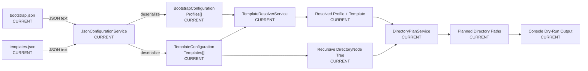

The current application consumes configuration and produces a read-only directory plan. It does not currently write the planned CareerOS workspace to the filesystem.

---

# Current Configuration Data Sources

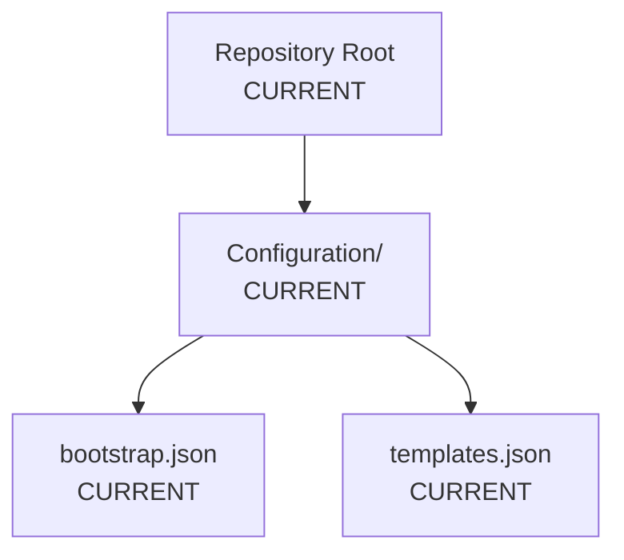

The two JSON configuration files have different responsibilities:

| Source | Primary Data |
| --- | --- |
| `bootstrap.json` | Profile definitions and profile-to-template assignments |
| `templates.json` | Reusable directory template definitions and recursive directory structures |

---

# Current Profile Data Flow

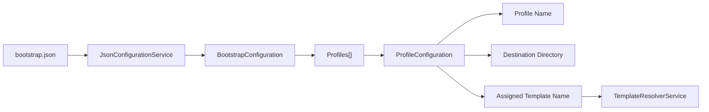

Profile configuration identifies **who or what workspace is being planned**, where that workspace belongs, and which reusable template should define its structure.

---

# Current Template Data Flow

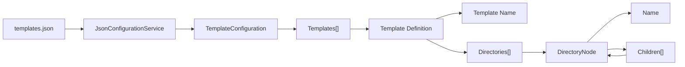

`DirectoryNode.Children` provides the recursive structure required for templates of arbitrary supported depth.

---

# Recursive Directory Data Structure

```text
Template
└── Directories[]
    ├── DirectoryNode
    │   ├── Name
    │   └── Children[]
    │       ├── DirectoryNode
    │       │   ├── Name
    │       │   └── Children[]
    │       └── DirectoryNode
    └── DirectoryNode
        ├── Name
        └── Children[]
```

The planner traverses this hierarchy rather than relying on a fixed number of directory levels.

---

# Current Resolution Flow

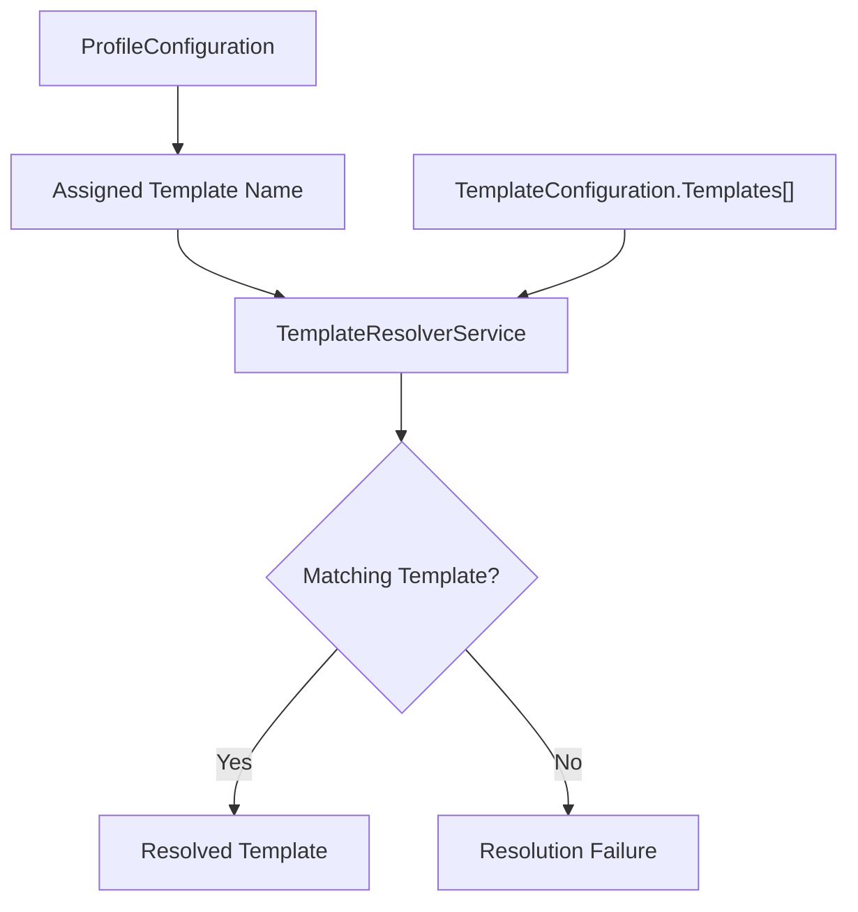

The template name acts as the logical link between profile configuration and reusable template configuration.

---

# Current Planning Data Flow

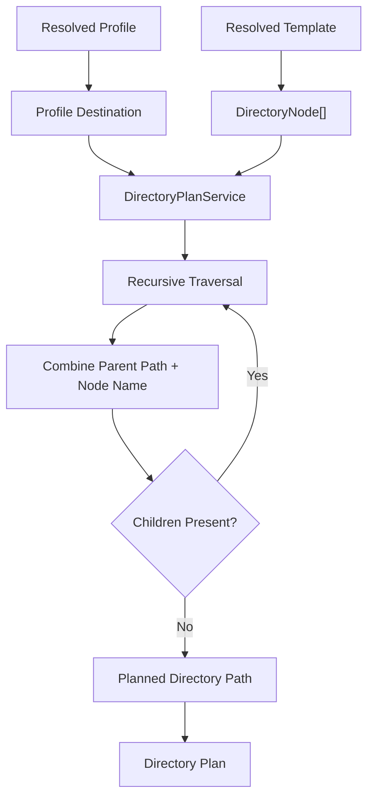

Conceptually, each planned path is derived from:

```text
Profile Destination
        +
Current Parent Path
        +
DirectoryNode.Name
```

Child nodes inherit the path produced for their parent.

---

# Current Output Data Flow

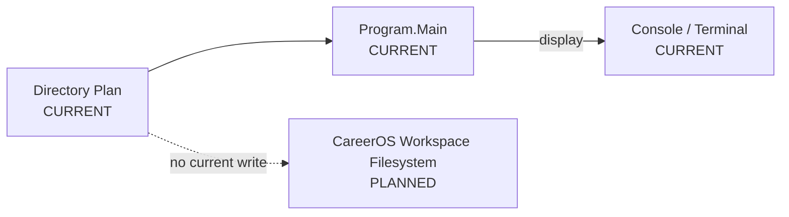

The current output is informational. The planned paths are displayed for review but are not provisioned.

---

# Current End-to-End Data Transformation

```text
JSON Files
   |
   v
Raw Configuration Data
   |
   v
Strongly Typed Configuration Models
   |
   v
Profile + Template Relationship
   |
   v
Recursive Directory Definition
   |
   v
Resolved Destination Paths
   |
   v
Read-Only Directory Plan
   |
   v
Console Output
```

---

# Planned Data Flow

```mermaid
flowchart LR
    Config["Configuration Data<br/>CURRENT"]
    Request["Execution Request / CLI Options<br/>PLANNED"]

    Load["Configuration Loading<br/>CURRENT"]
    Validate["Validation<br/>PLANNED"]
    Resolve["Profile + Template Resolution<br/>CURRENT"]
    Plan["Provisioning Plan<br/>CURRENT FOUNDATION / PLANNED EVOLUTION"]

    Inspect["Existing-State Inspection<br/>PLANNED"]
    Classify["Action Classification<br/>PLANNED"]
    Execute["Filesystem Provisioning<br/>PLANNED"]
    Verify["Outcome Verification<br/>PLANNED"]
    Result["Structured Execution Result<br/>PLANNED"]
    Report["Console / Logging / Reporting<br/>PLANNED"]

    Config --> Load
    Load --> Validate
    Request --> Validate

    Validate --> Resolve
    Resolve --> Plan

    Plan --> Inspect
    Inspect --> Classify
    Classify --> Execute
    Execute --> Verify
    Verify --> Result
    Result --> Report
```

---

# Planned Validation Data Flow

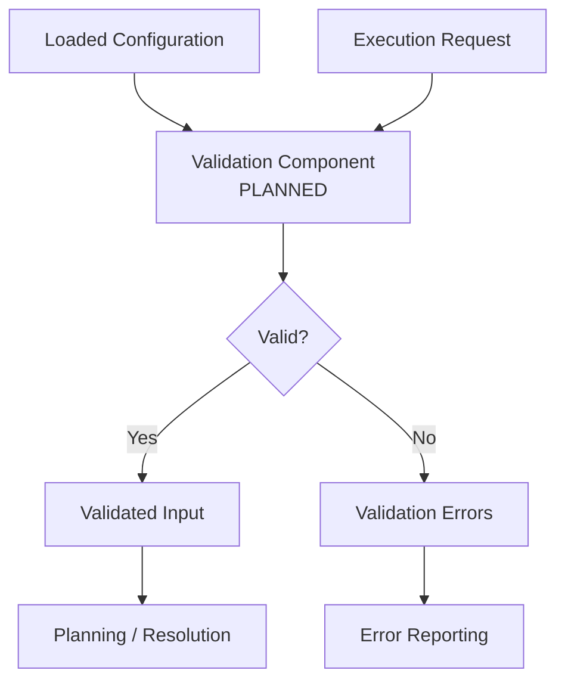

Validation should transform untrusted or potentially incomplete configuration into data that downstream components can safely consume.

---

# Planned Provisioning Plan

The current collection of planned paths can evolve into richer action-oriented data.

```text
ProvisioningPlan
└── Actions[]
    ├── TargetPath
    ├── ActionType
    ├── CurrentState
    ├── DesiredState
    └── Reason
```

Possible action classifications include:

```text
CREATE
PRESERVE
SKIP
CONFLICT
REJECT
```

Exact names remain subject to implementation design.

---

# Planned Existing-State Data Flow

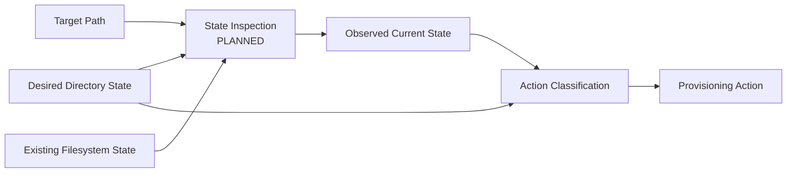

This stage allows the application to reason about the difference between **desired state** and **actual state** before performing writes.

---

# Planned Dry-Run Data Flow

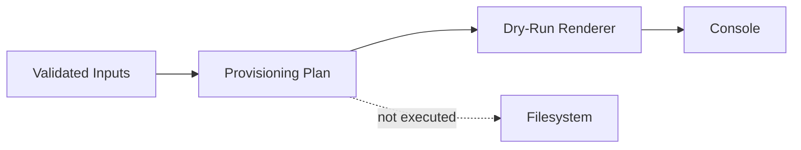

Dry-run should continue to use the same underlying plan as real provisioning while suppressing write execution.

---

# Planned Provisioning Data Flow

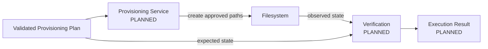

Provisioning should consume approved plan data rather than independently reconstructing desired paths.

---

# Planned Result and Reporting Data Flow

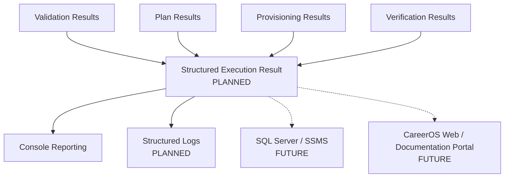

A structured result model would provide a common source for human-readable output and future integrations.

---

# Future Persistence and Search Flow

The longer-term architecture may persist project metadata, documentation relationships, requirements, execution history, and other structured CareerOS information.

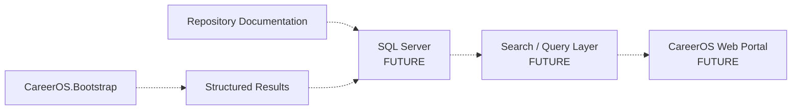

This is a future extension and is not part of the current bootstrap implementation.

---

# Data Ownership

| Data | Primary Source / Owner | Status |
| --- | --- | --- |
| Profile definitions | `bootstrap.json` | CURRENT |
| Template assignment | `bootstrap.json` | CURRENT |
| Template definitions | `templates.json` | CURRENT |
| Recursive directory hierarchy | `DirectoryNode` configuration | CURRENT |
| Deserialized configuration | Configuration models | CURRENT |
| Template resolution | `TemplateResolverService` | CURRENT |
| Planned directory paths | `DirectoryPlanService` | CURRENT |
| Existing filesystem state | Future inspection component | PLANNED |
| Provisioning actions | Future plan/action model | PLANNED |
| Execution outcomes | Future result model | PLANNED |
| Persisted searchable metadata | SQL Server or later persistence layer | FUTURE |

---

# Data Boundaries

## Repository Boundary

Contains:

```text
Source Code
Configuration
Documentation
Git Metadata
```

## Configuration Boundary

Provides declarative input to application behavior.

```text
Configuration/
├── bootstrap.json
└── templates.json
```

## Application Boundary

Transforms configuration into planning and, later, controlled provisioning behavior.

## Workspace Boundary

Represents the target CareerOS user directory structure.

It is currently a **planned output target**, not an active write destination.

## Future Persistence Boundary

May contain structured project and execution information intended for search, reporting, traceability, or web presentation.

---

# Data Integrity Principles

The data flow should preserve the following principles:

1. Configuration remains the source of truth for declarative workspace structure.
2. JSON input is deserialized into explicit models before business processing.
3. Profile-to-template relationships are resolved explicitly.
4. Recursive directory hierarchy is preserved through `DirectoryNode.Children`.
5. Planning remains separate from filesystem execution.
6. Validation occurs before future provisioning.
7. Provisioning consumes an approved plan rather than rebuilding intent independently.
8. Existing filesystem state is observed before modification.
9. Verification compares expected state with actual state.
10. Future persistence must not silently replace repository configuration as the authoritative bootstrap definition.

---

# Relationship to Other Diagrams

```text
SYSTEM_CONTEXT.md
    |
    v
COMPONENT_DIAGRAM.md
    |
    v
BOOTSTRAP_PROCESS_FLOW.md
    |
    v
DATA_FLOW_DIAGRAM.md
    |
    v
FUTURE_STATE_DIAGRAM.md
```

This document focuses specifically on **what data moves**, **where it moves**, and **how it changes**.

`BOOTSTRAP_PROCESS_FLOW.md` focuses primarily on execution order and decisions.

`COMPONENT_DIAGRAM.md` focuses primarily on structural responsibilities and component relationships.

---

# Summary

The current data pipeline is:

```text
Configuration
    |
    v
Models
    |
    v
Resolution
    |
    v
Recursive Planning
    |
    v
Directory Plan
    |
    v
Console Preview
```

The planned pipeline becomes:

```text
Configuration + Execution Request
              |
              v
           Validate
              |
              v
           Resolve
              |
              v
             Plan
              |
              v
      Inspect Current State
              |
              v
      Classify Intended Actions
              |
        +-----+-----+
        |           |
        v           v
     Preview      Execute
                    |
                    v
                  Verify
                    |
                    v
             Structured Result
                    |
                    v
                  Report
```

The architecture keeps **configuration**, **planning**, **execution**, and **verification** as distinct data-processing stages so that future filesystem changes can remain understandable, testable, and controlled.
