# CareerOS.Bootstrap — Future State Diagram

## Purpose

This document visualizes the target architectural evolution of `CareerOS.Bootstrap` from its current read-only planning foundation into a validated, testable, idempotent provisioning platform with future extensibility for structured persistence and web-based project visibility.

All elements are labeled to distinguish implemented capabilities from planned or future concepts.

## Status Legend

- **CURRENT** — implemented today.
- **PLANNED** — defined architectural direction, not yet fully implemented.
- **FUTURE** — longer-term extension outside the current implementation commitment.

---

## Architectural Evolution

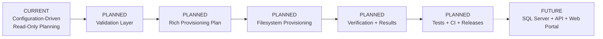

---

## Current Foundation

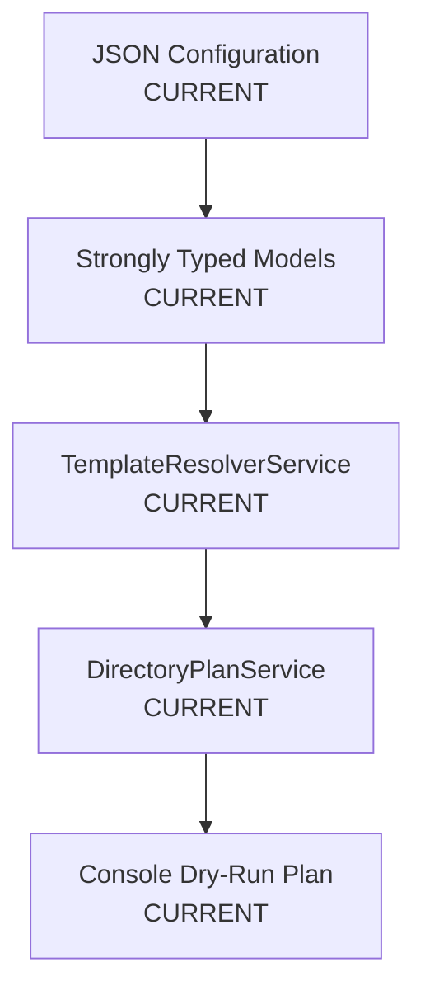

The current system intentionally stops before filesystem modification.

---

## Planned Target Architecture

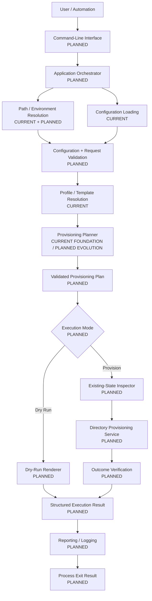

---

## Planned Safety Gates

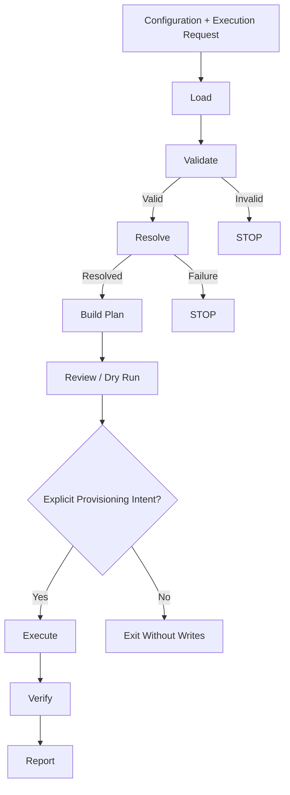

The target architecture places explicit decision and validation boundaries ahead of filesystem writes.

---

## Planned Provisioning Model

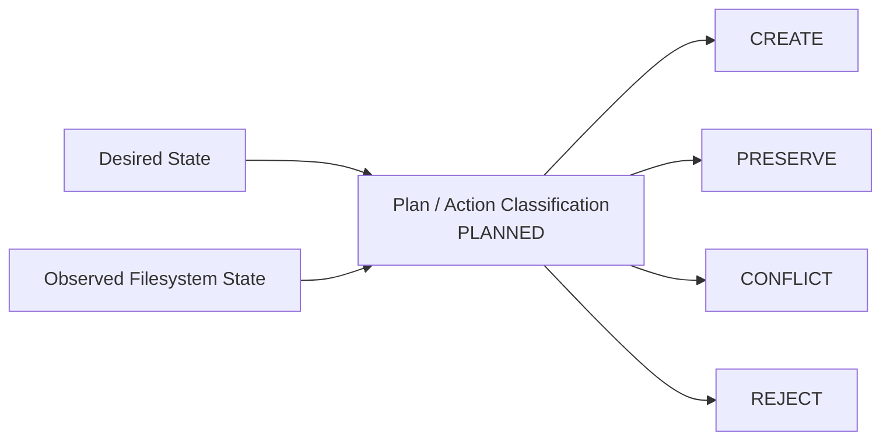

Normal provisioning is intended to create missing structure while preserving valid existing content.

---

## Planned Idempotent Lifecycle

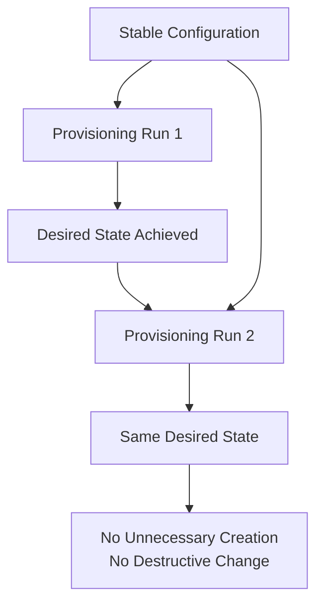

Idempotency is a core target quality attribute.

---

## Planned Testing and CI Architecture

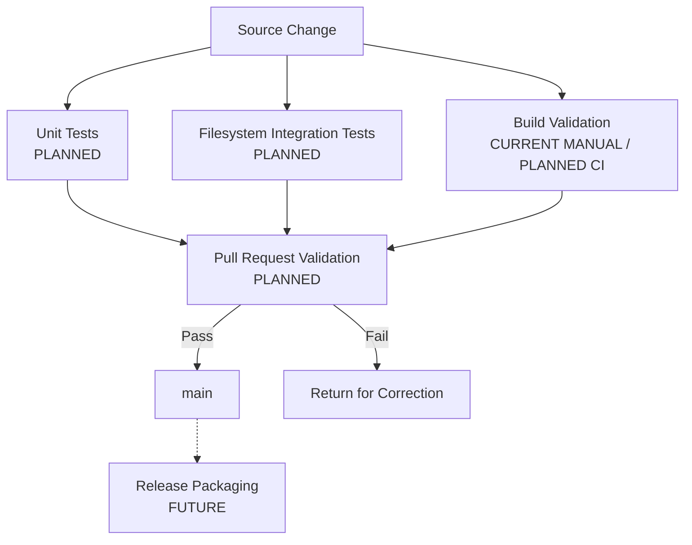

Automated tests should operate against controlled inputs and isolated temporary filesystem roots.

---

## Planned Documentation and Traceability Architecture

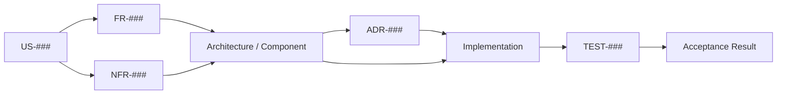

The repository documentation establishes the foundation for end-to-end traceability.

---

## Future Structured Persistence Extension

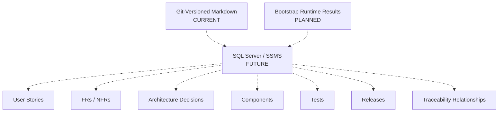

A future database may improve searchability and reporting without replacing Git-controlled Markdown as readable project documentation.

---

## Future Query and Web Layer

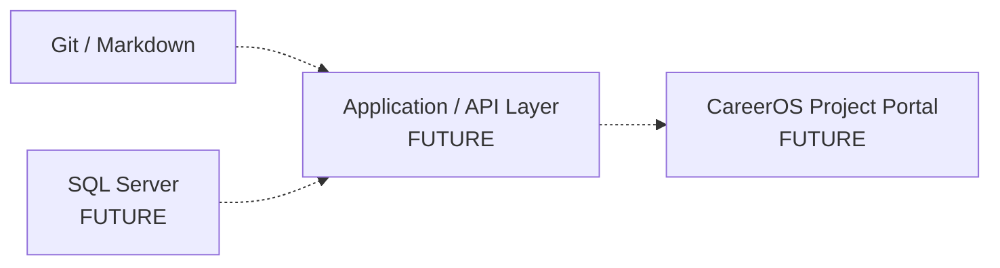

Potential future portal capabilities include requirements search, traceability navigation, diagram viewing, test coverage status, release history, and roadmap visibility.

---

## Future Deployment Evolution

```text
Development Source
      |
      v
Automated Build
      |
      v
Automated Tests
      |
      v
Versioned Package
      |
      v
GitHub Release
      |
      v
Documented User Execution
```

Potential distribution formats may include framework-dependent or self-contained .NET executables.

No distribution model is final until release requirements are formally defined.

---

## Current-to-Future Component Evolution

```text
CURRENT
├── Program.Main
├── PathService
├── JsonConfigurationService
├── TemplateResolverService
├── DirectoryPlanService
└── Configuration Models

PLANNED
├── Application Runner / Orchestrator
├── CLI Options / Request Model
├── ConfigurationValidationService
├── ValidationResult
├── ProvisioningPlan
├── ProvisioningAction
├── Existing-State Inspector
├── DirectoryProvisioningService
├── ProvisioningResult
├── ExecutionSummary
└── Reporting / Logging

FUTURE
├── Release Packaging
├── Optional Git Workspace Integration
├── SQL Server Persistence
├── Query / API Layer
└── Web / Documentation Portal
```

Future component names are conceptual until implementation decisions formally establish them.

---

## Architectural Guardrails

The future state should preserve these boundaries:

1. Configuration remains declarative and externally maintainable.
2. Person-specific logic stays out of core services.
3. Validation occurs before write-capable behavior.
4. Planning remains separate from execution.
5. Dry-run and execution consume the same validated intent where practical.
6. Existing valid user content is preserved.
7. Provisioning is idempotent.
8. Filesystem outcomes are verified.
9. Tests use isolated environments.
10. Documentation distinguishes current, planned, and future capabilities.
11. External persistence and web layers remain decoupled from the core bootstrap engine.
12. Security design precedes any remote, database, credential, or network integration.

---

## Evolution Roadmap View

```mermaid
flowchart LR
    D["Documentation Foundation<br/>CURRENT"]
    R["Requirements Foundation<br/>CURRENT"]
    T["Testing Foundation<br/>PLANNED"]
    V["Configuration Validation<br/>PLANNED"]
    P["Provisioning Plan Evolution<br/>PLANNED"]
    F["Filesystem Provisioning<br/>PLANNED"]
    L["Logging / Reporting<br/>PLANNED"]
    C["CLI Expansion<br/>PLANNED"]
    CI["CI / Release Automation<br/>PLANNED / FUTURE"]
    DB["SQL / Web Platform<br/>FUTURE"]

    D --> R
    R --> T
    T --> V
    V --> P
    P --> F
    F --> L
    L --> C
    C --> CI
    CI -.-> DB
```

This ordering is directional rather than an immutable delivery schedule.

---

## Relationship to Other Diagrams

```text
SYSTEM_CONTEXT.md
    |
    v
COMPONENT_DIAGRAM.md
    |
    v
BOOTSTRAP_PROCESS_FLOW.md
    |
    v
DATA_FLOW_DIAGRAM.md
    |
    v
FUTURE_STATE_DIAGRAM.md
```

`FUTURE_STATE_DIAGRAM.md` serves as the visual endpoint of Diagrams v1.0 by connecting the current foundation to the planned provisioning platform and longer-term CareerOS ecosystem.

---

## Summary

CareerOS.Bootstrap is intended to evolve through controlled layers rather than jumping directly from directory planning to unrestricted filesystem automation.

```text
CURRENT
Configuration-Driven Planning
        |
        v
PLANNED
Validation + Rich Planning
        |
        v
PLANNED
Safe Provisioning + Verification
        |
        v
PLANNED
Testing + CI + Releases
        |
        v
FUTURE
Structured Persistence + Web Platform
```

The future architecture remains grounded in the same principle established by the current implementation:

> **Understand, validate, plan, and verify changes before treating automation as complete.**
