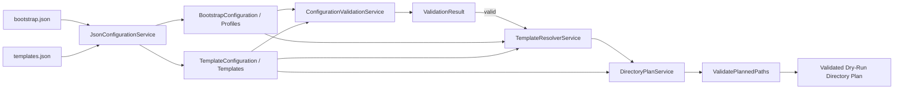

# CareerOS.Bootstrap — Configuration Reference

## Purpose

This document is the reference guide for the current `CareerOS.Bootstrap` configuration model.

It explains the role of the repository-level JSON configuration files, the strongly typed models they map to, the relationships between profiles and templates, and the configuration behaviors that are implemented today versus planned for future versions.

This reference is intended for maintainers who need to add, review, or evolve CareerOS profiles and templates without embedding person-specific directory structures in C# source code.

---

## Configuration Location

Current repository configuration is stored under:

```text
Configuration/
├── bootstrap.json
└── templates.json
```

The application discovers the repository root and then locates this repository-level `Configuration` directory.

The configuration location should not be confused with runtime output or the planned CareerOS workspace destination.

---

## Configuration Files

### `bootstrap.json`

Primary purpose:

- Defines configured CareerOS profiles.
- Associates each profile with a reusable template.
- Defines the profile-specific destination directory name used by planning logic.

Conceptual structure:

```json
{
  "profiles": [
    {
      "name": "Example User",
      "directory": "CareerOS_Example",
      "template": "CareerProfessional"
    }
  ]
}
```

The exact configured values are data and may change over time.

---

### `templates.json`

Primary purpose:

- Defines reusable CareerOS directory templates.
- Defines top-level directories for each template.
- Supports nested directory structures through recursive child nodes.

Conceptual structure:

```json
{
  "templates": [
    {
      "name": "CareerProfessional",
      "directories": [
        {
          "name": "Resume",
          "children": [
            {
              "name": "Master",
              "children": []
            }
          ]
        }
      ]
    }
  ]
}
```

Templates are intentionally separate from profiles so multiple profiles can reuse a common structure.

---

## Current Strongly Typed Models

### `BootstrapConfiguration`

Represents the root structure loaded from `bootstrap.json`.

Conceptually:

```text
BootstrapConfiguration
└── Profiles[]
```

The collection contains `ProfileConfiguration` objects.

---

### `ProfileConfiguration`

Represents one configured CareerOS profile.

Current properties:

```text
Name
Directory
Template
```

#### `Name`

Human-readable profile name.

Purpose:

- Identifies the profile in application output.
- Distinguishes one configured profile from another.

The name should not be treated as a hard-coded application identity.

#### `Directory`

Profile-specific directory name used when constructing the planned workspace path.

Purpose:

- Provides the profile root directory under the selected base path.
- Allows the physical directory name to differ from the human-readable profile name.

#### `Template`

Name of the reusable template assigned to the profile.

Purpose:

- Links profile configuration to a template defined in `templates.json`.
- Keeps reusable structure outside person-specific profile configuration.

Template resolution is case-insensitive in the current implementation.

---

### `TemplateConfiguration`

Represents the root structure loaded from `templates.json`.

Conceptually:

```text
TemplateConfiguration
└── Templates[]
```

The collection contains reusable template definitions.

---

### `CareerTemplate`

Represents one reusable directory template.

Current conceptual properties:

```text
Name
Directories[]
```

#### `Name`

Logical template name used by profile configuration.

Example:

```text
CareerProfessional
```

Profiles reference this value through `ProfileConfiguration.Template`.

#### `Directories[]`

Top-level directory nodes belonging to the template.

Each entry is represented by a `DirectoryNode`.

---

### `DirectoryNode`

Represents one directory within a template hierarchy.

Current properties:

```text
Name
Children[]
```

#### `Name`

Directory name for the current node.

#### `Children[]`

Optional nested directory nodes.

The recursive structure is:

```text
DirectoryNode
├── Name
└── Children[]
    └── DirectoryNode
        ├── Name
        └── Children[]
            └── DirectoryNode
```

This architecture avoids imposing a fixed directory depth.

---

## Profile-to-Template Relationship

The primary configuration relationship is:

```text
ProfileConfiguration.Template
            |
            v
CareerTemplate.Name
```

Conceptually:

```text
Profile
├── Name
├── Directory
└── Template ─────────────┐
                          |
                          v
                    CareerTemplate
                    ├── Name
                    └── Directories[]
```

The `TemplateResolverService` performs this lookup.

If the requested template cannot be resolved, current execution fails rather than silently selecting another template.

---

## Current Configured Template Types

The current project configuration includes reusable template categories for:

```text
CareerProfessional
HealthcareProfessional
```

These templates may share structural elements while remaining separate so they can evolve independently.

The presence of separate templates does not require separate C# service implementations.

---

## Current Multi-Profile Model

The application supports multiple configured profiles.

Conceptually:

```text
bootstrap.json
└── Profiles[]
    ├── Profile A
    │   └── Template = CareerProfessional
    │
    └── Profile B
        └── Template = HealthcareProfessional
```

Core services process configured profiles generically.

Adding another supported profile should remain a configuration change rather than requiring person-specific branching in application logic.

---

## Recursive Directory Example

A template can define structures such as:

```text
Resume
├── Master
├── RC
└── Archived
```

Conceptual JSON:

```json
{
  "name": "Resume",
  "children": [
    {
      "name": "Master",
      "children": []
    },
    {
      "name": "RC",
      "children": []
    },
    {
      "name": "Archived",
      "children": []
    }
  ]
}
```

The planner recursively processes each child node.

---

## Current Configuration Loading Behavior

Configuration is loaded by `JsonConfigurationService`.

Current behavior includes:

- File existence checking.
- Reading JSON text from disk.
- Deserialization through `System.Text.Json`.
- Case-insensitive property-name matching.
- Support for trailing commas.
- Support for JSON comments.
- Actionable failure when configuration cannot be loaded or deserialized.

No third-party JSON library is currently required.

---

## Current Configuration Discovery

`PathService` currently:

1. Starts from `AppContext.BaseDirectory`.
2. Walks upward through parent directories.
3. Detects the repository root by locating:

```text
CareerOS.Bootstrap.sln
```

4. Resolves the repository-level:

```text
Configuration/
```

directory.

This avoids hard-coding a developer-specific absolute repository path.

---

## Current Validation Coverage

Validation now has a dedicated centralized implementation boundary through
`ConfigurationValidationService`.

Current configuration validation includes:

- Required profile and template values.
- Empty required profile/template collections.
- Duplicate profile names.
- Duplicate profile destination directories.
- Duplicate template names.
- Missing template references.
- Empty directory-node names.
- Invalid Windows filesystem characters.
- Reserved Windows filesystem names.
- Duplicate sibling directory names.
- Recursive validation of nested directory nodes.

Current path-safety validation also includes:

- Fully qualified destination-root validation.
- Invalid/reserved destination path-segment rejection.
- Fully qualified planned-path validation.
- Parent-traversal escape rejection.
- Sibling-prefix escape rejection.
- Planned-path containment beneath the approved destination root.

Validation aggregates blocking errors through `ValidationResult` rather than
failing on the first semantic issue. `ValidationWarning` remains non-blocking.

Explicit configuration schema-version validation remains deferred because no
schema-version contract exists yet.

Existing-filesystem-object conflicts and reparse/symbolic-link behavior remain
future provisioning-state concerns rather than current configuration-model
validation.

---

## Planned Schema Versioning

Future configuration may include a schema version.

Conceptually:

```json
{
  "schemaVersion": 1
}
```

Potential purpose:

- Detect incompatible configuration.
- Support controlled configuration evolution.
- Provide migration guidance.
- Avoid silently interpreting unsupported structures.

Schema versioning is not currently implemented.

---

## Planned Destination Configuration

The current planner uses a logical preview base path.

Future versions are expected to support a configurable CareerOS destination root.

Potential precedence may eventually be:

```text
Command-Line Override
        |
        v
Configuration Value
        |
        v
Documented Default
```

The final precedence rules must be formally defined before implementation.

---

## Planned Execution Configuration

Future configuration or CLI options may support execution settings such as:

```text
Dry-run mode
Profile selection
Template override
Destination root override
Configuration path override
Logging options
```

Exact syntax and configuration placement are not finalized.

---

## Configuration Safety Rules

The following rules should guide configuration changes:

1. Keep profile-specific data in profile configuration.
2. Keep reusable directory structure in templates.
3. Do not duplicate large directory trees across profiles when a template can be reused.
4. Do not add person-specific branching to core application services.
5. Preserve recursive `DirectoryNode.Children` behavior.
6. Do not enable filesystem writes solely because configuration contains a path.
7. Validate future write targets before provisioning.
8. Do not store secrets in normal repository bootstrap configuration.
9. Treat configuration changes as code-adjacent changes that require review.
10. Update documentation when configuration structure changes.

---

## Adding a New Profile

Current conceptual process:

1. Open `Configuration/bootstrap.json`.
2. Add another profile object.
3. Assign:
   - `name`
   - `directory`
   - `template`
4. Ensure the referenced template exists in `templates.json`.
5. Run:

```powershell
dotnet build
```

6. Execute the application with the current project command.
7. Inspect the dry-run output.
8. Confirm the new profile resolves to the expected template.
9. Confirm recursive directory planning is correct.
10. Commit the configuration change after validation.

A new profile should not require a new C# class or service branch.

---

## Adding a New Template

Current conceptual process:

1. Open `Configuration/templates.json`.
2. Add a new template definition.
3. Assign a unique logical template name.
4. Define the top-level directory nodes.
5. Add nested `children` nodes as required.
6. Reference the template from one or more profiles.
7. Build and run the application.
8. Inspect the generated dry-run plan.
9. Confirm all nested structures are represented correctly.
10. Commit the configuration change after validation.

---

## Modifying an Existing Template

Template changes should be reviewed carefully because multiple profiles may reference the same template.

Before changing a template:

1. Identify every profile that uses it.
2. Determine whether the change should apply to all of those profiles.
3. If not, create or evolve a separate template instead of introducing profile-specific conditional logic.
4. Run the planner for affected profiles.
5. Review the resulting directory plans.
6. Update relevant requirements or documentation if the structural intent changes materially.

Future filesystem provisioning will make template changes more consequential because desired-state changes may interact with existing user workspaces.

---

## Removing Configuration

Current planning behavior does not automatically delete physical workspace content.

Future configuration removal should not imply destructive synchronization.

For example:

```text
Directory removed from template
        |
        v
Future planner notices desired-state change
        |
        v
Existing physical directory remains preserved
```

Any future destructive cleanup capability should require separate requirements, explicit user intent, safeguards, tests, and documentation.

---

## Example Profile Configuration

Illustrative only:

```json
{
  "name": "Example User",
  "directory": "CareerOS_Example",
  "template": "CareerProfessional"
}
```

Interpretation:

```text
Human-readable profile:
    Example User

Profile directory:
    CareerOS_Example

Reusable directory structure:
    CareerProfessional
```

---

## Example Template Configuration

Illustrative only:

```json
{
  "name": "CareerProfessional",
  "directories": [
    {
      "name": "Resume",
      "children": [
        {
          "name": "Master",
          "children": []
        },
        {
          "name": "Archived",
          "children": []
        }
      ]
    }
  ]
}
```

Interpretation:

```text
CareerProfessional
└── Resume
    ├── Master
    └── Archived
```

---

## Configuration-to-Application Flow



Blocking configuration validation failures stop before normal
resolution/planning. Planned-path containment is validated before a dry-run plan
is presented.

---

## Configuration Ownership Matrix

| Concern | Configuration Source | Application Responsibility |
| --- | --- | --- |
| Profile identity | `bootstrap.json` | Load and display |
| Profile directory name | `bootstrap.json` | Use during path planning |
| Profile template assignment | `bootstrap.json` | Resolve template |
| Template identity | `templates.json` | Make available for resolution |
| Top-level directories | `templates.json` | Traverse and plan |
| Nested directories | `templates.json` | Traverse recursively |
| Repository discovery | Application logic | `PathService` |
| JSON deserialization | Application logic | `JsonConfigurationService` |
| Template lookup | Application logic | `TemplateResolverService` |
| Directory planning | Application logic | `DirectoryPlanService` |
| Comprehensive configuration validation | Application logic | `ConfigurationValidationService` |
| Future provisioning | Planned application logic | Provisioning layer |

---

## Configuration Change Checklist

Before committing a configuration change:

```text
[ ] JSON remains syntactically valid.
[ ] Referenced templates exist.
[ ] Names and directory values are intentional.
[ ] Reusable structure remains in templates.
[ ] No person-specific application code was introduced.
[ ] Recursive children are structured correctly.
[ ] dotnet build succeeds.
[ ] Dry-run output is reviewed.
[ ] Existing profiles are considered for template-impact changes.
[ ] Documentation is updated if the configuration model itself changed.
```

Future versions should increasingly automate these checks.

---

## Related Documentation

```text
Documentation/References/GLOSSARY.md

Documentation/Architecture/ARCHITECTURE.md
Documentation/Architecture/CURRENT_STATE.md
Documentation/Architecture/FUTURE_STATE.md
Documentation/Architecture/COMPONENTS.md
Documentation/Architecture/DATA_FLOW.md

Documentation/Requirements/FUNCTIONAL_REQUIREMENTS.md
Documentation/Requirements/NON_FUNCTIONAL_REQUIREMENTS.md
Documentation/Requirements/TRACEABILITY.md

Documentation/Development/DEVELOPMENT_GUIDE.md
Documentation/Development/CODING_STANDARDS.md
Documentation/Development/TESTING_STRATEGY.md

Documentation/Diagrams/DATA_FLOW_DIAGRAM.md
Documentation/Diagrams/BOOTSTRAP_PROCESS_FLOW.md
```

---

## Summary

The current configuration architecture can be summarized as:

```text
bootstrap.json
     |
     +--> Profiles
     |      ├── Name
     |      ├── Directory
     |      └── Template
     |
templates.json
     |
     +--> Templates
            ├── Name
            └── Directories[]
                   |
                   └── DirectoryNode.Children[]
```

The application then performs:

```text
Load
  |
  v
Deserialize
  |
  v
Resolve
  |
  v
Traverse
  |
  v
Plan
  |
  v
Preview
```

Configuration should continue to describe **desired CareerOS structure**, while application services remain responsible for interpreting, validating, planning, and eventually provisioning that structure safely.
