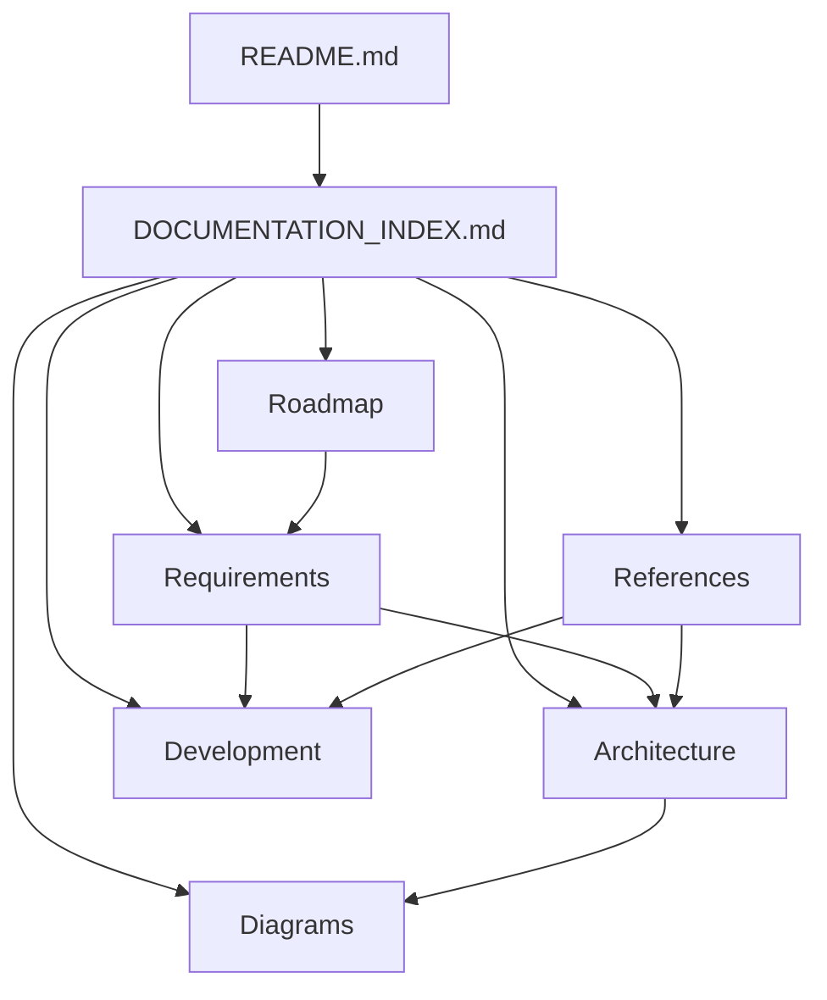

# CareerOS.Bootstrap — Documentation Index

## Purpose

This document is the primary navigation index for the `CareerOS.Bootstrap` documentation suite.

Use it to locate architecture, requirements, development guidance, diagrams, reference material, and roadmap documentation without needing to search the repository manually.

---

## Documentation Structure

```text
Documentation/
├── Architecture/
│   ├── ARCHITECTURE.md
│   ├── COMPONENTS.md
│   ├── CURRENT_STATE.md
│   ├── DATA_FLOW.md
│   └── FUTURE_STATE.md
│
├── Development/
│   ├── CODING_STANDARDS.md
│   ├── DEVELOPMENT_GUIDE.md
│   └── TESTING_STRATEGY.md
│
├── Diagrams/
│   ├── SYSTEM_CONTEXT.md
│   ├── COMPONENT_DIAGRAM.md
│   ├── BOOTSTRAP_PROCESS_FLOW.md
│   ├── DATA_FLOW_DIAGRAM.md
│   └── FUTURE_STATE_DIAGRAM.md
│
├── References/
│   ├── GLOSSARY.md
│   ├── CONFIGURATION_REFERENCE.md
│   └── DOCUMENTATION_INDEX.md
│
├── Requirements/
│   ├── USER_STORIES.md
│   ├── FUNCTIONAL_REQUIREMENTS.md
│   ├── NON_FUNCTIONAL_REQUIREMENTS.md
│   └── TRACEABILITY.md
│
└── Roadmap/
    ├── ROADMAP.md
    └── MILESTONES.md
```

The Roadmap documents are part of the planned documentation suite and may be created after this index.

---

# Quick Navigation

## I want to understand what the project is

Start with:

1. [`../../README.md`](../../README.md)
2. [`../Architecture/CURRENT_STATE.md`](../Architecture/CURRENT_STATE.md)
3. [`../Diagrams/SYSTEM_CONTEXT.md`](../Diagrams/SYSTEM_CONTEXT.md)
4. [`../Architecture/ARCHITECTURE.md`](../Architecture/ARCHITECTURE.md)

---

## I want to understand what exists today

Read:

- [`../Architecture/CURRENT_STATE.md`](../Architecture/CURRENT_STATE.md)
- [`../Architecture/COMPONENTS.md`](../Architecture/COMPONENTS.md)
- [`../Architecture/DATA_FLOW.md`](../Architecture/DATA_FLOW.md)
- [`../Diagrams/SYSTEM_CONTEXT.md`](../Diagrams/SYSTEM_CONTEXT.md)
- [`../Diagrams/COMPONENT_DIAGRAM.md`](../Diagrams/COMPONENT_DIAGRAM.md)
- [`../Diagrams/BOOTSTRAP_PROCESS_FLOW.md`](../Diagrams/BOOTSTRAP_PROCESS_FLOW.md)
- [`../Diagrams/DATA_FLOW_DIAGRAM.md`](../Diagrams/DATA_FLOW_DIAGRAM.md)

---

## I want to understand where the project is going

Read:

- [`../Architecture/FUTURE_STATE.md`](../Architecture/FUTURE_STATE.md)
- [`../Diagrams/FUTURE_STATE_DIAGRAM.md`](../Diagrams/FUTURE_STATE_DIAGRAM.md)
- [`../Requirements/USER_STORIES.md`](../Requirements/USER_STORIES.md)
- [`../Requirements/FUNCTIONAL_REQUIREMENTS.md`](../Requirements/FUNCTIONAL_REQUIREMENTS.md)
- [`../Requirements/NON_FUNCTIONAL_REQUIREMENTS.md`](../Requirements/NON_FUNCTIONAL_REQUIREMENTS.md)
- `../Roadmap/ROADMAP.md` — planned
- `../Roadmap/MILESTONES.md` — planned

---

## I want to change configuration

Read:

1. [`CONFIGURATION_REFERENCE.md`](CONFIGURATION_REFERENCE.md)
2. [`../Development/DEVELOPMENT_GUIDE.md`](../Development/DEVELOPMENT_GUIDE.md)
3. [`../Architecture/DATA_FLOW.md`](../Architecture/DATA_FLOW.md)

Also review the repository configuration files:

```text
Configuration/bootstrap.json
Configuration/templates.json
```

---

## I want to change application code

Read:

1. [`../Development/DEVELOPMENT_GUIDE.md`](../Development/DEVELOPMENT_GUIDE.md)
2. [`../Development/CODING_STANDARDS.md`](../Development/CODING_STANDARDS.md)
3. [`../Architecture/COMPONENTS.md`](../Architecture/COMPONENTS.md)
4. [`../Development/TESTING_STRATEGY.md`](../Development/TESTING_STRATEGY.md)
5. [`../Requirements/TRACEABILITY.md`](../Requirements/TRACEABILITY.md)

---

## I want to understand a project term

Use:

- [`GLOSSARY.md`](GLOSSARY.md)

---

## I want to understand requirements

Read:

1. [`../Requirements/USER_STORIES.md`](../Requirements/USER_STORIES.md)
2. [`../Requirements/FUNCTIONAL_REQUIREMENTS.md`](../Requirements/FUNCTIONAL_REQUIREMENTS.md)
3. [`../Requirements/NON_FUNCTIONAL_REQUIREMENTS.md`](../Requirements/NON_FUNCTIONAL_REQUIREMENTS.md)
4. [`../Requirements/TRACEABILITY.md`](../Requirements/TRACEABILITY.md)

---

## I want diagrams instead of long-form architecture documentation

Use:

- [`../Diagrams/SYSTEM_CONTEXT.md`](../Diagrams/SYSTEM_CONTEXT.md)
- [`../Diagrams/COMPONENT_DIAGRAM.md`](../Diagrams/COMPONENT_DIAGRAM.md)
- [`../Diagrams/BOOTSTRAP_PROCESS_FLOW.md`](../Diagrams/BOOTSTRAP_PROCESS_FLOW.md)
- [`../Diagrams/DATA_FLOW_DIAGRAM.md`](../Diagrams/DATA_FLOW_DIAGRAM.md)
- [`../Diagrams/FUTURE_STATE_DIAGRAM.md`](../Diagrams/FUTURE_STATE_DIAGRAM.md)

---

# Status Terminology

The documentation suite uses three primary status labels.

| Status | Meaning |
| --- | --- |
| **CURRENT** | Implemented or actively used today |
| **PLANNED** | Defined direction that is not yet fully implemented |
| **FUTURE** | Longer-term extension outside the current implementation commitment |

See [`GLOSSARY.md`](GLOSSARY.md) for complete terminology.

---

# Architecture Documentation

## `ARCHITECTURE.md`

**Location:** [`../Architecture/ARCHITECTURE.md`](../Architecture/ARCHITECTURE.md)

Primary architecture overview for the project.

Use this document for:

- Architectural principles.
- Repository and application structure.
- Configuration-driven design.
- Service boundaries.
- Recursive directory modeling.
- Current and planned architecture.
- Architectural constraints and guardrails.

---

## `CURRENT_STATE.md`

**Location:** [`../Architecture/CURRENT_STATE.md`](../Architecture/CURRENT_STATE.md)

Detailed description of the implemented application state.

Use this document for:

- Current repository structure.
- Current .NET application behavior.
- Existing services and models.
- Current configuration flow.
- Current dry-run behavior.
- Known current limitations.
- Distinguishing implemented functionality from planned functionality.

This is one of the most important documents to consult before claiming that a feature already exists.

---

## `FUTURE_STATE.md`

**Location:** [`../Architecture/FUTURE_STATE.md`](../Architecture/FUTURE_STATE.md)

Describes the target architectural direction.

Use this document for:

- Planned validation.
- Planned provisioning.
- Existing-state inspection.
- Idempotency.
- Verification.
- Structured execution results.
- Testing evolution.
- CI and release direction.
- Longer-term platform extensions.

Planned and future content in this document must not be interpreted as current behavior.

---

## `COMPONENTS.md`

**Location:** [`../Architecture/COMPONENTS.md`](../Architecture/COMPONENTS.md)

Component-level reference for current and planned application responsibilities.

Use this document for:

- Service responsibilities.
- Model responsibilities.
- Component relationships.
- Current versus planned components.
- Expected separation of concerns.
- Future test boundaries.

---

## `DATA_FLOW.md`

**Location:** [`../Architecture/DATA_FLOW.md`](../Architecture/DATA_FLOW.md)

Detailed explanation of how configuration and derived information move through the application.

Use this document for:

- Configuration loading.
- Profile data flow.
- Template resolution.
- Recursive directory traversal.
- Dry-run planning.
- Planned provisioning data.
- Planned result and verification flow.

---

# Development Documentation

## `DEVELOPMENT_GUIDE.md`

**Location:** [`../Development/DEVELOPMENT_GUIDE.md`](../Development/DEVELOPMENT_GUIDE.md)

Primary contributor and maintainer workflow guide.

Use this document for:

- Repository setup.
- Solution structure.
- Building the application.
- Running the application.
- Git workflow.
- Branching.
- Documentation workflow.
- Configuration changes.
- Development checkpoints.

---

## `CODING_STANDARDS.md`

**Location:** [`../Development/CODING_STANDARDS.md`](../Development/CODING_STANDARDS.md)

Coding conventions and implementation guardrails.

Use this document for:

- C# conventions.
- Naming.
- Service boundaries.
- Error handling.
- Configuration handling.
- Filesystem safety.
- Maintainability expectations.
- Documentation expectations.

---

## `TESTING_STRATEGY.md`

**Location:** [`../Development/TESTING_STRATEGY.md`](../Development/TESTING_STRATEGY.md)

Defines the intended testing approach.

Use this document for:

- Unit-test strategy.
- Integration-test strategy.
- Filesystem testing.
- Test isolation.
- Validation testing.
- Regression coverage.
- Future CI expectations.
- Requirement-to-test traceability.

Some testing capabilities described here are planned rather than implemented.

---

# Diagram Documentation

## `SYSTEM_CONTEXT.md`

**Location:** [`../Diagrams/SYSTEM_CONTEXT.md`](../Diagrams/SYSTEM_CONTEXT.md)

Highest-level system-boundary view.

Use this diagram for:

- Actors.
- Repository boundary.
- Inputs and outputs.
- Current external interactions.
- Planned workspace provisioning.
- Future SQL and web concepts.

---

## `COMPONENT_DIAGRAM.md`

**Location:** [`../Diagrams/COMPONENT_DIAGRAM.md`](../Diagrams/COMPONENT_DIAGRAM.md)

Visual component architecture.

Use this diagram for:

- Current service relationships.
- Configuration and model relationships.
- Planned application layers.
- Responsibility boundaries.
- Component evolution.

---

## `BOOTSTRAP_PROCESS_FLOW.md`

**Location:** [`../Diagrams/BOOTSTRAP_PROCESS_FLOW.md`](../Diagrams/BOOTSTRAP_PROCESS_FLOW.md)

Process-oriented view of application execution.

Use this diagram for:

- Startup flow.
- Configuration discovery.
- Loading.
- Profile iteration.
- Template resolution.
- Recursive planning.
- Dry-run output.
- Planned validation and provisioning flow.

---

## `DATA_FLOW_DIAGRAM.md`

**Location:** [`../Diagrams/DATA_FLOW_DIAGRAM.md`](../Diagrams/DATA_FLOW_DIAGRAM.md)

Visual representation of data movement.

Use this diagram for:

- JSON-to-model transformation.
- Profile and template data.
- Resolution.
- Directory planning.
- Planned provisioning actions.
- Planned execution results.

---

## `FUTURE_STATE_DIAGRAM.md`

**Location:** [`../Diagrams/FUTURE_STATE_DIAGRAM.md`](../Diagrams/FUTURE_STATE_DIAGRAM.md)

Visual target-state architecture.

Use this diagram for:

- Current-to-planned evolution.
- Safety gates.
- Idempotent provisioning.
- Testing and CI evolution.
- Traceability.
- Future SQL persistence.
- Future API and web portal concepts.

---

# Requirements Documentation

## `USER_STORIES.md`

**Location:** [`../Requirements/USER_STORIES.md`](../Requirements/USER_STORIES.md)

User- and maintainer-oriented desired outcomes.

Identifier format:

```text
US-###
```

Use this document to understand why capabilities are needed and what value they provide.

---

## `FUNCTIONAL_REQUIREMENTS.md`

**Location:** [`../Requirements/FUNCTIONAL_REQUIREMENTS.md`](../Requirements/FUNCTIONAL_REQUIREMENTS.md)

Defines system behavior requirements.

Identifier format:

```text
FR-###
```

Use this document for:

- Required application behavior.
- Current functionality.
- Planned functionality.
- Acceptance-oriented implementation guidance.

---

## `NON_FUNCTIONAL_REQUIREMENTS.md`

**Location:** [`../Requirements/NON_FUNCTIONAL_REQUIREMENTS.md`](../Requirements/NON_FUNCTIONAL_REQUIREMENTS.md)

Defines system quality attributes and constraints.

Identifier format:

```text
NFR-###
```

Use this document for:

- Safety.
- Reliability.
- Maintainability.
- Testability.
- Performance.
- Compatibility.
- Security.
- Observability.
- Documentation quality.

---

## `TRACEABILITY.md`

**Location:** [`../Requirements/TRACEABILITY.md`](../Requirements/TRACEABILITY.md)

Connects requirements to architecture, implementation, and testing.

Use this document for:

- User-story relationships.
- Functional-requirement relationships.
- Non-functional-requirement relationships.
- Architecture mappings.
- Planned test mappings.
- Identifying coverage gaps.

---

# Reference Documentation

## `GLOSSARY.md`

**Location:** [`GLOSSARY.md`](GLOSSARY.md)

Shared terminology for the project.

Use it when terminology such as the following needs clarification:

```text
CURRENT
PLANNED
FUTURE
Profile
Template
DirectoryNode
Dry Run
Provisioning
Desired State
Idempotency
Traceability
ADR
```

---

## `CONFIGURATION_REFERENCE.md`

**Location:** [`CONFIGURATION_REFERENCE.md`](CONFIGURATION_REFERENCE.md)

Primary configuration lookup guide.

Use this document for:

- `bootstrap.json`.
- `templates.json`.
- Profile properties.
- Template properties.
- Recursive directory nodes.
- Profile-to-template relationships.
- Configuration loading.
- Current validation.
- Planned validation.
- Safe configuration changes.

---

## `DOCUMENTATION_INDEX.md`

**Location:** [`DOCUMENTATION_INDEX.md`](DOCUMENTATION_INDEX.md)

This document.

Its purpose is to provide a single navigation point for the complete documentation suite.

---

# Roadmap Documentation

## `ROADMAP.md`

**Location:** [`../Roadmap/ROADMAP.md`](../Roadmap/ROADMAP.md)

Planned documentation.

Its purpose is to describe the intended evolution of `CareerOS.Bootstrap` across major capability phases while clearly distinguishing current, planned, and future work.

---

## `MILESTONES.md`

**Location:** [`../Roadmap/MILESTONES.md`](../Roadmap/MILESTONES.md)

Planned documentation.

Its purpose is to convert roadmap direction into concrete development checkpoints and completion criteria without inventing unsupported delivery dates.

---

# Repository-Level Documentation

Several important documents live outside the `Documentation/` hierarchy.

## `README.md`

**Location:** [`../../README.md`](../../README.md)

Repository landing page.

Use it for:

- Project introduction.
- High-level current state.
- Build and run instructions.
- Quick architecture orientation.
- Navigation into deeper documentation.

---

## `CHANGELOG.md`

**Location:** [`../../CHANGELOG.md`](../../CHANGELOG.md)

Version-oriented history of meaningful project changes.

Use it to record notable additions, changes, fixes, and releases as the project evolves.

---

## `.github/copilot-instructions.md`

**Location:** [`../../.github/copilot-instructions.md`](../../.github/copilot-instructions.md)

Repository-specific AI coding guidance.

Use it to maintain consistent expectations when GitHub Copilot assists with implementation.

---

## `.editorconfig`

**Location:** `../../.editorconfig`

Repository editor safeguards.

It helps normalize text formatting behavior such as encoding, line endings, and whitespace across supported editors.

---

# Documentation Relationships

The documentation suite can be viewed as a connected system:



---

# Recommended Reading Paths

## New Maintainer

```text
README.md
   |
   v
DOCUMENTATION_INDEX.md
   |
   v
CURRENT_STATE.md
   |
   v
SYSTEM_CONTEXT.md
   |
   v
ARCHITECTURE.md
   |
   v
DEVELOPMENT_GUIDE.md
   |
   v
CODING_STANDARDS.md
   |
   v
TESTING_STRATEGY.md
```

---

## Implementing a New Feature

```text
USER_STORIES.md
   |
   v
FUNCTIONAL_REQUIREMENTS.md
   |
   v
NON_FUNCTIONAL_REQUIREMENTS.md
   |
   v
TRACEABILITY.md
   |
   v
ARCHITECTURE / COMPONENTS
   |
   v
DEVELOPMENT_GUIDE
   |
   v
CODING_STANDARDS
   |
   v
TESTING_STRATEGY
```

---

## Changing Configuration

```text
CONFIGURATION_REFERENCE.md
   |
   v
DATA_FLOW.md
   |
   v
DEVELOPMENT_GUIDE.md
   |
   v
Build + Dry Run
```

---

## Planning Future Architecture

```text
CURRENT_STATE.md
   |
   v
FUTURE_STATE.md
   |
   v
FUTURE_STATE_DIAGRAM.md
   |
   v
USER_STORIES.md
   |
   v
Requirements
   |
   v
ROADMAP.md
   |
   v
MILESTONES.md
```

---

# Documentation Maintenance Rules

When implementation changes:

1. Determine whether `CURRENT_STATE.md` is affected.
2. Determine whether architecture or component responsibilities changed.
3. Update relevant diagrams when relationships or flows changed.
4. Update requirements when behavior or acceptance criteria changed.
5. Update traceability when implementation or test mappings changed.
6. Update configuration reference when configuration schema or behavior changed.
7. Update development guidance when contributor workflow changed.
8. Update roadmap status when planned capabilities become current.
9. Update the repository `README.md` when high-level behavior changes.
10. Update this index when documents are added, renamed, moved, or retired.

---

# Documentation Status Discipline

A capability must not be described as `CURRENT` merely because it appears in a roadmap, future-state diagram, requirement, or architectural plan.

Before promoting documentation from `PLANNED` to `CURRENT`, verify that the repository implementation supports the claim.

Similarly, completed implementation should not remain indefinitely described as planned.

Documentation is expected to evolve with the codebase.

---

# Traceability Identifier Reference

Current and planned identifier conventions include:

```text
US-###    User Story
FR-###    Functional Requirement
NFR-###   Non-Functional Requirement
ADR-###   Architectural Decision Record
TEST-###  Test Identifier
```

See:

- [`../Requirements/TRACEABILITY.md`](../Requirements/TRACEABILITY.md)
- [`GLOSSARY.md`](GLOSSARY.md)

---

# Documentation Source of Truth

The repository's Git-versioned Markdown documentation is the human-readable documentation source of truth for `CareerOS.Bootstrap`.

Future structured persistence, SQL Server integration, search capabilities, APIs, or web interfaces may index or expose this information, but they should not silently replace version-controlled documentation without an explicit architectural decision.

---

# Summary

Use this index as the entry point whenever the correct documentation location is unclear.

At a high level:

```text
Architecture  -> How the system is structured
Requirements  -> What the system must achieve
Development   -> How the system should be changed safely
Diagrams      -> Visual representation of structure and behavior
References    -> Lookup and navigation information
Roadmap       -> Where the project is heading
```

Together, these documents provide the working technical and product record for `CareerOS.Bootstrap`.
