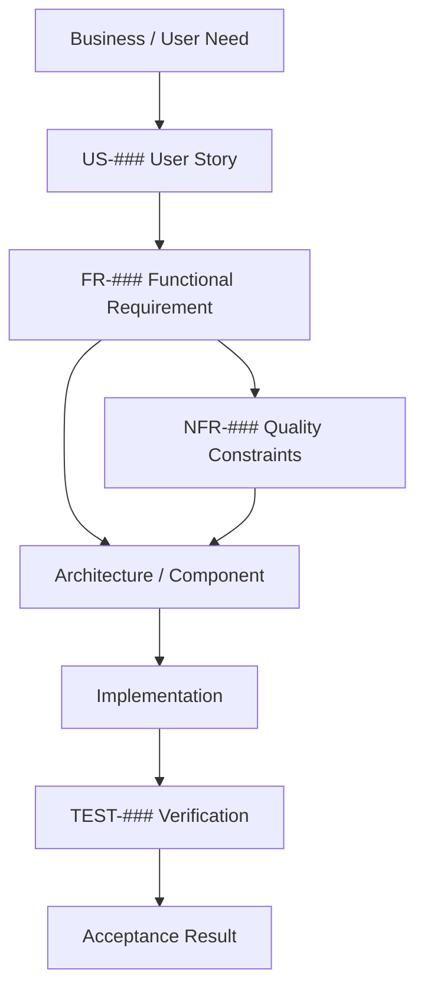

# CareerOS.Bootstrap — Requirements Traceability

## Purpose

This document maps the relationships among CareerOS.Bootstrap user stories, functional requirements, non-functional requirements, architecture/components, implementation state, and planned verification.

It is the project’s central requirements traceability matrix and is intended to evolve as implementation and automated testing mature.

Traceability uses stable identifiers:

```text
US-###   User Story
FR-###   Functional Requirement
NFR-###  Non-Functional Requirement
ADR-###  Architecture Decision Record
TEST-### Automated or Manual Verification Identifier
```

The current project has established `US-001` through `US-030`, `FR-001` through `FR-047`, and `NFR-001` through `NFR-036`.

---

## Traceability Model



Traceability is many-to-many. A user story may produce several functional requirements; a functional requirement may be constrained by several NFRs; one component may satisfy several requirements; and one test may verify more than one related requirement.

---

# Status Legend

```text
Implemented              Observable behavior is substantially present.
Partially Implemented    Some behavior exists, but acceptance is incomplete.
Planned                  Required future work has been identified.
Future                   Optional or later-direction capability.
Documentation In Progress Requirement is being established through documentation/process work.
```

Verification status:

```text
MANUAL    Currently verified manually.
PLANNED   Verification identified but not implemented.
AUTO      Automated verification exists.
CI        Automated CI verification exists.
DOC       Documentation/review verification.
```

---

# Core Requirements Traceability Matrix

| User Story | Functional Requirement(s) | Key NFR Constraints | Primary Components / Artifacts | Current State | Verification |
|---|---|---|---|---|---|
| US-001 Multiple profiles | FR-001, FR-003 | NFR-009, NFR-016 | `bootstrap.json`, `BootstrapConfiguration`, `ProfileConfiguration`, `Program` | Implemented | MANUAL; unit tests planned |
| US-002 Reusable templates | FR-002, FR-004, FR-005 | NFR-009, NFR-016 | `templates.json`, `CareerTemplate`, `TemplateResolverService` | Implemented | MANUAL; unit tests planned |
| US-003 Nested structures | FR-002, FR-006, FR-012 | NFR-009, NFR-014, NFR-018, NFR-028 | `DirectoryNode`, `DirectoryPlanService`, `templates.json` | Implemented | MANUAL; unit tests planned |
| US-004 Configuration without recompilation | FR-001, FR-002, FR-003, FR-004 | NFR-009, NFR-016 | JSON configuration and model layer | Implemented | MANUAL / DOC |
| US-005 Dynamic repository discovery | FR-007, FR-008 | NFR-011, NFR-034 | `PathService` | Implemented | MANUAL; unit tests planned |
| US-006 Configurable destination root | FR-009, FR-010 | NFR-004, NFR-012, NFR-026, NFR-031 | Future execution/configuration layer | Planned | PLANNED |
| US-007 Preview directory plan | FR-011, FR-012, FR-013, FR-014 | NFR-001, NFR-015, NFR-021, NFR-030, NFR-031 | `DirectoryPlanService`, `Program` | Implemented | MANUAL; unit tests planned |
| US-008 Explicit dry run | FR-014, FR-015, FR-026 | NFR-001, NFR-015, NFR-021, NFR-031 | Current preview; future CLI/plan model | Partially Implemented | MANUAL + PLANNED automated no-write tests |
| US-009 Pre-provision validation | FR-016, FR-017, FR-018, FR-019, FR-020 | NFR-004, NFR-008, NFR-026 | Current services; future validation service | Partial / Planned | MANUAL + PLANNED unit tests |
| US-010 Preserve existing directories | FR-021, FR-022, FR-024 | NFR-002, NFR-005, NFR-007, NFR-031 | Future provisioning service | Planned | PLANNED filesystem integration tests |
| US-011 Create missing directories | FR-021, FR-023, FR-026 | NFR-002, NFR-004, NFR-005, NFR-006, NFR-007, NFR-026, NFR-031 | Future plan/provisioning services | Planned | PLANNED integration tests |
| US-012 Safe repeat provisioning | FR-021, FR-022, FR-024, FR-042 | NFR-002, NFR-005, NFR-019 | Future provisioning + test project | Planned | PLANNED repeated-run integration test |
| US-013 Prevent automatic deletion | FR-014, FR-022, FR-025 | NFR-001, NFR-002, NFR-003, NFR-031 | Safety policy; future provisioning | Planned safety constraint | PLANNED integration/review |
| US-014 Select profile | FR-027 | NFR-016, NFR-021 | Future CLI/orchestration | Planned | PLANNED unit/integration tests |
| US-015 Template override | FR-028 | NFR-008, NFR-016, NFR-021 | Future CLI/resolution | Future | PLANNED |
| US-016 Execution summary | FR-020, FR-031, FR-032 | NFR-006, NFR-007, NFR-021, NFR-030 | `Program`; future result/summary models | Partial / Planned | MANUAL + PLANNED tests |
| US-017 Actionable errors | FR-005, FR-016, FR-017, FR-018, FR-020, FR-034, FR-035 | NFR-006, NFR-008, NFR-022 | Current exception handling; future validation/error model | Partially Implemented | MANUAL + PLANNED negative tests |
| US-018 Help/version | FR-029, FR-030 | NFR-030, NFR-032, NFR-033 | Future CLI/release layer | Planned | PLANNED |
| US-019 Logging | FR-036 | NFR-023, NFR-025 | Future logging abstraction | Planned | PLANNED |
| US-020 Action statuses | FR-013, FR-020, FR-026, FR-031, FR-032, FR-033 | NFR-006, NFR-007, NFR-021, NFR-030 | Current console; future plan/result models | Partial / Planned | MANUAL + PLANNED tests |
| US-021 Core automated tests | FR-041 | NFR-018, NFR-020, NFR-036 | Future `CareerOS.Bootstrap.Tests` | Planned | PLANNED |
| US-022 Filesystem isolation tests | FR-042 | NFR-019, NFR-002, NFR-005 | Future integration-test fixtures | Planned | PLANNED |
| US-023 Validate before merge | FR-043, FR-044 | NFR-020, NFR-034, NFR-036 | Git branches, PRs, future GitHub Actions | Partially Implemented | MANUAL; CI planned |
| US-024 Current-state documentation | FR-037 | NFR-017, NFR-035, NFR-036 | `README.md`, `CURRENT_STATE.md`, architecture docs | In Progress | DOC |
| US-025 Future-state documentation | FR-038 | NFR-017, NFR-035, NFR-036 | `FUTURE_STATE.md`, `DATA_FLOW.md`, roadmap | In Progress | DOC |
| US-026 Requirements traceability | FR-039 | NFR-017, NFR-035, NFR-036 | Requirements documents, this file | In Progress | DOC |
| US-027 Architecture decisions | FR-040 | NFR-014, NFR-017, NFR-035 | Future ADR directory | Planned | DOC planned |
| US-028 Packaged release | FR-030, FR-045 | NFR-032, NFR-033, NFR-034 | Future release pipeline | Future | PLANNED release validation |
| US-029 GitHub CI | FR-034, FR-043, FR-044 | NFR-020, NFR-033, NFR-034, NFR-036 | Future GitHub Actions | Planned | CI planned |
| US-030 Optional Git initialization | FR-046, FR-047 | NFR-027, NFR-031 | Future Git integration | Future | PLANNED |

---

# Functional Requirement Verification Matrix

The following matrix records the expected verification mechanism at the current stage. Test identifiers are reserved conceptually; concrete `TEST-###` identifiers should be assigned when the test project is created.

| FR Range | Area | Current Verification | Target Verification |
|---|---|---|---|
| FR-001–FR-006 | Configuration, profiles, templates | Manual runtime/code review | Unit tests |
| FR-007–FR-008 | Repository/configuration discovery | Manual runtime | Unit tests where practical + CI runtime/build validation |
| FR-009–FR-010 | Destination root | Not implemented | Unit tests + integration validation |
| FR-011–FR-014 | Recursive planning / preview | Manual runtime | Unit tests + dry-run no-write tests |
| FR-015 | Explicit dry-run | Partial manual behavior | Unit + integration tests |
| FR-016–FR-018 | Existing validation behavior | Manual negative tests / code review | Unit tests |
| FR-019–FR-020 | Comprehensive structured validation | Not implemented | Unit tests + integration workflow tests |
| FR-021–FR-026 | Filesystem provisioning | Not implemented | Isolated filesystem integration tests; selected unit tests |
| FR-027–FR-030 | CLI/profile/help/version | Not implemented | CLI/unit/integration tests |
| FR-031–FR-035 | Reporting/errors/exit codes | Manual runtime | Unit/integration tests |
| FR-036 | Logging | Not implemented | Unit/integration tests |
| FR-037–FR-040 | Documentation/traceability/ADRs | Documentation review | Documentation review + PR review |
| FR-041 | Unit-test foundation | Not implemented | Test runner / CI |
| FR-042 | Filesystem integration tests | Not implemented | Test runner / CI |
| FR-043 | Pre-merge validation | Manual branch/build process | PR checks + CI |
| FR-044 | GitHub CI | Not implemented | GitHub Actions |
| FR-045 | Versioned releases | Not implemented | Release pipeline validation |
| FR-046–FR-047 | Optional Git integration | Not implemented | Unit/integration tests with isolated repositories |

---

# Non-Functional Requirement Verification Matrix

| NFR Range | Quality Area | Current Verification | Target Verification |
|---|---|---|---|
| NFR-001–NFR-004 | Safety / data preservation | Manual review/runtime for preview | Automated dry-run + filesystem safety tests |
| NFR-005–NFR-007 | Reliability / idempotency | Not implemented beyond exit behavior | Repeated-run integration tests + result assertions |
| NFR-008–NFR-010 | Configuration integrity | Manual negative behavior / documentation | Validation unit tests + schema tests |
| NFR-011–NFR-013 | Portability / compatibility | Manual relocation assumptions + documentation | Build/runtime matrix where supported |
| NFR-014–NFR-017 | Maintainability / architecture/docs | Code and documentation review | PR review + ADR/documentation governance |
| NFR-018–NFR-020 | Testability / quality lifecycle | Architecture/process only | Automated tests + CI + protected merge workflow |
| NFR-021–NFR-023 | Observability / diagnostics | Manual console review | Output/result/log tests |
| NFR-024–NFR-027 | Security / privacy / Git safety | Configuration/code review | Security-focused validation + isolated Git tests |
| NFR-028–NFR-031 | Performance / usability / safe defaults | Manual interactive use | Regression checks; targeted automated tests |
| NFR-032–NFR-034 | Compatibility / release / build quality | Documentation + manual build | CI and release validation |
| NFR-035–NFR-036 | Traceability / verifiability | Documentation review | PR/documentation/test traceability review |

---

# Current Implementation Traceability

The current validated implementation primarily covers:

```text
US-001  -> FR-001, FR-003 -> BootstrapConfiguration / ProfileConfiguration / Program
US-002  -> FR-002, FR-004, FR-005 -> CareerTemplate / TemplateResolverService
US-003  -> FR-006, FR-012 -> DirectoryNode / DirectoryPlanService
US-004  -> FR-001, FR-002, FR-003, FR-004 -> JSON configuration model
US-005  -> FR-007, FR-008 -> PathService
US-007  -> FR-011, FR-012, FR-013, FR-014 -> DirectoryPlanService / Program
US-017  -> FR-034, FR-035 -> Program top-level error handling
```

Important current NFR coverage includes:

```text
NFR-001  Non-destructive preview
NFR-009  Configuration without recompilation
NFR-011  Avoid machine-specific repository paths
NFR-016  Generic multi-profile behavior
NFR-024  No core secrets required in JSON
NFR-029  Minimal external dependency use
NFR-030  Human-readable console output
NFR-035  Stable requirement identifiers
```

This mapping should be revisited whenever implementation status changes.

---

# Planned Test Traceability Convention

When the automated test project is introduced, use stable test references where useful.

Example:

```text
TEST-001  Load valid profile configuration
TEST-002  Load valid template configuration
TEST-003  Resolve template case-insensitively
TEST-004  Reject unknown template
TEST-005  Traverse nested directory tree
TEST-006  Reject empty directory node name
TEST-007  Dry-run performs no writes
TEST-008  Preserve existing directory
TEST-009  Create missing directory
TEST-010  Repeat provisioning is idempotent
```

These numbers are illustrative until the testing foundation is formally created. Do not treat them as assigned test IDs yet.

Once tests exist, each test should reference the FR/NFR it verifies where practical.

---

# Architecture Traceability

Current primary relationships:

```text
JsonConfigurationService
    -> FR-001, FR-002, FR-016
    -> NFR-008, NFR-009

PathService
    -> FR-007, FR-008
    -> NFR-011

TemplateResolverService
    -> FR-004, FR-005, FR-018
    -> NFR-008, NFR-014, NFR-016

DirectoryPlanService
    -> FR-011, FR-012, FR-014
    -> NFR-001, NFR-014, NFR-015, NFR-018

Program
    -> FR-003, FR-013, FR-031, FR-034, FR-035
    -> NFR-006, NFR-021, NFR-022, NFR-030
```

Future components should be added only when implemented or when clearly labeled as planned.

---

# Documentation Traceability

| Artifact | Primary Requirement Coverage |
|---|---|
| `README.md` | US-024, US-025; FR-037, FR-038; NFR-017 |
| `ARCHITECTURE.md` | US-024, US-025, US-027; FR-037, FR-038, FR-040 |
| `CURRENT_STATE.md` | US-024; FR-037; NFR-017 |
| `FUTURE_STATE.md` | US-025; FR-038; NFR-017 |
| `COMPONENTS.md` | US-024, US-025; FR-037, FR-038; NFR-014 |
| `DATA_FLOW.md` | US-024, US-025; FR-037, FR-038; NFR-015 |
| `USER_STORIES.md` | US-001–US-030; FR-039; NFR-035, NFR-036 |
| `FUNCTIONAL_REQUIREMENTS.md` | FR-001–FR-047; US-026; NFR-035, NFR-036 |
| `NON_FUNCTIONAL_REQUIREMENTS.md` | NFR-001–NFR-036; US-026; FR-039 |
| `TRACEABILITY.md` | US-026; FR-039; NFR-035, NFR-036 |

---

# Governance Rules

Traceability should be updated whenever:

1. A user story is added, changed, retired, or implemented.
2. A functional or non-functional requirement changes status.
3. A new service/component is introduced to satisfy a requirement.
4. An ADR changes the architecture supporting a requirement.
5. Automated tests are added or renamed.
6. A requirement is superseded or intentionally removed.
7. A release materially changes requirement coverage.

Stable IDs should be preserved whenever the conceptual requirement remains the same.

---

# Traceability Gaps at Current Stage

The following gaps are intentional and expected:

- No automated `TEST-###` catalog exists yet.
- No ADR files have been formally created yet.
- Filesystem provisioning has not been implemented.
- Comprehensive configuration validation has not been implemented.
- CI and release traceability do not yet exist.

These gaps should remain visible rather than being represented as completed work.

---

# Future SQL / Searchable Requirements Repository

A future extension may persist requirements and documentation metadata in SQL Server while retaining Markdown and source control as authoritative engineering artifacts.

Conceptual future entities may include:

```text
UserStory
FunctionalRequirement
NonFunctionalRequirement
ArchitectureDecision
Component
Document
TestCase
RequirementRelationship
ImplementationReference
Release
```

A relational model could support queries such as:

```text
Which functional requirements support US-011?
Which NFRs constrain FR-023?
Which tests verify idempotency?
Which requirements are Planned but have no test mapping?
Which components implement FR-001 through FR-006?
Which release first satisfied a requirement?
```

This could later support a local or web-based CareerOS project portal. Such a database should be treated as a derived/queryable representation unless a future ADR intentionally changes the source-of-truth model.

---

# Summary

The traceability model connects:

```text
User Need
   |
   v
US-###
   |
   v
FR-### + NFR-###
   |
   v
Architecture / Components
   |
   v
Implementation
   |
   v
Tests / Verification
   |
   v
Acceptance / Release Evidence
```

At the current stage, requirements-to-components and documentation traceability are established, while automated test and release traceability remain planned.

This document should become increasingly evidence-based as automated tests, provisioning, CI, ADRs, and releases are added.
