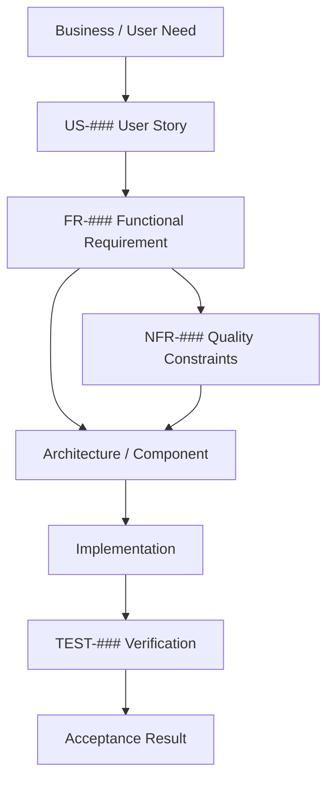

# CareerOS.Bootstrap — Requirements Traceability

## Purpose

This document maps the relationships among CareerOS.Bootstrap user stories, functional requirements, non-functional requirements, architecture/components, implementation state, and planned verification.

It is the project’s central requirements traceability matrix and evolves as implementation, automated testing, and delivery controls mature.

Traceability uses stable identifiers:

```text
US-###   User Story
FR-###   Functional Requirement
NFR-###  Non-Functional Requirement
ADR-###  Architecture Decision Record
TEST-### Automated or Manual Verification Identifier
```

The current project has established `US-001` through `US-030`, `FR-001` through `FR-047`, `NFR-001` through `NFR-036`, and an initial implemented automated verification catalog `TEST-001` through `TEST-014`.

---

## Traceability Model



Traceability is many-to-many. A user story may produce several functional requirements; a functional requirement may be constrained by several NFRs; one component may satisfy several requirements; and one test may verify more than one related requirement.

---

# Status Legend

```text
Implemented              Observable behavior is substantially present.
Partially Implemented    Some behavior exists, but acceptance is incomplete.
Planned                  Required future work has been identified.
Future                   Optional or later-direction capability.
Documentation In Progress Requirement is being established through documentation/process work.
```

Verification status:

```text
MANUAL    Currently verified manually.
PLANNED   Verification identified but not implemented.
AUTO      Automated verification exists.
CI        Automated CI verification exists.
DOC       Documentation/review verification.
```

---

# Core Requirements Traceability Matrix

| User Story | Functional Requirement(s) | Key NFR Constraints | Primary Components / Artifacts | Current State | Verification |
|---|---|---|---|---|---|
| US-001 Multiple profiles | FR-001, FR-003 | NFR-009, NFR-016 | `bootstrap.json`, `BootstrapConfiguration`, `ProfileConfiguration`, `Program` | Implemented | AUTO: TEST-001, TEST-013; MANUAL |
| US-002 Reusable templates | FR-002, FR-004, FR-005 | NFR-009, NFR-016 | `templates.json`, `CareerTemplate`, `TemplateResolverService` | Implemented | AUTO: TEST-002, TEST-003, TEST-004, TEST-013 |
| US-003 Nested structures | FR-002, FR-006, FR-012 | NFR-009, NFR-014, NFR-018, NFR-028 | `DirectoryNode`, `DirectoryPlanService`, `templates.json` | Implemented | AUTO: TEST-005, TEST-006, TEST-012 |
| US-004 Configuration without recompilation | FR-001, FR-002, FR-003, FR-004 | NFR-009, NFR-016 | JSON configuration and model layer | Implemented | MANUAL / DOC |
| US-005 Dynamic repository discovery | FR-007, FR-008 | NFR-011, NFR-034 | `PathService` | Implemented | AUTO: TEST-008, TEST-009, TEST-010, TEST-011 |
| US-006 Configurable destination root | FR-009, FR-010 | NFR-004, NFR-012, NFR-026, NFR-031 | Future execution/configuration layer | Planned | PLANNED |
| US-007 Preview directory plan | FR-011, FR-012, FR-013, FR-014 | NFR-001, NFR-015, NFR-021, NFR-030, NFR-031 | `DirectoryPlanService`, `Program` | Implemented | AUTO: TEST-005, TEST-007, TEST-012; MANUAL console review |
| US-008 Explicit dry run | FR-014, FR-015, FR-026 | NFR-001, NFR-015, NFR-021, NFR-031 | Current preview; future CLI/plan model | Partially Implemented | AUTO: TEST-007, TEST-012; MANUAL for current console flow |
| US-009 Pre-provision validation | FR-016, FR-017, FR-018, FR-019, FR-020 | NFR-004, NFR-008, NFR-026 | Current services; future validation service | Partial / Planned | AUTO for current failure behavior: TEST-004, TEST-006, TEST-009, TEST-011; broader validation PLANNED |
| US-010 Preserve existing directories | FR-021, FR-022, FR-024 | NFR-002, NFR-005, NFR-007, NFR-031 | Future provisioning service | Planned | PLANNED filesystem integration tests |
| US-011 Create missing directories | FR-021, FR-023, FR-026 | NFR-002, NFR-004, NFR-005, NFR-006, NFR-007, NFR-026, NFR-031 | Future plan/provisioning services | Planned | PLANNED integration tests |
| US-012 Safe repeat provisioning | FR-021, FR-022, FR-024, FR-042 | NFR-002, NFR-005, NFR-019 | Future provisioning + test project | Planned | PLANNED repeated-run integration test |
| US-013 Prevent automatic deletion | FR-014, FR-022, FR-025 | NFR-001, NFR-002, NFR-003, NFR-031 | Safety policy; future provisioning | Planned safety constraint | PLANNED integration/review |
| US-014 Select profile | FR-027 | NFR-016, NFR-021 | Future CLI/orchestration | Planned | PLANNED unit/integration tests |
| US-015 Template override | FR-028 | NFR-008, NFR-016, NFR-021 | Future CLI/resolution | Future | PLANNED |
| US-016 Execution summary | FR-020, FR-031, FR-032 | NFR-006, NFR-007, NFR-021, NFR-030 | `Program`; future result/summary models | Partial / Planned | MANUAL + PLANNED tests |
| US-017 Actionable errors | FR-005, FR-016, FR-017, FR-018, FR-020, FR-034, FR-035 | NFR-006, NFR-008, NFR-022 | Current exception handling; future validation/error model | Partially Implemented | AUTO negative-path coverage: TEST-004, TEST-006, TEST-009, TEST-011; MANUAL console review |
| US-018 Help/version | FR-029, FR-030 | NFR-030, NFR-032, NFR-033 | Future CLI/release layer | Planned | PLANNED |
| US-019 Logging | FR-036 | NFR-023, NFR-025 | Future logging abstraction | Planned | PLANNED |
| US-020 Action statuses | FR-013, FR-020, FR-026, FR-031, FR-032, FR-033 | NFR-006, NFR-007, NFR-021, NFR-030 | Current console; future plan/result models | Partial / Planned | MANUAL + PLANNED tests |
| US-021 Core automated tests | FR-041 | NFR-018, NFR-020, NFR-036 | `CareerOS.Bootstrap.Tests` | Implemented | AUTO: TEST-001–TEST-014; 75 passing xUnit tests at M2 checkpoint |
| US-022 Filesystem isolation tests | FR-042 | NFR-019, NFR-002, NFR-005 | `TemporaryDirectoryFixture`, integration tests | Implemented foundation | AUTO: TEST-007, TEST-012, TEST-014 |
| US-023 Validate before merge | FR-043, FR-044 | NFR-020, NFR-034, NFR-036 | Git branches, local build/test checkpoints, future GitHub Actions | Partially Implemented | MANUAL + local AUTO build/test; CI planned |
| US-024 Current-state documentation | FR-037 | NFR-017, NFR-035, NFR-036 | `README.md`, `CURRENT_STATE.md`, architecture docs | In Progress | DOC |
| US-025 Future-state documentation | FR-038 | NFR-017, NFR-035, NFR-036 | `FUTURE_STATE.md`, `DATA_FLOW.md`, roadmap | In Progress | DOC |
| US-026 Requirements traceability | FR-039 | NFR-017, NFR-035, NFR-036 | Requirements documents, this file | In Progress | DOC |
| US-027 Architecture decisions | FR-040 | NFR-014, NFR-017, NFR-035 | Future ADR directory | Planned | DOC planned |
| US-028 Packaged release | FR-030, FR-045 | NFR-032, NFR-033, NFR-034 | Future release pipeline | Future | PLANNED release validation |
| US-029 GitHub CI | FR-034, FR-043, FR-044 | NFR-020, NFR-033, NFR-034, NFR-036 | Future GitHub Actions | Planned | CI planned |
| US-030 Optional Git initialization | FR-046, FR-047 | NFR-027, NFR-031 | Future Git integration | Future | PLANNED |

---

# Functional Requirement Verification Matrix

The following matrix records the verification mechanism at the current M2 stage. Stable `TEST-###` identifiers now refer to implemented behavioral verification categories; individual xUnit methods may provide multiple cases beneath one identifier.

| FR Range | Area | Current Verification | Target Verification |
|---|---|---|---|
| FR-001–FR-006 | Configuration, profiles, templates | AUTO: TEST-001–TEST-006, TEST-012, TEST-013 | Maintain unit/integration regression coverage |
| FR-007–FR-008 | Repository/configuration discovery | AUTO: TEST-008–TEST-011 | Add CI runtime/build validation |
| FR-009–FR-010 | Destination root | Not implemented | Unit tests + integration validation when implemented |
| FR-011–FR-014 | Recursive planning / preview | AUTO: TEST-005, TEST-006, TEST-007, TEST-012, TEST-013 | Maintain dry-run/no-write regression coverage |
| FR-015 | Explicit dry-run | Partial implementation; AUTO no-write evidence: TEST-007, TEST-012 | CLI/unit/integration coverage when explicit execution mode exists |
| FR-016–FR-018 | Existing validation behavior | AUTO negative-path coverage: TEST-004, TEST-006, TEST-009, TEST-011 | Extend under centralized validation |
| FR-019–FR-020 | Comprehensive structured validation | Not implemented | Unit tests + integration workflow tests |
| FR-021–FR-026 | Filesystem provisioning | Not implemented | Isolated filesystem integration tests; selected unit tests |
| FR-027–FR-030 | CLI/profile/help/version | Not implemented | CLI/unit/integration tests |
| FR-031–FR-035 | Reporting/errors/exit codes | Manual runtime; selected exception behavior automated | Unit/integration tests as result/exit models mature |
| FR-036 | Logging | Not implemented | Unit/integration tests |
| FR-037–FR-040 | Documentation/traceability/ADRs | Documentation review | Documentation review + PR review |
| FR-041 | Unit-test foundation | Implemented | AUTO: TEST-001–TEST-014; CI planned |
| FR-042 | Filesystem integration-test foundation | Implemented for isolated current-state testing | AUTO: TEST-007, TEST-012, TEST-014; provisioning tests planned |
| FR-043 | Pre-merge validation | Local build/test/diff checkpoints on feature branch | PR checks + CI |
| FR-044 | GitHub CI | Not implemented | GitHub Actions |
| FR-045 | Versioned releases | Not implemented | Release pipeline validation |
| FR-046–FR-047 | Optional Git integration | Not implemented | Unit/integration tests with isolated repositories |

---

# Non-Functional Requirement Verification Matrix

| NFR Range | Quality Area | Current Verification | Target Verification |
|---|---|---|---|
| NFR-001–NFR-004 | Safety / data preservation | AUTO current no-write planning: TEST-007, TEST-012; provisioning safety remains future | Extend with provisioning safety tests |
| NFR-005–NFR-007 | Reliability / idempotency | Current planning behavior tested; provisioning idempotency not implemented | Repeated-run provisioning tests + result assertions |
| NFR-008–NFR-010 | Configuration integrity | AUTO configuration/resolution coverage: TEST-001–TEST-004 | Extend with centralized validation/schema tests |
| NFR-011–NFR-013 | Portability / compatibility | AUTO injectable repository discovery: TEST-008–TEST-011; manual build | Build/runtime matrix where supported |
| NFR-014–NFR-017 | Maintainability / architecture/docs | Code/documentation review plus focused service tests | PR review + ADR/documentation governance |
| NFR-018–NFR-020 | Testability / quality lifecycle | AUTO test project, isolated fixture, unit/integration suite; local build/test checkpoints | CI + protected merge workflow |
| NFR-021–NFR-023 | Observability / diagnostics | Manual console review; selected error behavior automated | Output/result/log tests |
| NFR-024–NFR-027 | Security / privacy / Git safety | Configuration/code review; fixture path containment tested in TEST-014 | Security-focused validation + isolated Git tests |
| NFR-028–NFR-031 | Performance / usability / safe defaults | Fast deterministic automated suite plus manual interactive use | Regression checks; targeted automated tests |
| NFR-032–NFR-034 | Compatibility / release / build quality | Local restore/build/test checkpoints; TEST-008–TEST-011 support repository portability | CI and release validation |
| NFR-035–NFR-036 | Traceability / verifiability | Documentation review + assigned TEST-001–TEST-014 catalog | PR/documentation/test traceability review |

---

# Current Implementation Traceability

The current validated implementation primarily covers:

```text
US-001  -> FR-001, FR-003 -> BootstrapConfiguration / ProfileConfiguration / Program
US-002  -> FR-002, FR-004, FR-005 -> CareerTemplate / TemplateResolverService
US-003  -> FR-006, FR-012 -> DirectoryNode / DirectoryPlanService
US-004  -> FR-001, FR-002, FR-003, FR-004 -> JSON configuration model
US-005  -> FR-007, FR-008 -> PathService
US-007  -> FR-011, FR-012, FR-013, FR-014 -> DirectoryPlanService / Program
US-017  -> FR-034, FR-035 -> Program top-level error handling
US-021  -> FR-041 -> CareerOS.Bootstrap.Tests
US-022  -> FR-042 -> TemporaryDirectoryFixture / BootstrapPlanningWorkflowTests
```

Important current NFR coverage includes:

```text
NFR-001  Non-destructive preview, automated no-write verification
NFR-009  Configuration without recompilation
NFR-011  Repository discovery without machine-specific hard-coding
NFR-016  Generic multi-profile behavior
NFR-018  Automated focused testability
NFR-019  Isolated filesystem test execution
NFR-020  Repeatable local build/test quality gate
NFR-024  No core secrets required in JSON
NFR-029  Minimal external dependency use
NFR-030  Human-readable console output
NFR-035  Stable requirement identifiers
NFR-036  Evidence-based requirements/test traceability
```

At the current M2 checkpoint the test project contains service tests, fixture tests, and integration/workflow tests. The suite has reached 75 passing xUnit cases with zero failures at the documented checkpoint.

This mapping should be revisited whenever implementation status changes.

---

# Automated Test Traceability Catalog

The automated testing foundation now uses stable behavioral verification identifiers. A `TEST-###` identifier represents a durable verification intent; one identifier may be implemented by multiple xUnit `[Fact]` or `[Theory]` cases.

| Test ID | Verification Intent | Primary Test Artifact(s) | Requirement Relationships | Status |
|---|---|---|---|---|
| TEST-001 | Load valid bootstrap/profile configuration, including supported JSON options and collection behavior | `JsonConfigurationServiceTests.cs` | FR-001, FR-003, FR-016; NFR-008, NFR-009 | AUTO |
| TEST-002 | Load valid recursive template configuration, including supported JSON options | `JsonConfigurationServiceTests.cs` | FR-002, FR-006, FR-016; NFR-008, NFR-009 | AUTO |
| TEST-003 | Resolve configured template names, including case-insensitive matching and correct selection | `TemplateResolverServiceTests.cs` | FR-004, FR-005; NFR-008, NFR-016 | AUTO |
| TEST-004 | Reject missing, invalid, or unknown template resolution requests | `TemplateResolverServiceTests.cs`, `BootstrapPlanningWorkflowTests.cs` | FR-005, FR-018; NFR-008 | AUTO |
| TEST-005 | Build top-level and recursive directory plans in deterministic traversal order | `DirectoryPlanServiceTests.cs` | FR-011, FR-012, FR-013; NFR-014, NFR-018 | AUTO |
| TEST-006 | Reject invalid planning inputs, including missing base paths/profile directories and unnamed directory nodes | `DirectoryPlanServiceTests.cs` | FR-016, FR-017; NFR-008, NFR-026 | AUTO |
| TEST-007 | Verify planning remains read-only and does not create planned workspace directories | `DirectoryPlanServiceTests.cs`, `BootstrapPlanningWorkflowTests.cs` | FR-014, FR-015; NFR-001, NFR-031 | AUTO |
| TEST-008 | Discover the repository root from the default or injected starting directory | `PathServiceTests.cs` | FR-007; NFR-011, NFR-034 | AUTO |
| TEST-009 | Reject repository discovery when the expected solution root cannot be found | `PathServiceTests.cs` | FR-007, FR-016; NFR-006, NFR-011 | AUTO |
| TEST-010 | Resolve the repository `Configuration` directory from default or injected roots | `PathServiceTests.cs` | FR-008; NFR-011 | AUTO |
| TEST-011 | Reject configuration-directory discovery when the directory is missing | `PathServiceTests.cs` | FR-008, FR-016; NFR-006, NFR-011 | AUTO |
| TEST-012 | Execute the current configuration-load → template-resolution → recursive-planning workflow against isolated files | `BootstrapPlanningWorkflowTests.cs` | FR-001–FR-006, FR-011–FR-014; NFR-001, NFR-018, NFR-019 | AUTO |
| TEST-013 | Execute multi-profile planning with each profile’s assigned template | `BootstrapPlanningWorkflowTests.cs` | FR-001, FR-003, FR-004, FR-011, FR-012; NFR-016 | AUTO |
| TEST-014 | Provide and verify isolated temporary filesystem fixtures, including cleanup and path-boundary protection | `TemporaryDirectoryFixture.cs`, `TemporaryDirectoryFixtureTests.cs` | FR-042; NFR-019, NFR-020, NFR-026 | AUTO |

## Test Catalog Governance

The stable identifier describes verification intent rather than an individual test method name. This allows test methods to be split, parameterized, or renamed without unnecessarily renumbering traceability.

When behavior materially changes:

1. Preserve an existing `TEST-###` identifier if the verification intent remains the same.
2. Add a new identifier when a genuinely new behavioral verification category is introduced.
3. Update this catalog when a test category is retired or superseded.
4. Keep future provisioning, CLI, CI, and release tests separate until the corresponding implementation exists.

Current automated evidence includes 75 passing xUnit cases at the M2 checkpoint. CI execution remains planned; current automated verification is executed locally through `dotnet test`.

---

# Architecture Traceability

Current primary relationships:

```text
JsonConfigurationService
    -> FR-001, FR-002, FR-016
    -> NFR-008, NFR-009

PathService
    -> FR-007, FR-008
    -> NFR-011

TemplateResolverService
    -> FR-004, FR-005, FR-018
    -> NFR-008, NFR-014, NFR-016

DirectoryPlanService
    -> FR-011, FR-012, FR-014
    -> NFR-001, NFR-014, NFR-015, NFR-018

Program
    -> FR-003, FR-013, FR-031, FR-034, FR-035
    -> NFR-006, NFR-021, NFR-022, NFR-030
```

Future components should be added only when implemented or when clearly labeled as planned.

---

# Documentation Traceability

| Artifact | Primary Requirement Coverage |
|---|---|
| `README.md` | US-024, US-025; FR-037, FR-038; NFR-017 |
| `ARCHITECTURE.md` | US-024, US-025, US-027; FR-037, FR-038, FR-040 |
| `CURRENT_STATE.md` | US-024; FR-037; NFR-017 |
| `FUTURE_STATE.md` | US-025; FR-038; NFR-017 |
| `COMPONENTS.md` | US-024, US-025; FR-037, FR-038; NFR-014 |
| `DATA_FLOW.md` | US-024, US-025; FR-037, FR-038; NFR-015 |
| `USER_STORIES.md` | US-001–US-030; FR-039; NFR-035, NFR-036 |
| `FUNCTIONAL_REQUIREMENTS.md` | FR-001–FR-047; US-026; NFR-035, NFR-036 |
| `NON_FUNCTIONAL_REQUIREMENTS.md` | NFR-001–NFR-036; US-026; FR-039 |
| `TRACEABILITY.md` | US-026; FR-039; NFR-035, NFR-036 |

---

# Governance Rules

Traceability should be updated whenever:

1. A user story is added, changed, retired, or implemented.
2. A functional or non-functional requirement changes status.
3. A new service/component is introduced to satisfy a requirement.
4. An ADR changes the architecture supporting a requirement.
5. Automated tests are added or renamed.
6. A requirement is superseded or intentionally removed.
7. A release materially changes requirement coverage.

Stable IDs should be preserved whenever the conceptual requirement remains the same.

---

# Traceability Gaps at Current Stage

The following gaps are intentional and expected:

- No ADR files have been formally created yet.
- Filesystem provisioning has not been implemented, so provisioning, preservation, deletion-safety, and idempotency tests remain planned.
- Comprehensive configuration validation has not been implemented beyond current service-level validation behavior.
- CLI-specific verification has not been implemented.
- CI and release traceability do not yet exist; automated tests currently run locally.
- Formal release-level acceptance evidence does not yet exist.

These gaps should remain visible rather than being represented as completed work.

---

# Future SQL / Searchable Requirements Repository

A future extension may persist requirements and documentation metadata in SQL Server while retaining Markdown and source control as authoritative engineering artifacts.

Conceptual future entities may include:

```text
UserStory
FunctionalRequirement
NonFunctionalRequirement
ArchitectureDecision
Component
Document
TestCase
RequirementRelationship
ImplementationReference
Release
```

A relational model could support queries such as:

```text
Which functional requirements support US-011?
Which NFRs constrain FR-023?
Which tests verify idempotency?
Which requirements are Planned but have no test mapping?
Which components implement FR-001 through FR-006?
Which release first satisfied a requirement?
```

This could later support a local or web-based CareerOS project portal. Such a database should be treated as a derived/queryable representation unless a future ADR intentionally changes the source-of-truth model.

---

# Summary

The traceability model connects:

```text
User Need
   |
   v
US-###
   |
   v
FR-### + NFR-###
   |
   v
Architecture / Components
   |
   v
Implementation
   |
   v
Tests / Verification
   |
   v
Acceptance / Release Evidence
```

At the current M2 stage, requirements-to-components, documentation, and automated test traceability are established for the implemented planning foundation. Provisioning, CI, ADR, and release traceability remain intentionally future-facing.

This document should continue becoming increasingly evidence-based as validation, provisioning, CI, ADRs, and releases are added.
