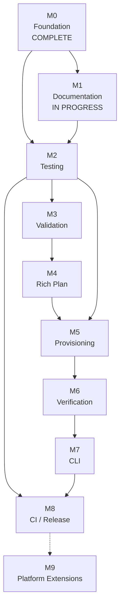

# CareerOS.Bootstrap — Milestones

## Purpose

This document converts the direction established in `ROADMAP.md` into concrete, reviewable development milestones for `CareerOS.Bootstrap`.

Milestones are capability-based rather than date-based. A milestone is complete only when its implementation, verification, documentation, and Git checkpoint criteria are satisfied.

This document intentionally avoids assigning delivery dates that have not been formally established.

---

## Status Model

- **COMPLETE** — milestone outcomes are implemented and checkpointed.
- **IN PROGRESS** — milestone work has started but completion criteria are not fully satisfied.
- **PLANNED** — milestone is intentionally defined but implementation has not yet started.
- **FUTURE** — longer-term extension outside the current implementation commitment.

Milestone status should reflect repository evidence rather than intention alone.

---

# Milestone Overview

| Milestone | Capability | Status |
| --- | --- | --- |
| M0 | Bootstrap application foundation | COMPLETE |
| M1 | Documentation and design baseline | COMPLETE |
| M2 | Automated testing foundation | IN PROGRESS |
| M3 | Comprehensive validation | PLANNED |
| M4 | Rich provisioning plan | PLANNED |
| M5 | Safe filesystem provisioning | PLANNED |
| M6 | Verification and structured results | PLANNED |
| M7 | CLI and operational maturity | PLANNED |
| M8 | CI and release maturity | PLANNED |
| M9 | CareerOS platform extensions | FUTURE |

---

# M0 — Bootstrap Application Foundation

**Status:** COMPLETE

## Goal

Establish a working .NET 8 application that can load reusable configuration and generate read-only CareerOS directory plans for multiple profiles.

## Delivered Capabilities

- .NET 8 console application.
- Explicit application entry point.
- Repository-root discovery.
- Repository-level configuration discovery.
- JSON configuration loading.
- Strongly typed configuration models.
- Multi-profile configuration.
- Reusable profile-to-template assignment.
- Recursive directory templates.
- Case-insensitive template resolution.
- Recursive directory planning.
- Read-only dry-run output.
- Top-level error handling.
- Git-based development workflow.

## Completion Evidence

```text
Application restores successfully.
Application builds successfully.
Configured profiles can be loaded.
Assigned templates can be resolved.
Nested directory structures can be planned.
No CareerOS workspace provisioning occurs during normal current execution.
```

## Milestone Outcome

The repository has a safe planning foundation on which later validation and provisioning behavior can be built.

---

# M1 — Documentation and Design Baseline

**Status:** COMPLETE

## Goal

Establish a comprehensive, version-controlled technical baseline before increasing application responsibility.

## Required Documentation

### Architecture

```text
ARCHITECTURE.md
CURRENT_STATE.md
FUTURE_STATE.md
COMPONENTS.md
DATA_FLOW.md
```

### Development

```text
DEVELOPMENT_GUIDE.md
CODING_STANDARDS.md
TESTING_STRATEGY.md
```

### Requirements

```text
USER_STORIES.md
FUNCTIONAL_REQUIREMENTS.md
NON_FUNCTIONAL_REQUIREMENTS.md
TRACEABILITY.md
```

### Diagrams

```text
SYSTEM_CONTEXT.md
COMPONENT_DIAGRAM.md
BOOTSTRAP_PROCESS_FLOW.md
DATA_FLOW_DIAGRAM.md
FUTURE_STATE_DIAGRAM.md
```

### References

```text
GLOSSARY.md
CONFIGURATION_REFERENCE.md
DOCUMENTATION_INDEX.md
```

### Roadmap

```text
ROADMAP.md
MILESTONES.md
```

## Repository Safeguards

- `.editorconfig` established.
- Markdown stored as UTF-8.
- Mermaid fences compatible with GitHub rendering.
- Unicode diagram characters verified.
- Documentation changes reviewed through a feature branch.
- Git checkpoints used throughout documentation development.

## Completion Evidence

```text
[x] ROADMAP.md is in place.
[x] MILESTONES.md is in place.
[x] git diff --check passed.
[x] dotnet build passed.
[x] Staged documentation inventory was reviewed.
[x] References and Roadmap documentation were committed coherently.
[x] Documentation feature branch was pushed.
[x] Markdown and Mermaid rendering were verified on GitHub.
[x] Documentation navigation and cross-links were recursively audited.
[x] Documentation working tree was clean before merge.
[x] Documentation v1 baseline was merged into main.
```

The documentation baseline was merged into `main` with merge commit `f994440`.

## Exit Criteria

M1 is complete when the documentation baseline is version-controlled, reviewable, internally navigable, and synchronized with the current application state.

---

# M2 — Automated Testing Foundation

**Status:** IN PROGRESS

## Goal

Protect current behavior with automated tests before introducing significant filesystem write capability.

## Implemented Test Architecture

A dedicated .NET 8 xUnit test project is now included in the solution.

Current structure:

```text
CareerOS.Bootstrap.Tests/
├── Fixtures/
│   ├── TemporaryDirectoryFixture.cs
│   └── TemporaryDirectoryFixtureTests.cs
│
├── Integration/
│   └── BootstrapPlanningWorkflowTests.cs
│
├── Services/
│   ├── DirectoryPlanServiceTests.cs
│   ├── JsonConfigurationServiceTests.cs
│   ├── PathServiceTests.cs
│   └── TemplateResolverServiceTests.cs
│
└── CareerOS.Bootstrap.Tests.csproj
```

A `Models/` test directory was intentionally not created because the current models are simple DTOs without independent business behavior that warrants dedicated tests.

### `PathService` Coverage

Implemented coverage:

```text
Repository-root discovery
Configuration-directory discovery
Expected failure behavior
```

### `JsonConfigurationService` Coverage

Implemented coverage:

```text
Valid configuration
Missing file
Malformed JSON
Deserialization failure
Supported JSON options
```

### `TemplateResolverService` Coverage

Implemented coverage:

```text
Exact template match
Case-insensitive match
Unknown template
Empty template name
Null or invalid input where applicable
```

### `DirectoryPlanService` Coverage

Implemented coverage:

```text
Single directory
Multiple directories
Nested directories
Deep recursion
Empty child collections
Invalid node names
Path construction
```

### Integration Fixtures

`TemporaryDirectoryFixture` now provides isolated temporary directories and files for filesystem-dependent tests.

The fixture itself is tested for:

```text
Unique temporary roots
Nested directory creation
UTF-8 file creation
Path-boundary protection
Recursive cleanup
Idempotent disposal
Disposed-object protection
```

Current integration tests use isolated temporary locations and do not target a real CareerOS workspace.

### Workflow Integration Coverage

`BootstrapPlanningWorkflowTests` currently verifies:

```text
Configuration load
Template resolution
Recursive planning
Multiple profiles using assigned templates
Unknown-template failure
Dry-run/no-write behavior
```

The workflow intentionally stops at planning because filesystem provisioning has not yet been implemented.

### PathService Testability Seam

`PathService` retains its default `AppContext.BaseDirectory` runtime behavior and now also accepts an injected starting directory.

This small production seam enables isolated tests for:

```text
Repository-root discovery
Missing repository root
Configuration-directory discovery
Missing Configuration directory
Nested starting directories
```

without renaming or manipulating the real repository.

## Completion Criteria

```text
[x] Test project exists and is included in the solution.
[x] Current core services have meaningful automated coverage.
[x] Recursive planning has regression tests.
[x] Configuration failure cases are tested.
[x] Tests are repeatable.
[x] Filesystem-related tests use isolated temporary locations.
[x] dotnet test succeeds.
[x] dotnet build succeeds.
[x] Testing documentation reflects the implemented test architecture.
[x] Traceability is updated with implemented test mappings.
[x] Changes are committed and pushed through a reviewable branch.
```

## Current M2 Evidence

```text
Branch: test/automated-testing-foundation

Automated test framework: xUnit
Target framework: .NET 8

Current automated result:
75 total
75 passed
0 failed
0 skipped

Stable automated verification catalog:
TEST-001 through TEST-014

Implemented checkpoints:
bf21208  test: add service unit test foundation
b4e5b52  test: add fixture and integration test foundation
f67b85a  test: improve path service failure-path coverage
```

## Remaining M2 Closeout

The functional testing foundation is implemented. Remaining work is milestone closeout rather than additional test-volume work:

```text
[x] Synchronize TRACEABILITY.md with TEST-001 through TEST-014.
[x] Synchronize TESTING_STRATEGY.md with the implemented architecture.
[x] Synchronize MILESTONES.md with repository evidence.
[ ] Review whether ROADMAP.md requires an M2 status synchronization update.
[ ] Run final documentation and test validation.
[ ] Commit and push the M2 documentation synchronization.
[ ] Review the complete feature-branch diff against main.
[ ] Merge the completed M2 branch when review is clean.
```

CI, provisioning safety/idempotency tests, centralized validation tests, CLI tests, and release automation remain future work because their corresponding production capabilities are not yet implemented.

## Exit Condition

Current read-only planning behavior is protected sufficiently to support safe architectural evolution.

The technical exit condition is satisfied by the implemented automated suite. M2 remains `IN PROGRESS` until the documentation synchronization, final branch review, and merge closeout are complete.

---

# M3 — Comprehensive Validation

**Status:** PLANNED

## Goal

Create a centralized validation boundary that rejects invalid configuration and unsafe execution requests before provisioning can occur.

## Required Capabilities

Potential validation responsibilities include:

```text
Required profile values
Required template values
Duplicate profile names
Duplicate destination directories
Duplicate template names
Unknown template references
Invalid directory-node names
Duplicate sibling directory names
Invalid filesystem characters
Reserved filesystem names
Invalid destination roots
Unsafe path relationships
Unsupported schema versions
```

## Planned Design Work

Determine and document:

- Validation service boundaries.
- Validation result model.
- Error versus warning behavior.
- Whether validation aggregates failures or fails immediately.
- Configuration schema-version strategy.
- Path-safety rules.
- User-facing validation output.

## Completion Criteria

```text
[ ] Validation architecture is implemented.
[ ] Configuration is validated before planning proceeds where required.
[ ] Write-capable execution cannot bypass blocking validation.
[ ] Duplicate and missing-reference scenarios are tested.
[ ] Filesystem naming constraints are tested.
[ ] Destination-root safety is tested.
[ ] Validation failures produce actionable messages.
[ ] Requirements are updated if implementation decisions refine behavior.
[ ] Architecture and diagrams reflect actual validation flow.
[ ] Automated tests pass.
[ ] Build passes.
[ ] Changes are committed and pushed.
```

## Exit Condition

The application has a dependable safety gate between external configuration and future filesystem writes.

---

# M4 — Rich Provisioning Plan

**Status:** PLANNED

## Goal

Replace or extend the current path-only plan with a structured desired-state plan that can safely drive both preview and future execution.

## Required Capabilities

Introduce a model capable of representing:

```text
Target path
Desired state
Observed current state
Proposed action
Reason
Warnings or conflicts
```

Potential action classifications include:

```text
CREATE
PRESERVE
SKIP
CONFLICT
REJECT
```

Final terminology must be defined by implementation.

## Existing-State Inspection

The application should inspect target paths without changing them.

It should distinguish:

- Missing directory.
- Existing expected directory.
- Conflicting file or object.
- Invalid target.
- Unsafe target.

## Dry-Run Upgrade

Dry-run should render the same structured intent that would later be consumed by provisioning.

This reduces the risk of preview logic diverging from execution logic.

## Completion Criteria

```text
[ ] Structured provisioning-plan model exists.
[ ] Existing filesystem state can be inspected safely.
[ ] Desired and current state can be compared.
[ ] Actions are classified consistently.
[ ] Dry-run renders structured actions.
[ ] Conflicts are represented without performing writes.
[ ] Existing valid directories are recognized as preserved.
[ ] Unit tests cover action classification.
[ ] Integration tests cover controlled filesystem states.
[ ] Requirements, architecture, data flow, and diagrams are updated.
[ ] Build and tests pass.
[ ] Changes are committed and pushed.
```

## Exit Condition

The application can explain exactly what it intends to do before it is allowed to do it.

---

# M5 — Safe Filesystem Provisioning

**Status:** PLANNED

## Goal

Enable explicit, controlled creation of missing CareerOS directory structure.

## Required Safety Model

Provisioning must be separated from preview behavior.

Conceptually:

```text
Validated Configuration
        |
        v
Provisioning Plan
        |
        v
Explicit Execution Intent
       / \
      /   \
     v     v
Preview   Provision
```

## Required Behavior

Provisioning should:

- Create missing directories.
- Preserve existing expected directories.
- Reject unsafe paths.
- Stop or report conflicts according to defined policy.
- Remain under the approved destination root.
- Avoid deleting user content.
- Avoid replacing existing content implicitly.
- Be idempotent.

## Explicit Non-Goal

Normal provisioning must not interpret configuration removal as permission to delete existing filesystem content.

## Completion Criteria

```text
[ ] Provisioning requires explicit intent.
[ ] Dry-run remains available.
[ ] Missing directories can be created.
[ ] Existing expected directories are preserved.
[ ] Conflicting filesystem objects are handled safely.
[ ] Path escape attempts are rejected.
[ ] Repeated execution is idempotent.
[ ] No implicit destructive synchronization exists.
[ ] Filesystem integration tests cover creation and preservation.
[ ] Failure scenarios are tested.
[ ] Requirements and safety documentation are updated.
[ ] Build and tests pass.
[ ] Changes are committed and pushed.
```

## Exit Condition

CareerOS workspaces can be provisioned without sacrificing the project's safety-first design.

---

# M6 — Verification and Structured Results

**Status:** PLANNED

## Goal

Verify filesystem outcomes and expose structured execution results suitable for humans, scripts, tests, and future integrations.

## Required Capabilities

### Verification

After provisioning, verify expected state.

Potential checks:

```text
Expected directory exists
Filesystem object type is correct
Resulting path remains within approved root
Completed action matches planned action
```

### Structured Result

Introduce an execution result that can represent:

```text
Success / failure
Selected profile
Destination
Planned actions
Completed actions
Preserved actions
Warnings
Errors
Verification results
```

### Logging

Add an appropriate logging strategy for:

- Startup.
- Configuration source.
- Selected execution mode.
- Validation.
- Planning.
- Provisioning.
- Verification.
- Completion.
- Failure.

### Exit Codes

Define predictable process exit codes for automation.

## Completion Criteria

```text
[ ] Provisioning outcomes are verified.
[ ] Verification failures are distinguishable from provisioning failures.
[ ] Structured execution result exists.
[ ] Console output derives from structured results where practical.
[ ] Logging strategy is implemented and documented.
[ ] Exit codes are defined and tested.
[ ] Sensitive information is not unnecessarily logged.
[ ] Automated tests cover verification and result behavior.
[ ] Documentation and diagrams are updated.
[ ] Build and tests pass.
[ ] Changes are committed and pushed.
```

## Exit Condition

The application can prove and communicate what happened rather than assuming execution success.

---

# M7 — CLI and Operational Maturity

**Status:** PLANNED

## Goal

Turn the bootstrap engine into a predictable command-line utility suitable for normal use and controlled automation.

## Potential CLI Surface

Final syntax is not yet defined, but capabilities may include:

```text
--profile
--dry-run
--provision
--destination
--config
--verbose
--help
--version
```

## Required Decisions

Define:

- Default execution mode.
- Profile-selection behavior.
- Multi-profile behavior.
- Destination precedence.
- Configuration override behavior.
- Help and usage output.
- Invalid argument handling.
- Exit-code behavior.
- Logging verbosity.

## Completion Criteria

```text
[ ] CLI contract is documented.
[ ] Dry-run versus provisioning intent is explicit.
[ ] Profile selection is supported.
[ ] Invalid options fail clearly.
[ ] Help output is available.
[ ] Version output is available if required.
[ ] Destination overrides are validated.
[ ] Configuration overrides are validated if supported.
[ ] CLI behavior has automated tests.
[ ] Development and configuration references are updated.
[ ] Build and tests pass.
[ ] Changes are committed and pushed.
```

## Exit Condition

Users can invoke the application intentionally and predictably without relying on development-stage assumptions.

---

# M8 — CI and Release Maturity

**Status:** PLANNED

## Goal

Automate quality gates and establish a reproducible release process.

## Continuous Integration

Expected automated checks may include:

```text
Restore
Build
Unit Tests
Integration Tests
Static / Formatting Checks
Documentation Checks
```

## Repository Controls

Evaluate:

- Pull-request requirements.
- Protected `main`.
- Required build checks.
- Required test checks.
- Review requirements.
- Release tagging.

## Packaging

Choose and document an appropriate distribution model.

Potential options:

```text
Framework-dependent executable
Self-contained executable
Platform-specific package
```

## Versioning

Adopt a formal versioning approach before public or repeatable releases.

## Completion Criteria

```text
[ ] CI runs automatically for relevant repository changes.
[ ] Build failures block integration where configured.
[ ] Test failures block integration where configured.
[ ] Release packaging is reproducible.
[ ] Versioning strategy is documented.
[ ] Release notes / changelog process is defined.
[ ] Clean-environment release validation succeeds.
[ ] Installation or execution instructions are documented.
[ ] Repository documentation reflects release behavior.
[ ] A release can be produced from a known commit.
```

## Exit Condition

The project can be built, tested, packaged, and released through a repeatable repository-driven process.

---

# M9 — CareerOS Platform Extensions

**Status:** FUTURE

## Goal

Explore capabilities beyond the focused bootstrap utility after the core application is mature.

M9 is intentionally broad and should be decomposed into separate milestones if future work becomes committed.

---

## M9.1 — Structured Persistence

Potential SQL Server-backed project data may include:

```text
Projects
Profiles
Templates
Requirements
User Stories
Architecture Decisions
Components
Tests
Releases
Execution History
Traceability Relationships
```

### Entry Conditions

Do not begin solely because a database is technically possible.

A concrete query, reporting, persistence, or integration requirement should justify the work.

---

## M9.2 — Search and Query Layer

Potential capabilities:

- Requirements search.
- Traceability queries.
- Test-coverage queries.
- Release-history queries.
- Documentation metadata search.
- Profile and template queries.

---

## M9.3 — API Layer

Potential API responsibilities:

- Read structured CareerOS metadata.
- Expose documentation relationships.
- Expose roadmap and release information.
- Support future web consumers.

The API should remain decoupled from core bootstrap filesystem logic.

---

## M9.4 — CareerOS Web Portal

Potential portal capabilities:

```text
Documentation navigation
Requirements search
Traceability visualization
Architecture diagrams
Roadmap status
Test status
Release history
Configuration reference
Project dashboards
```

---

## M9.5 — Additional Integrations

Potential integrations may include:

- Git/GitHub automation.
- Document indexing.
- Reporting services.
- Search services.
- Additional CareerOS applications.

Each integration should have its own requirements and architecture review.

---

# Milestone Dependency Map



---

# Standard Milestone Checkpoint

Before marking an implementation milestone complete, perform the applicable repository checks.

Typical local checkpoint:

```powershell
git status
git diff --check
dotnet build
dotnet test
```

`dotnet test` becomes meaningful once the automated test project exists.

Before committing:

```powershell
git add <intended-files>
git diff --cached --check
git diff --cached --stat
git diff --cached --name-status
git status
```

Then commit with a message representing the completed unit of work.

After committing:

```powershell
git push
git status
git log --oneline -5
```

The exact commands may evolve with the repository workflow.

---

# Milestone Review Questions

Before declaring a milestone complete, ask:

1. Does the implementation actually exist?
2. Does the solution build?
3. Do applicable automated tests pass?
4. Are unsafe paths or failure scenarios tested?
5. Does documentation describe current behavior accurately?
6. Have planned items been distinguished from current items?
7. Are diagrams still accurate?
8. Are requirements and traceability updated?
9. Is configuration reference material still correct?
10. Is the change isolated in coherent commits?
11. Is the remote branch synchronized?
12. Is the working tree clean?

A milestone should remain open when important answers are no.

---

# Documentation Promotion Rule

When a planned capability becomes implemented:

```text
PLANNED
   |
   v
Implementation
   |
   v
Tests / Verification
   |
   v
Documentation Update
   |
   v
Checkpoint
   |
   v
CURRENT
```

Documentation status should not be promoted before implementation evidence exists.

---

# Milestone Change Control

Milestones may evolve as implementation reveals better technical boundaries.

When changing milestone scope:

- Preserve the reason for the change.
- Update `ROADMAP.md` if strategic sequencing changes.
- Update requirements if behavior changes.
- Update architecture if component boundaries change.
- Avoid silently removing safety requirements.
- Avoid marking deferred work complete.
- Split oversized milestones when independent delivery becomes clearer.

---

# Immediate Next Milestone Transition

After the documentation baseline is completed and safely merged, the preferred next implementation milestone is:

```text
M2 — Automated Testing Foundation
```

This sequencing intentionally places regression protection before the application gains meaningful filesystem write capability.

The expected progression is:

```text
Documentation Baseline
        |
        v
Automated Tests
        |
        v
Validation
        |
        v
Structured Planning
        |
        v
Provisioning
```

---

# Summary

The milestone sequence is designed to increase application capability without increasing risk faster than the project's testing, validation, and documentation can support.

```text
M0  Foundation                 COMPLETE
M1  Documentation              IN PROGRESS
M2  Automated Testing          PLANNED
M3  Validation                 PLANNED
M4  Rich Provisioning Plan     PLANNED
M5  Filesystem Provisioning    PLANNED
M6  Verification / Results     PLANNED
M7  CLI Maturity               PLANNED
M8  CI / Releases              PLANNED
M9  Platform Extensions        FUTURE
```

The central progression remains:

> **Understand → Test → Validate → Plan → Execute deliberately → Verify.**
