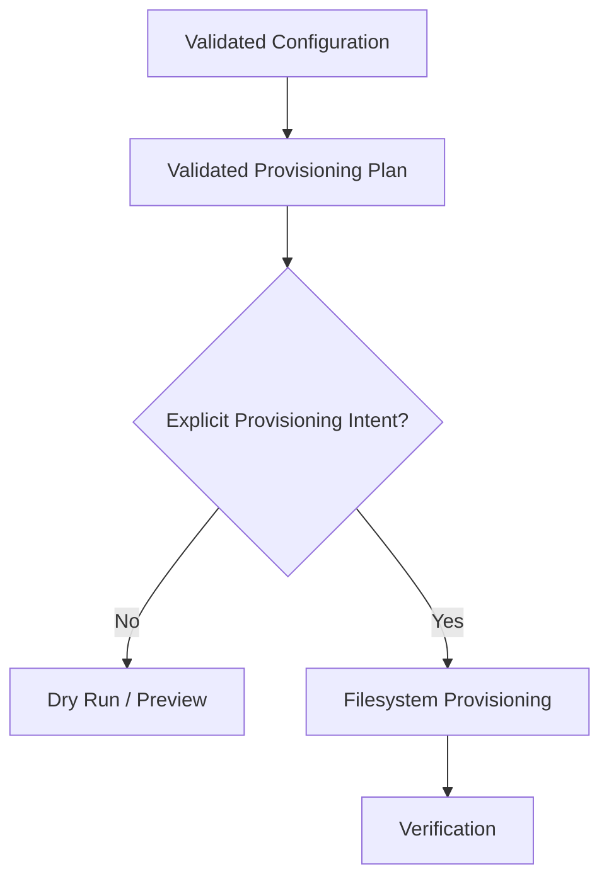
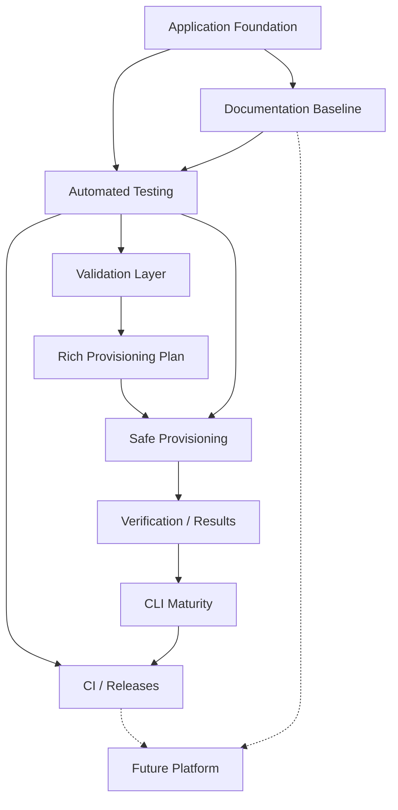

# CareerOS.Bootstrap — Roadmap

## Purpose

This roadmap defines the intended evolution of `CareerOS.Bootstrap` from its current configuration-driven, read-only planning foundation into a safe, validated, testable, and maintainable CareerOS workspace provisioning utility.

The roadmap also identifies longer-term extension opportunities without presenting them as committed implementation.

This document is directional rather than date-driven. Detailed completion checkpoints belong in `MILESTONES.md`.

---

## Status Model

Roadmap items use three primary states:

- **CURRENT** — implemented or actively used.
- **PLANNED** — intentionally identified for implementation but not yet fully implemented.
- **FUTURE** — longer-term extension outside the current implementation commitment.

A roadmap item must not be treated as implemented merely because it appears in this document.

---

# Roadmap Principles

Project evolution should continue to follow these principles:

1. Preserve a working build at meaningful checkpoints.
2. Keep configuration declarative and reusable.
3. Avoid person-specific branching in core services.
4. Separate planning from execution.
5. Validate before enabling write-capable behavior.
6. Preserve existing valid user content.
7. Design provisioning to be idempotent.
8. Verify filesystem outcomes after writes.
9. Introduce automated tests before filesystem behavior becomes more complex.
10. Keep documentation synchronized with implementation.
11. Use feature branches and reviewable commits for meaningful changes.
12. Treat future database and web capabilities as extensions rather than prerequisites for the bootstrap engine.

---

# Roadmap Overview

```mermaid
flowchart LR
    P0["Phase 0<br/>Foundation<br/>CURRENT"]
    P1["Phase 1<br/>Documentation Baseline<br/>CURRENT"]
    P2["Phase 2<br/>Automated Testing<br/>CURRENT"]
    P3["Phase 3<br/>Validation<br/>COMPLETE"]
    P4["Phase 4<br/>Provisioning Plan<br/>CURRENT"]
    P5["Phase 5<br/>Filesystem Provisioning<br/>PLANNED"]
    P6["Phase 6<br/>Verification + Reporting<br/>PLANNED"]
    P7["Phase 7<br/>CLI + Operational Maturity<br/>PLANNED"]
    P8["Phase 8<br/>CI + Release<br/>PLANNED"]
    P9["Phase 9<br/>CareerOS Platform Extensions<br/>FUTURE"]

    P0 --> P1
    P1 --> P2
    P2 --> P3
    P3 --> P4
    P4 --> P5
    P5 --> P6
    P6 --> P7
    P7 --> P8
    P8 -.-> P9
```



The ordering represents the preferred dependency direction. Some low-risk work may overlap when it does not compromise safety or clarity.

---

# Phase 0 — Application Foundation

**Status:** CURRENT

## Objective

Establish a configuration-driven .NET application capable of loading multiple profiles and reusable templates and producing a read-only preview of intended CareerOS directory structures.

## Current Foundation

The project currently includes:

- .NET 8 console application.
- Explicit application entry point.
- Repository-root discovery.
- Repository-level JSON configuration.
- Strongly typed configuration models.
- Multiple profile support.
- Reusable templates.
- Recursive directory-node structures.
- Template resolution.
- Recursive directory planning.
- Read-only dry-run output.
- Top-level exception handling.
- Git repository and `main` branch.
- Feature/documentation branch workflow.

## Current Core Components

```text
Program.Main
PathService
JsonConfigurationService
TemplateResolverService
DirectoryPlanService

BootstrapConfiguration
ProfileConfiguration
TemplateConfiguration
DirectoryNode
```

## Foundation Outcome

The application can understand configured CareerOS structure without modifying a user's CareerOS workspace.

This is the safety baseline upon which later provisioning behavior will be built.

---

# Phase 1 — Documentation and Design Baseline

**Status:** CURRENT

## Objective

Create a version-controlled technical and requirements baseline before expanding the application's write-capable behavior.

## Documentation Areas

```text
Documentation/
├── Architecture/
├── Development/
├── Diagrams/
├── References/
├── Requirements/
└── Roadmap/
```

## Established Documentation

Architecture:

- `ARCHITECTURE.md`
- `CURRENT_STATE.md`
- `FUTURE_STATE.md`
- `COMPONENTS.md`
- `DATA_FLOW.md`

Development:

- `DEVELOPMENT_GUIDE.md`
- `CODING_STANDARDS.md`
- `TESTING_STRATEGY.md`

Diagrams:

- `SYSTEM_CONTEXT.md`
- `COMPONENT_DIAGRAM.md`
- `BOOTSTRAP_PROCESS_FLOW.md`
- `DATA_FLOW_DIAGRAM.md`
- `FUTURE_STATE_DIAGRAM.md`

Requirements:

- `USER_STORIES.md`
- `FUNCTIONAL_REQUIREMENTS.md`
- `NON_FUNCTIONAL_REQUIREMENTS.md`
- `TRACEABILITY.md`

References:

- `GLOSSARY.md`
- `CONFIGURATION_REFERENCE.md`
- `DOCUMENTATION_INDEX.md`

Repository safeguards include `.editorconfig` to help maintain consistent Markdown and source-file formatting.

## Phase 1 Completion Evidence

The documentation and design baseline is established and merged into `main`.

Completed evidence includes:

- Roadmap and milestone documentation established.
- Documentation checkpoint completed.
- Repository navigation and cross-links recursively audited.
- Markdown and Mermaid rendering reviewed.
- Documentation baseline merged through the documentation feature branch.
- Repository build validated at the merge checkpoint.

## Exit Direction

With the documentation baseline established, implementation has moved into automated regression protection before adding meaningful filesystem write behavior.

---

# Phase 2 — Automated Testing Foundation

**Status:** CURRENT

## Objective

Establish automated regression protection around current behavior before significantly expanding application responsibilities.

## Implemented Test Architecture

A dedicated .NET 8 xUnit test project is included in the solution:

```text
CareerOS.Bootstrap.Tests/
├── Fixtures/
│   ├── TemporaryDirectoryFixture.cs
│   └── TemporaryDirectoryFixtureTests.cs
│
├── Integration/
│   └── BootstrapPlanningWorkflowTests.cs
│
├── Services/
│   ├── DirectoryPlanServiceTests.cs
│   ├── JsonConfigurationServiceTests.cs
│   ├── PathServiceTests.cs
│   └── TemplateResolverServiceTests.cs
│
└── CareerOS.Bootstrap.Tests.csproj
```

A separate `Models/` test directory is not currently required because the existing models are simple data-transfer/configuration types without independent business behavior.

## Implemented Service Coverage

### `PathService`

Automated coverage includes:

- Repository-root discovery.
- Configuration-directory discovery.
- Nested starting-directory behavior.
- Missing repository-root failure behavior.
- Missing configuration-directory failure behavior.
- Isolated execution through an injectable starting-directory seam.

The default runtime behavior remains based on `AppContext.BaseDirectory`.

### `JsonConfigurationService`

Automated coverage includes:

- Valid JSON loading.
- Missing files.
- Malformed JSON.
- Deserialization behavior.
- Supported JSON options and property casing.
- Configuration collection behavior.

### `TemplateResolverService`

Automated coverage includes:

- Successful template resolution.
- Case-insensitive matching.
- Missing-template behavior.
- Empty and invalid input behavior where applicable.

### `DirectoryPlanService`

Automated coverage includes:

- Top-level directory planning.
- Multiple directories.
- Nested directory planning.
- Deep recursive structures.
- Empty child collections.
- Invalid directory-node names.
- Path construction.

## Filesystem Fixture Foundation

`TemporaryDirectoryFixture` provides isolated temporary filesystem locations for tests that require real directory or file behavior.

Fixture verification covers:

- Unique temporary roots.
- Nested directory creation.
- UTF-8 file creation.
- Path-boundary protection.
- Recursive cleanup.
- Idempotent disposal.
- Protection against use after disposal.

No test should depend on or modify a real CareerOS workspace.

## Workflow Integration Coverage

`BootstrapPlanningWorkflowTests` exercises the current planning workflow across service boundaries, including:

- Configuration loading.
- Template resolution.
- Recursive planning.
- Multiple profiles using assigned templates.
- Unknown-template failure.
- Dry-run/no-write behavior.

The integration boundary intentionally stops at planning because filesystem provisioning has not yet been implemented.

## Current Verification Baseline

At the current M2 checkpoint:

```text
Framework: xUnit
Target framework: .NET 8

75 total tests
75 passed
0 failed
0 skipped

Automated verification catalog:
TEST-001 through TEST-014
```

The implemented test mappings are maintained in `TRACEABILITY.md`, while testing conventions and future test layers are maintained in `TESTING_STRATEGY.md`.

## Remaining Phase 2 Closeout

The technical automated-testing foundation is implemented. Remaining work is repository/milestone closeout:

- Synchronize M2 documentation with repository evidence.
- Run final build, test, and documentation validation.
- Review the complete feature-branch diff against `main`.
- Commit and push the documentation synchronization.
- Merge the M2 feature branch when review is clean.

CI execution, provisioning safety/idempotency tests, centralized validation tests, CLI/result tests, and release-validation automation remain later-phase work because their corresponding production capabilities do not yet exist.

## Expected Outcome

Current planning behavior is protected by repeatable automated tests, reducing regression risk before validation and provisioning are introduced.

---

# Phase 3 — Configuration and Request Validation

**Status:** COMPLETE

## Objective

Centralize validation so invalid configuration or unsafe execution requests are rejected before write-capable behavior becomes possible.

## Implemented Validation Layer

The current M3 implementation introduces:

```text
ConfigurationValidationService
ValidationResult
ValidationError
ValidationWarning
```

`ConfigurationValidationService` now provides focused validation boundaries for:

```text
Configuration consistency
Destination-root safety
Planned-path containment
```

## Implemented Configuration Checks

Current automated validation includes:

- Required profile fields.
- Required template fields.
- Empty required profile/template collections.
- Duplicate profile names.
- Duplicate profile destination directories.
- Duplicate template names.
- Missing template references.
- Empty directory-node names.
- Invalid filesystem characters.
- Reserved Windows filesystem names.
- Duplicate sibling directory names.
- Recursive nested directory validation.

Validation aggregates blocking failures rather than stopping at the first validation issue.

## Structured Validation Results

M3 establishes structured validation semantics:

- `ValidationError` represents a blocking failure.
- `ValidationWarning` represents non-blocking validation information.
- `ValidationResult.IsValid` remains true when only warnings exist.
- Stable validation codes and human-readable messages are retained.
- Property/configuration locations are included where practical.
- Multiple validation errors can be reported together.

## Implemented Path-Safety Checks

The current validation boundary verifies:

- Destination roots are present and fully qualified.
- Destination path segments are syntactically valid and not reserved.
- Planned paths are fully qualified.
- Planned paths remain at or beneath the approved destination root.
- Parent-traversal escapes are rejected.
- Sibling-prefix escape paths are rejected.
- Validation itself performs no filesystem provisioning.

Duplicate configured profile destinations represent the current
configuration-level conflicting-destination case.

Existing filesystem object conflicts, reparse/symbolic-link inspection, and
write-time state validation remain later provisioning-plan/provisioning work.

## Current Workflow Integration

The current application workflow now follows:

```text
Configuration Load
        |
        v
Centralized Configuration Validation
        |
        +---- blocking error ----> Reject
        |
        v
Destination-Root Validation
        |
        v
Template Resolution
        |
        v
Directory Planning
        |
        v
Planned-Path Containment Validation
        |
        v
Read-Only Preview
```

This establishes the validation gate that future write-capable execution must preserve.

## Current Verification Evidence

At the M3 implementation checkpoint:

```text
161 total tests
161 passed
0 failed
0 skipped

TEST-001 through TEST-020
```

M3-specific verification categories are `TEST-015` through `TEST-020` and cover centralized configuration validation, recursive filesystem-name validation, destination-root safety, path containment, structured validation-result semantics, and validation-first workflow integration.

## Deferred Execution Checks

The following remain tied to later request/CLI/provisioning capabilities that do not yet exist:

- Explicit requested-profile selection.
- Explicit provisioning intent.
- Destination override precedence.
- Write-time filesystem conflict inspection.
- Reparse/symbolic-link safety inspection where relevant.

These should not be introduced merely to make M3 appear broader than the implemented application surface.

## Schema Evolution

Explicit configuration schema versioning has not yet been introduced.

Unsupported-version validation therefore remains deferred until a real
`schemaVersion` contract exists. Schema versioning should be introduced only when compatibility or migration requirements justify it.

## Phase 3 Completion Evidence

Phase 3 implementation, verification, documentation synchronization, final
branch review, and merge closeout are complete.

```text
Merge commit: 6724008
Build: succeeded
Tests: 161 total, 161 passed, 0 failed, 0 skipped
Stable verification catalog: TEST-001 through TEST-020
```

## Expected Outcome

Invalid or ambiguous configuration now fails before the application crosses the
future filesystem-write safety boundary, while later provisioning-specific
checks remain intentionally deferred.

Phase 3 is complete. The roadmap now advances to Phase 4 — Rich Provisioning
Plan.

---

# Phase 4 — Rich Provisioning Plan

**Status:** CURRENT / IMPLEMENTATION COMPLETE, CLOSEOUT IN PROGRESS

## Objective

Evolve the path-only directory plan into a structured representation of desired state, observed state, and proposed
actions without performing filesystem writes.

## Implemented Model

M4 implements:

```text
ProvisioningPlan
└── Actions[]
    └── ProvisioningAction
        ├── TargetPath
        ├── ActionType
        ├── CurrentState
        ├── DesiredState
        ├── Reason
        └── Warnings
```

The action vocabulary is:

```text
CREATE
PRESERVE
SKIP
CONFLICT
REJECT
```

Current classification emits `CREATE`, `PRESERVE`, `CONFLICT`, and `REJECT`. `SKIP` remains reserved for a future
condition if one is introduced intentionally.

## Existing-State Inspection

`ProvisioningPlanService` now inspects validated target paths without changing them.

```text
Missing directory          -> CREATE
Existing expected directory -> PRESERVE
Existing file              -> CONFLICT
Invalid direct input       -> REJECT
```

This is an observation/classification boundary only. M4 performs no filesystem provisioning.

## Structured Dry Run

The current dry run renders the same structured plan contract that future provisioning is expected to consume.

For each action it displays:

```text
Action type
Target path
Current state
Desired state
Reason
Warnings
```

The workflow remains explicitly non-destructive.

## Current Verification

```text
192 total tests
192 passed
0 failed
0 skipped
```

Stable verification catalog:

```text
TEST-001 through TEST-023
```

M4-specific categories are `TEST-021` through `TEST-023` and cover provisioning-plan model semantics, read-only
filesystem-state classification, and validation-first structured-plan workflow integration.

Implementation commits:

```text
a15af77  feat: add structured provisioning plan models
6fff7c2  feat: add read-only provisioning plan classification
b5b26d3  feat: integrate structured provisioning plan into dry run
```

## Remaining Phase 4 Closeout

```text
Finish M4 documentation synchronization.
Run final repository scans and build/test verification.
Commit and push the documentation synchronization.
Review the complete feature branch against main.
Merge M4 when clean.
Update main-line roadmap/milestone closeout state.
```

## Expected Outcome

The application now understands desired state and observed state and can explain the proposed action before any
write-capable provisioning occurs.

---

# Phase 5 — Safe Filesystem Provisioning

**Status:** PLANNED

## Objective

Enable controlled creation of missing CareerOS directories while preserving existing valid user content.

## Planned Provisioning Boundary



## Safety Requirements

Provisioning should:

- Create missing required directories.
- Preserve existing expected directories.
- Avoid deleting existing content.
- Reject unsafe target paths.
- Detect conflicting filesystem objects.
- Remain within the approved destination root.
- Avoid implicit destructive synchronization.
- Produce actionable failures.

## Idempotency

Repeated provisioning against an already-correct workspace should not create duplicate structures or produce unnecessary changes.

Conceptually:

```text
Run 1
  |
  v
Desired State Achieved
  |
  v
Run 2
  |
  v
No Unnecessary Changes
```

## Destructive Operations

Deletion, relocation, or replacement of existing user content is not part of the normal planned provisioning model.

Any future destructive operation would require:

- Separate requirements.
- Explicit user intent.
- Additional safeguards.
- Dedicated tests.
- Clear documentation.

## Expected Outcome

`CareerOS.Bootstrap` crosses from planner to provisioner without abandoning its safety-first architecture.

---

# Phase 6 — Verification, Results, and Reporting

**Status:** PLANNED

## Objective

Make provisioning outcomes explicit, verifiable, and diagnosable.

## Verification

After write operations, verify that expected filesystem state exists.

Potential checks include:

- Directory exists.
- Expected type is correct.
- Target remains within approved root.
- Action outcome matches the provisioning plan.

## Structured Results

Potential result model:

```text
ExecutionResult
├── Success
├── Profile
├── Destination
├── PlannedActions[]
├── CompletedActions[]
├── PreservedActions[]
├── Warnings[]
├── Errors[]
└── VerificationResults[]
```

Exact structure is not finalized.

## Logging

Introduce structured operational logging appropriate to the application's complexity.

Potential concerns:

- Execution start.
- Configuration source.
- Selected profile.
- Execution mode.
- Validation outcome.
- Planned actions.
- Applied actions.
- Warnings.
- Failures.
- Verification result.
- Completion summary.

Sensitive information should not be written unnecessarily.

## Exit Codes

Define consistent process exit behavior suitable for scripting and future CI usage.

Potential categories:

```text
Success
Validation Failure
Configuration Failure
Provisioning Failure
Verification Failure
Unexpected Failure
```

## Expected Outcome

Application success is determined by verified outcomes rather than merely by the absence of an exception.

---

# Phase 7 — CLI and Operational Maturity

**Status:** PLANNED

## Objective

Provide an explicit, maintainable command-line interface suitable for normal use and automation.

## Potential CLI Capabilities

Conceptually:

```text
--profile
--dry-run
--provision
--destination
--config
--verbose
--help
--version
```

Final command syntax is not defined.

## Profile Selection

Support intentional selection of:

- One profile.
- Multiple profiles.
- Potentially all configured profiles.

Behavior should be explicit and documented.

## Destination Override

Allow controlled destination-root selection without hard-coding developer-specific paths.

## Configuration Override

Potentially support alternate configuration locations for testing or controlled deployment scenarios.

## User Experience

Improve:

- Help output.
- Validation messages.
- Action summaries.
- Error messages.
- Exit behavior.
- Preview readability.

## Expected Outcome

The bootstrap engine becomes usable as a predictable command-line utility rather than only as a development-stage console application.

---

# Phase 8 — Continuous Integration and Release Maturity

**Status:** PLANNED

## Objective

Automate repository quality gates and establish repeatable release practices.

## Planned CI Checks

For pull requests and integration:

```text
Restore
Build
Unit Tests
Integration Tests
Formatting / Static Checks
Documentation Checks
```

The exact workflow platform and rules should be documented when implemented.

## Branch Protection Direction

Potential repository safeguards:

- Pull requests before `main` changes.
- Required successful builds.
- Required automated tests.
- Review requirements where appropriate.

## Release Direction

Potential release flow:

```text
main
  |
  v
Version
  |
  v
Build
  |
  v
Test
  |
  v
Package
  |
  v
GitHub Release
```

## Packaging Options

Potential .NET distribution approaches include:

- Framework-dependent executable.
- Self-contained executable.
- Platform-specific package.

The final distribution model should reflect actual user needs.

## Versioning

Adopt a documented versioning strategy before formal releases.

## Expected Outcome

The project becomes reproducibly buildable, testable, and distributable from a clean repository state.

---

# Phase 9 — CareerOS Platform Extensions

**Status:** FUTURE

## Objective

Explore capabilities that extend beyond the bootstrap utility while preserving the bootstrap engine as a focused component.

These items are opportunities rather than committed implementation.

---

## Structured SQL Persistence

A future SQL Server database could store structured project metadata such as:

```text
Projects
Profiles
Templates
Requirements
User Stories
Architecture Decisions
Components
Tests
Releases
Execution History
Traceability Relationships
```

Potential benefits:

- Search.
- Reporting.
- Cross-document relationships.
- Requirement queries.
- Test coverage reporting.
- Release history.
- Website data access.

Git-versioned Markdown should remain an important human-readable source unless a future architectural decision explicitly changes that model.

---

## SQL Server Management

SQL Server Management Studio may be used to administer a future SQL Server implementation.

SSMS is a management environment, not the application datastore itself.

---

## API Layer

A future API could expose structured CareerOS information to other applications.

Potential consumers:

- Web portal.
- Reporting tools.
- Administrative utilities.
- Search interfaces.
- Future CareerOS modules.

The API should remain decoupled from the core bootstrap planning and provisioning responsibilities.

---

## CareerOS Web Portal

A future website could provide:

- Documentation navigation.
- Requirements search.
- Traceability views.
- Mermaid diagram access.
- Roadmap status.
- Test coverage status.
- Release history.
- Profile or template reference information.
- Project dashboards.

This capability should be designed as a consumer of structured project information rather than embedded directly into bootstrap filesystem logic.

---

## Additional Integrations

Possible future integrations may include:

- Git/GitHub workspace automation.
- Document indexing.
- Search services.
- Reporting systems.
- Additional CareerOS modules.

Each integration should be evaluated independently for security, coupling, maintenance cost, and actual user value.

---

# Cross-Cutting Workstreams

Some concerns span multiple roadmap phases.

## Security

Security work should evolve alongside capability.

Particular attention is required before introducing:

- Arbitrary filesystem paths.
- Remote services.
- Credentials.
- Databases.
- APIs.
- Web interfaces.
- Authentication or authorization.
- Automated repository modification.

---

## Documentation

Every phase should update the documentation suite when behavior changes.

Relevant documents may include:

```text
CURRENT_STATE.md
FUTURE_STATE.md
ARCHITECTURE.md
COMPONENTS.md
DATA_FLOW.md
USER_STORIES.md
FUNCTIONAL_REQUIREMENTS.md
NON_FUNCTIONAL_REQUIREMENTS.md
TRACEABILITY.md
DEVELOPMENT_GUIDE.md
CODING_STANDARDS.md
TESTING_STRATEGY.md
CONFIGURATION_REFERENCE.md
DOCUMENTATION_INDEX.md
ROADMAP.md
MILESTONES.md
```

Diagrams should also be updated when architecture or workflow changes materially.

---

## Testing

Testing should progress from:

```text
Build Validation
      |
      v
Unit Tests
      |
      v
Integration Tests
      |
      v
Filesystem Safety Tests
      |
      v
Regression Suite
      |
      v
Automated CI
```

Testing should precede or accompany increased filesystem responsibility.

---

## Traceability

As implementation progresses:

```text
User Story
   |
   v
Requirement
   |
   v
Architecture
   |
   v
Implementation
   |
   v
Test
   |
   v
Verified Outcome
```

Traceability now includes implemented `TEST-001` through `TEST-020` identifiers, including M3 validation categories `TEST-015` through `TEST-020`, and should continue becoming more concrete as additional capabilities, tests, and architectural decisions are introduced.

---

# Architectural Decision Records

**Status:** PLANNED

Introduce ADRs when decisions become significant enough to warrant a durable record.

Potential ADR topics include:

```text
ADR-001  Provisioning safety model
ADR-002  CLI parsing approach
ADR-003  Validation architecture
ADR-004  Logging approach
ADR-005  Configuration schema versioning
ADR-006  Test framework and filesystem fixture strategy
ADR-007  Release packaging strategy
ADR-008  Structured persistence architecture
```

These identifiers and titles are illustrative until ADRs are actually created.

---

# Configuration Evolution

Configuration should evolve cautiously.

Potential progression:

```text
CURRENT
Profiles + Templates
      |
      v
COMPLETE
Comprehensive Validation
      |
      v
CURRENT
Rich Provisioning Plan
      |
      v
PLANNED
Schema Versioning
      |
      v
PLANNED
Execution / Destination Options
      |
      v
FUTURE
Migration / Compatibility Tooling
```

Backward compatibility expectations should be explicitly documented once configuration is distributed beyond development use.

---

# Roadmap Dependency View



---

# What Is Explicitly Not a Near-Term Goal

The following should not distract from the bootstrap application's core progression:

- Building a web application before provisioning is mature.
- Building a database before there is a concrete persistence requirement.
- Adding destructive synchronization.
- Supporting arbitrary plugin systems prematurely.
- Introducing distributed architecture without a demonstrated need.
- Replacing readable repository documentation solely for technology novelty.
- Hard-coding individual users into application services.
- Expanding scope faster than testing and documentation can support.

---

# Roadmap Completion Model

Each roadmap phase should be considered complete only when applicable criteria are satisfied:

```text
[ ] Implementation exists.
[ ] Build succeeds.
[ ] Automated tests exist where required.
[ ] Safety behavior is verified.
[ ] Documentation reflects actual behavior.
[ ] Diagrams are updated when needed.
[ ] Requirements and traceability are updated.
[ ] Changes are committed coherently.
[ ] Changes are pushed and reviewable.
[ ] Git working tree is clean at the checkpoint.
```

A roadmap label should be updated from `PLANNED` to `CURRENT` only after implementation evidence supports the change.

---

# Roadmap Summary

The intended project evolution is:

```text
Configuration-Driven Planning
          |
          v
Documentation + Requirements Baseline
          |
          v
Automated Testing
          |
          v
Comprehensive Validation
          |
          v
Rich Provisioning Planning
          |
          v
Safe Filesystem Provisioning
          |
          v
Verification + Reporting
          |
          v
CLI Maturity
          |
          v
CI + Releases
          |
          v
Optional CareerOS Platform Extensions
```

The central objective is not simply to automate directory creation.

The objective is to build a bootstrap utility whose behavior remains understandable, testable, predictable, and safe as automation increases.

> **Understand, validate, plan, execute deliberately, and verify the result.**
