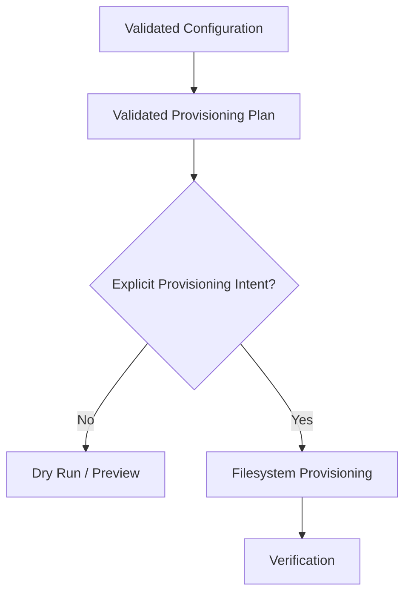
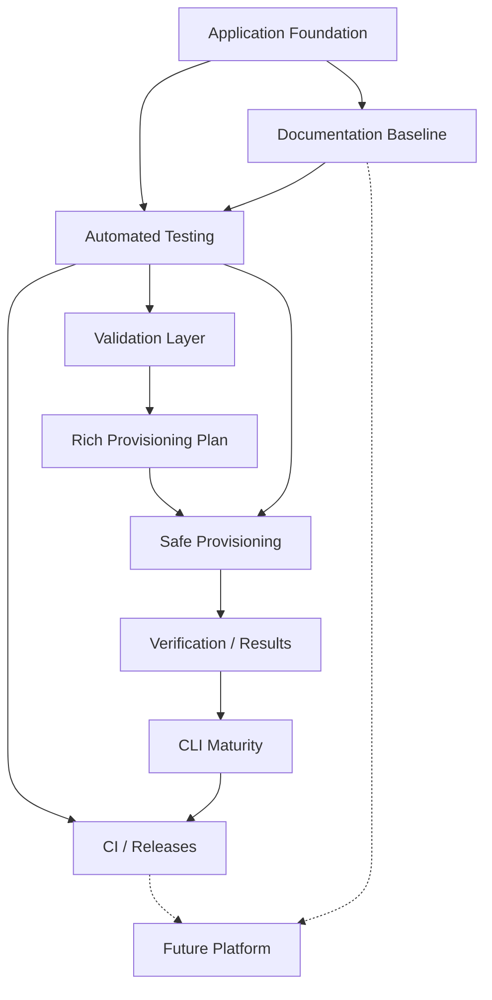

# CareerOS.Bootstrap — Roadmap

## Purpose

This roadmap defines the intended evolution of `CareerOS.Bootstrap` from its current configuration-driven, read-only planning foundation into a safe, validated, testable, and maintainable CareerOS workspace provisioning utility.

The roadmap also identifies longer-term extension opportunities without presenting them as committed implementation.

This document is directional rather than date-driven. Detailed completion checkpoints belong in `MILESTONES.md`.

---

## Status Model

Roadmap items use three primary states:

- **CURRENT** — implemented or actively used.
- **PLANNED** — intentionally identified for implementation but not yet fully implemented.
- **FUTURE** — longer-term extension outside the current implementation commitment.

A roadmap item must not be treated as implemented merely because it appears in this document.

---

# Roadmap Principles

Project evolution should continue to follow these principles:

1. Preserve a working build at meaningful checkpoints.
2. Keep configuration declarative and reusable.
3. Avoid person-specific branching in core services.
4. Separate planning from execution.
5. Validate before enabling write-capable behavior.
6. Preserve existing valid user content.
7. Design provisioning to be idempotent.
8. Verify filesystem outcomes after writes.
9. Introduce automated tests before filesystem behavior becomes more complex.
10. Keep documentation synchronized with implementation.
11. Use feature branches and reviewable commits for meaningful changes.
12. Treat future database and web capabilities as extensions rather than prerequisites for the bootstrap engine.

---

# Roadmap Overview

```mermaid
flowchart LR
    P0["Phase 0<br/>Foundation<br/>CURRENT"]
    P1["Phase 1<br/>Documentation Baseline<br/>CURRENT"]
    P2["Phase 2<br/>Automated Testing<br/>PLANNED"]
    P3["Phase 3<br/>Validation<br/>PLANNED"]
    P4["Phase 4<br/>Provisioning Plan<br/>PLANNED"]
    P5["Phase 5<br/>Filesystem Provisioning<br/>PLANNED"]
    P6["Phase 6<br/>Verification + Reporting<br/>PLANNED"]
    P7["Phase 7<br/>CLI + Operational Maturity<br/>PLANNED"]
    P8["Phase 8<br/>CI + Release<br/>PLANNED"]
    P9["Phase 9<br/>CareerOS Platform Extensions<br/>FUTURE"]

    P0 --> P1
    P1 --> P2
    P2 --> P3
    P3 --> P4
    P4 --> P5
    P5 --> P6
    P6 --> P7
    P7 --> P8
    P8 -.-> P9
```



The ordering represents the preferred dependency direction. Some low-risk work may overlap when it does not compromise safety or clarity.

---

# Phase 0 — Application Foundation

**Status:** CURRENT

## Objective

Establish a configuration-driven .NET application capable of loading multiple profiles and reusable templates and producing a read-only preview of intended CareerOS directory structures.

## Current Foundation

The project currently includes:

- .NET 8 console application.
- Explicit application entry point.
- Repository-root discovery.
- Repository-level JSON configuration.
- Strongly typed configuration models.
- Multiple profile support.
- Reusable templates.
- Recursive directory-node structures.
- Template resolution.
- Recursive directory planning.
- Read-only dry-run output.
- Top-level exception handling.
- Git repository and `main` branch.
- Feature/documentation branch workflow.

## Current Core Components

```text
Program.Main
PathService
JsonConfigurationService
TemplateResolverService
DirectoryPlanService

BootstrapConfiguration
ProfileConfiguration
TemplateConfiguration
DirectoryNode
```

## Foundation Outcome

The application can understand configured CareerOS structure without modifying a user's CareerOS workspace.

This is the safety baseline upon which later provisioning behavior will be built.

---

# Phase 1 — Documentation and Design Baseline

**Status:** CURRENT

## Objective

Create a version-controlled technical and requirements baseline before expanding the application's write-capable behavior.

## Documentation Areas

```text
Documentation/
├── Architecture/
├── Development/
├── Diagrams/
├── References/
├── Requirements/
└── Roadmap/
```

## Established Documentation

Architecture:

- `ARCHITECTURE.md`
- `CURRENT_STATE.md`
- `FUTURE_STATE.md`
- `COMPONENTS.md`
- `DATA_FLOW.md`

Development:

- `DEVELOPMENT_GUIDE.md`
- `CODING_STANDARDS.md`
- `TESTING_STRATEGY.md`

Diagrams:

- `SYSTEM_CONTEXT.md`
- `COMPONENT_DIAGRAM.md`
- `BOOTSTRAP_PROCESS_FLOW.md`
- `DATA_FLOW_DIAGRAM.md`
- `FUTURE_STATE_DIAGRAM.md`

Requirements:

- `USER_STORIES.md`
- `FUNCTIONAL_REQUIREMENTS.md`
- `NON_FUNCTIONAL_REQUIREMENTS.md`
- `TRACEABILITY.md`

References:

- `GLOSSARY.md`
- `CONFIGURATION_REFERENCE.md`
- `DOCUMENTATION_INDEX.md`

Repository safeguards include `.editorconfig` to help maintain consistent Markdown and source-file formatting.

## Remaining Phase 1 Work

- Complete roadmap documentation.
- Perform a documentation checkpoint.
- Review repository navigation and cross-links.
- Merge the documentation baseline when review is complete.

## Exit Direction

Once the documentation baseline is stable, implementation should move toward automated testing before adding meaningful filesystem write behavior.

---

# Phase 2 — Automated Testing Foundation

**Status:** PLANNED

## Objective

Establish automated regression protection around current behavior before significantly expanding application responsibilities.

## Planned Work

Create a dedicated test project.

Conceptually:

```text
CareerOS.Bootstrap.Tests/
├── Services/
├── Models/
├── Fixtures/
└── Integration/
```

## Initial Unit-Test Targets

### `PathService`

Validate:

- Repository-root discovery.
- Configuration-directory discovery.
- Failure behavior when the expected repository structure cannot be found.

### `JsonConfigurationService`

Validate:

- Valid JSON loading.
- Missing files.
- Invalid JSON.
- Deserialization failures.
- Supported JSON options.

### `TemplateResolverService`

Validate:

- Successful template resolution.
- Case-insensitive matching.
- Missing template behavior.
- Invalid input behavior.

### `DirectoryPlanService`

Validate:

- Top-level directory planning.
- Nested directory planning.
- Deep recursive structures.
- Empty collections.
- Invalid directory-node names.
- Path construction.

## Integration-Test Direction

Introduce isolated temporary filesystem fixtures for behavior that crosses service boundaries.

No test should depend on or modify a real CareerOS workspace.

## Expected Outcome

Current planning behavior becomes protected by repeatable automated tests, reducing regression risk before provisioning is introduced.

---

# Phase 3 — Configuration and Request Validation

**Status:** PLANNED

## Objective

Centralize validation so invalid configuration or unsafe execution requests are rejected before write-capable behavior becomes possible.

## Planned Validation Layer

Potential components:

```text
ConfigurationValidationService
ValidationResult
ValidationError
ValidationWarning
```

Final names remain subject to implementation design.

## Planned Configuration Checks

Potential validation includes:

- Required profile fields.
- Required template fields.
- Duplicate profile names.
- Duplicate profile destination directories.
- Duplicate template names.
- Missing template references.
- Empty directory-node names.
- Invalid filesystem characters.
- Reserved filesystem names.
- Duplicate sibling directory names.
- Invalid destination roots.
- Unsupported configuration versions.

## Planned Execution Checks

Before provisioning:

- Requested profile exists.
- Assigned template resolves.
- Destination root is valid.
- Resulting paths remain under the approved root.
- Configuration is internally consistent.
- Provisioning was explicitly requested.

## Schema Evolution

Consider introducing explicit configuration schema versioning.

Conceptually:

```json
{
  "schemaVersion": 1
}
```

## Expected Outcome

Invalid or ambiguous configuration fails before the application crosses the filesystem-write safety boundary.

---

# Phase 4 — Rich Provisioning Plan

**Status:** PLANNED

## Objective

Evolve the current path-only directory plan into a structured representation of desired actions without immediately performing those actions.

## Planned Model

Conceptually:

```text
ProvisioningPlan
└── Actions[]
    ├── TargetPath
    ├── ActionType
    ├── CurrentState
    ├── DesiredState
    └── Reason
```

Exact types and names will be determined during implementation.

## Existing-State Inspection

Introduce controlled inspection of the target filesystem.

The application should be able to distinguish conditions such as:

```text
Missing directory
Existing expected directory
Conflicting filesystem object
Invalid target
Unsafe target
```

## Action Classification

Potential action categories:

```text
CREATE
PRESERVE
SKIP
CONFLICT
REJECT
```

Exact terminology may evolve.

## Dry-Run Evolution

Dry-run output should eventually render the structured provisioning plan rather than only listing intended directory paths.

Example conceptual output:

```text
CREATE    D:\CareerOS\Example\Resume
PRESERVE  D:\CareerOS\Example\Resume\Master
CREATE    D:\CareerOS\Example\Resume\Archived
```

## Expected Outcome

The application understands both desired state and observed state before any provisioning action occurs.

---

# Phase 5 — Safe Filesystem Provisioning

**Status:** PLANNED

## Objective

Enable controlled creation of missing CareerOS directories while preserving existing valid user content.

## Planned Provisioning Boundary



## Safety Requirements

Provisioning should:

- Create missing required directories.
- Preserve existing expected directories.
- Avoid deleting existing content.
- Reject unsafe target paths.
- Detect conflicting filesystem objects.
- Remain within the approved destination root.
- Avoid implicit destructive synchronization.
- Produce actionable failures.

## Idempotency

Repeated provisioning against an already-correct workspace should not create duplicate structures or produce unnecessary changes.

Conceptually:

```text
Run 1
  |
  v
Desired State Achieved
  |
  v
Run 2
  |
  v
No Unnecessary Changes
```

## Destructive Operations

Deletion, relocation, or replacement of existing user content is not part of the normal planned provisioning model.

Any future destructive operation would require:

- Separate requirements.
- Explicit user intent.
- Additional safeguards.
- Dedicated tests.
- Clear documentation.

## Expected Outcome

`CareerOS.Bootstrap` crosses from planner to provisioner without abandoning its safety-first architecture.

---

# Phase 6 — Verification, Results, and Reporting

**Status:** PLANNED

## Objective

Make provisioning outcomes explicit, verifiable, and diagnosable.

## Verification

After write operations, verify that expected filesystem state exists.

Potential checks include:

- Directory exists.
- Expected type is correct.
- Target remains within approved root.
- Action outcome matches the provisioning plan.

## Structured Results

Potential result model:

```text
ExecutionResult
├── Success
├── Profile
├── Destination
├── PlannedActions[]
├── CompletedActions[]
├── PreservedActions[]
├── Warnings[]
├── Errors[]
└── VerificationResults[]
```

Exact structure is not finalized.

## Logging

Introduce structured operational logging appropriate to the application's complexity.

Potential concerns:

- Execution start.
- Configuration source.
- Selected profile.
- Execution mode.
- Validation outcome.
- Planned actions.
- Applied actions.
- Warnings.
- Failures.
- Verification result.
- Completion summary.

Sensitive information should not be written unnecessarily.

## Exit Codes

Define consistent process exit behavior suitable for scripting and future CI usage.

Potential categories:

```text
Success
Validation Failure
Configuration Failure
Provisioning Failure
Verification Failure
Unexpected Failure
```

## Expected Outcome

Application success is determined by verified outcomes rather than merely by the absence of an exception.

---

# Phase 7 — CLI and Operational Maturity

**Status:** PLANNED

## Objective

Provide an explicit, maintainable command-line interface suitable for normal use and automation.

## Potential CLI Capabilities

Conceptually:

```text
--profile
--dry-run
--provision
--destination
--config
--verbose
--help
--version
```

Final command syntax is not defined.

## Profile Selection

Support intentional selection of:

- One profile.
- Multiple profiles.
- Potentially all configured profiles.

Behavior should be explicit and documented.

## Destination Override

Allow controlled destination-root selection without hard-coding developer-specific paths.

## Configuration Override

Potentially support alternate configuration locations for testing or controlled deployment scenarios.

## User Experience

Improve:

- Help output.
- Validation messages.
- Action summaries.
- Error messages.
- Exit behavior.
- Preview readability.

## Expected Outcome

The bootstrap engine becomes usable as a predictable command-line utility rather than only as a development-stage console application.

---

# Phase 8 — Continuous Integration and Release Maturity

**Status:** PLANNED

## Objective

Automate repository quality gates and establish repeatable release practices.

## Planned CI Checks

For pull requests and integration:

```text
Restore
Build
Unit Tests
Integration Tests
Formatting / Static Checks
Documentation Checks
```

The exact workflow platform and rules should be documented when implemented.

## Branch Protection Direction

Potential repository safeguards:

- Pull requests before `main` changes.
- Required successful builds.
- Required automated tests.
- Review requirements where appropriate.

## Release Direction

Potential release flow:

```text
main
  |
  v
Version
  |
  v
Build
  |
  v
Test
  |
  v
Package
  |
  v
GitHub Release
```

## Packaging Options

Potential .NET distribution approaches include:

- Framework-dependent executable.
- Self-contained executable.
- Platform-specific package.

The final distribution model should reflect actual user needs.

## Versioning

Adopt a documented versioning strategy before formal releases.

## Expected Outcome

The project becomes reproducibly buildable, testable, and distributable from a clean repository state.

---

# Phase 9 — CareerOS Platform Extensions

**Status:** FUTURE

## Objective

Explore capabilities that extend beyond the bootstrap utility while preserving the bootstrap engine as a focused component.

These items are opportunities rather than committed implementation.

---

## Structured SQL Persistence

A future SQL Server database could store structured project metadata such as:

```text
Projects
Profiles
Templates
Requirements
User Stories
Architecture Decisions
Components
Tests
Releases
Execution History
Traceability Relationships
```

Potential benefits:

- Search.
- Reporting.
- Cross-document relationships.
- Requirement queries.
- Test coverage reporting.
- Release history.
- Website data access.

Git-versioned Markdown should remain an important human-readable source unless a future architectural decision explicitly changes that model.

---

## SQL Server Management

SQL Server Management Studio may be used to administer a future SQL Server implementation.

SSMS is a management environment, not the application datastore itself.

---

## API Layer

A future API could expose structured CareerOS information to other applications.

Potential consumers:

- Web portal.
- Reporting tools.
- Administrative utilities.
- Search interfaces.
- Future CareerOS modules.

The API should remain decoupled from the core bootstrap planning and provisioning responsibilities.

---

## CareerOS Web Portal

A future website could provide:

- Documentation navigation.
- Requirements search.
- Traceability views.
- Mermaid diagram access.
- Roadmap status.
- Test coverage status.
- Release history.
- Profile or template reference information.
- Project dashboards.

This capability should be designed as a consumer of structured project information rather than embedded directly into bootstrap filesystem logic.

---

## Additional Integrations

Possible future integrations may include:

- Git/GitHub workspace automation.
- Document indexing.
- Search services.
- Reporting systems.
- Additional CareerOS modules.

Each integration should be evaluated independently for security, coupling, maintenance cost, and actual user value.

---

# Cross-Cutting Workstreams

Some concerns span multiple roadmap phases.

## Security

Security work should evolve alongside capability.

Particular attention is required before introducing:

- Arbitrary filesystem paths.
- Remote services.
- Credentials.
- Databases.
- APIs.
- Web interfaces.
- Authentication or authorization.
- Automated repository modification.

---

## Documentation

Every phase should update the documentation suite when behavior changes.

Relevant documents may include:

```text
CURRENT_STATE.md
FUTURE_STATE.md
ARCHITECTURE.md
COMPONENTS.md
DATA_FLOW.md
USER_STORIES.md
FUNCTIONAL_REQUIREMENTS.md
NON_FUNCTIONAL_REQUIREMENTS.md
TRACEABILITY.md
DEVELOPMENT_GUIDE.md
CODING_STANDARDS.md
TESTING_STRATEGY.md
CONFIGURATION_REFERENCE.md
DOCUMENTATION_INDEX.md
ROADMAP.md
MILESTONES.md
```

Diagrams should also be updated when architecture or workflow changes materially.

---

## Testing

Testing should progress from:

```text
Build Validation
      |
      v
Unit Tests
      |
      v
Integration Tests
      |
      v
Filesystem Safety Tests
      |
      v
Regression Suite
      |
      v
Automated CI
```

Testing should precede or accompany increased filesystem responsibility.

---

## Traceability

As implementation progresses:

```text
User Story
   |
   v
Requirement
   |
   v
Architecture
   |
   v
Implementation
   |
   v
Test
   |
   v
Verified Outcome
```

Traceability should become more concrete as test identifiers and architectural decisions are introduced.

---

# Architectural Decision Records

**Status:** PLANNED

Introduce ADRs when decisions become significant enough to warrant a durable record.

Potential ADR topics include:

```text
ADR-001  Provisioning safety model
ADR-002  CLI parsing approach
ADR-003  Validation architecture
ADR-004  Logging approach
ADR-005  Configuration schema versioning
ADR-006  Test framework and filesystem fixture strategy
ADR-007  Release packaging strategy
ADR-008  Structured persistence architecture
```

These identifiers and titles are illustrative until ADRs are actually created.

---

# Configuration Evolution

Configuration should evolve cautiously.

Potential progression:

```text
CURRENT
Profiles + Templates
      |
      v
PLANNED
Comprehensive Validation
      |
      v
PLANNED
Schema Versioning
      |
      v
PLANNED
Execution / Destination Options
      |
      v
FUTURE
Migration / Compatibility Tooling
```

Backward compatibility expectations should be explicitly documented once configuration is distributed beyond development use.

---

# Roadmap Dependency View



---

# What Is Explicitly Not a Near-Term Goal

The following should not distract from the bootstrap application's core progression:

- Building a web application before provisioning is mature.
- Building a database before there is a concrete persistence requirement.
- Adding destructive synchronization.
- Supporting arbitrary plugin systems prematurely.
- Introducing distributed architecture without a demonstrated need.
- Replacing readable repository documentation solely for technology novelty.
- Hard-coding individual users into application services.
- Expanding scope faster than testing and documentation can support.

---

# Roadmap Completion Model

Each roadmap phase should be considered complete only when applicable criteria are satisfied:

```text
[ ] Implementation exists.
[ ] Build succeeds.
[ ] Automated tests exist where required.
[ ] Safety behavior is verified.
[ ] Documentation reflects actual behavior.
[ ] Diagrams are updated when needed.
[ ] Requirements and traceability are updated.
[ ] Changes are committed coherently.
[ ] Changes are pushed and reviewable.
[ ] Git working tree is clean at the checkpoint.
```

A roadmap label should be updated from `PLANNED` to `CURRENT` only after implementation evidence supports the change.

---

# Roadmap Summary

The intended project evolution is:

```text
Configuration-Driven Planning
          |
          v
Documentation + Requirements Baseline
          |
          v
Automated Testing
          |
          v
Comprehensive Validation
          |
          v
Rich Provisioning Planning
          |
          v
Safe Filesystem Provisioning
          |
          v
Verification + Reporting
          |
          v
CLI Maturity
          |
          v
CI + Releases
          |
          v
Optional CareerOS Platform Extensions
```

The central objective is not simply to automate directory creation.

The objective is to build a bootstrap utility whose behavior remains understandable, testable, predictable, and safe as automation increases.

> **Understand, validate, plan, execute deliberately, and verify the result.**
