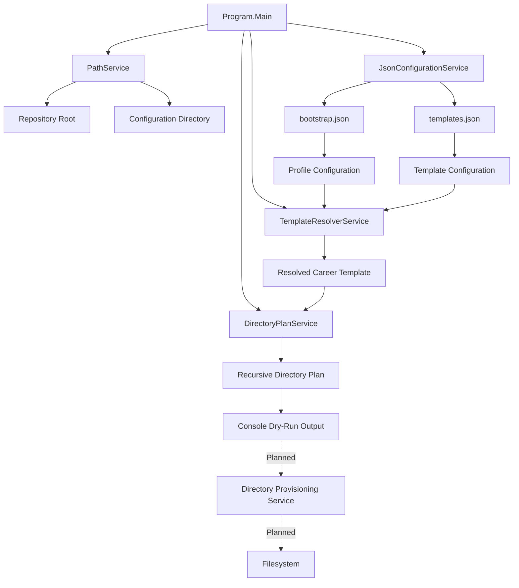

# CareerOS.Bootstrap

> A configuration-driven .NET bootstrap utility for provisioning and maintaining standardized, scalable CareerOS environments.

## Project Status

**Current Phase:** Foundation / Dry-Run Planning
**Runtime:** .NET 8
**Language:** C#
**Configuration:** JSON
**Development Status:** Active

CareerOS.Bootstrap is currently capable of loading multiple CareerOS profiles, resolving reusable directory templates, recursively traversing nested directory structures, and generating a dry-run provisioning plan without modifying the filesystem.

> **Safety Status:** Filesystem provisioning is not yet enabled. The current implementation is read-only with respect to CareerOS directory creation.

---

## Overview

CareerOS.Bootstrap was created to solve a practical problem: CareerOS environments contain numerous directories, documents, development resources, career materials, and supporting assets that need to follow a predictable structure.

Manually rebuilding that structure is:

- Time-consuming
- Repetitive
- Prone to inconsistency
- Difficult to scale across multiple users
- Difficult to reproduce after migration, drive replacement, or system recovery

CareerOS.Bootstrap moves that structure into configuration.

Instead of manually recreating directories, a CareerOS profile can reference a reusable template:

```text
Profile
   |
   v
Template
   |
   v
Directory Tree
   |
   v
Provisioning Plan
```

The long-term goal is to make CareerOS environments **repeatable, portable, auditable, safe, and scalable**.

---

## Goals

CareerOS.Bootstrap is designed around the following goals:

1. **Configuration over hard-coding**
   Profiles and directory structures should be defined outside application source code.

2. **Multi-profile support**
   A single installation should support multiple users and different CareerOS structures.

3. **Reusable templates**
   Career structures should be reusable rather than duplicated for every user.

4. **Safe execution**
   The application should validate and preview changes before modifying the filesystem.

5. **Idempotent provisioning**
   Re-running the bootstrapper should preserve valid existing structures rather than damage or unnecessarily recreate them.

6. **Portability**
   Machine-specific usernames, drive letters, and paths should not be embedded in application logic.

7. **Extensibility**
   Future profiles, templates, commands, validation rules, and provisioning capabilities should be addable without redesigning the application.

8. **Traceability**
   Requirements, architecture, implementation, tests, and major decisions should be documented and traceable.

9. **Maintainability**
   A developer unfamiliar with the project should be able to understand its purpose, current state, architecture, and planned direction from the repository documentation.

---

## Current Capabilities

The current implementation supports:

- Repository-root discovery
- Configuration-directory discovery
- JSON configuration loading
- Multiple CareerOS profiles
- Reusable profile templates
- Case-insensitive template resolution
- Recursive nested directory definitions
- Dry-run directory planning
- Profile-specific directory plans
- Explicit application entry point through `Program.Main()`
- Meaningful process exit codes
- Separation between planning and future filesystem modification

The current configuration contains two profile types used to validate the architecture:

- Career Professional
- Healthcare Professional

Both profiles currently resolve successfully through their assigned templates and produce recursive provisioning plans.

---

## Current Architecture

The application currently follows this high-level flow:



### Architectural Principle

Directory planning and filesystem modification are intentionally separate concerns.

`DirectoryPlanService` determines **what should exist**.

A future provisioning service will determine **what must actually be created**.

This separation allows the application to inspect and validate intended changes before receiving permission to modify the filesystem.

---

## Configuration Model

CareerOS.Bootstrap currently uses two primary configuration files.

### `bootstrap.json`

Defines CareerOS profiles and identifies the template assigned to each profile.

Conceptually:

```text
Profile
├── Name
├── Directory
└── Template
```

### `templates.json`

Defines reusable directory structures.

Conceptually:

```text
Template
└── Directories
    ├── Directory
    │   └── Children
    │       └── Children...
    └── Directory
```

Nested directory structures are represented recursively through `DirectoryNode.Children`.

This allows a template to represent structures such as:

```text
Resume
├── Master
├── RC
└── Archived
```

without placing those directory names directly into application logic.

---

## Project Structure

```text
CareerOS.Bootstrap/
│
├── .github/
│   └── copilot-instructions.md
│
├── CareerOS.Bootstrap/
│   ├── Models/
│   │   ├── BootstrapConfiguration.cs
│   │   ├── DirectoryNode.cs
│   │   ├── ProfileConfiguration.cs
│   │   └── TemplateConfiguration.cs
│   │
│   ├── Services/
│   │   ├── DirectoryPlanService.cs
│   │   ├── JsonConfigurationService.cs
│   │   ├── PathService.cs
│   │   └── TemplateResolverService.cs
│   │
│   ├── CareerOS.Bootstrap.csproj
│   └── Program.cs
│
├── Configuration/
│   ├── bootstrap.json
│   └── templates.json
│
├── CHANGELOG.md
├── CareerOS.Bootstrap.sln
├── LICENSE
└── README.md
```

Additional documentation and testing projects are planned as the architecture matures.

---

## Components

### `Program`

Provides the explicit application entry point and currently coordinates the application workflow.

Responsibilities include:

- Service initialization
- Path discovery
- Configuration loading
- Template resolution
- Directory-plan generation
- Console output
- Top-level exception handling
- Process exit status

Business logic should continue moving into focused services rather than accumulating inside `Program`.

### `PathService`

Responsible for locating important repository paths without hard-coding a particular development machine or drive.

### `JsonConfigurationService`

Loads and deserializes CareerOS JSON configuration.

### `TemplateResolverService`

Matches the template requested by a profile to its configured `CareerTemplate`.

Template matching is case-insensitive.

### `DirectoryPlanService`

Recursively traverses the configured directory tree and generates the paths that would be required for a profile.

This service is intentionally read-only and does **not** create directories.

---

## Safety Philosophy

Filesystem operations require additional care because a bootstrap utility may eventually operate against directories containing important user data.

CareerOS.Bootstrap therefore follows a safety-first sequence:

```text
Load
  |
  v
Validate
  |
  v
Resolve
  |
  v
Plan
  |
  v
Preview
  |
  v
Provision
```

The final provisioning stage is **planned but not currently implemented**.

Future filesystem functionality should follow these rules:

- Never delete user data automatically.
- Never overwrite existing user content without explicit requirements and safeguards.
- Validate configuration before filesystem modification.
- Support dry-run execution.
- Preserve existing valid directories.
- Make repeated execution safe.
- Report proposed and completed actions clearly.
- Fail with actionable error messages.
- Prefer recoverable behavior over destructive behavior.

---

## Build

From the repository root:

```powershell
dotnet build
```

A successful build should complete without compilation errors.

---

## Run

Because the executable project is located beneath the solution directory, run the application from the repository root with:

```powershell
dotnet run --project .\CareerOS.Bootstrap\CareerOS.Bootstrap.csproj
```

The current application displays:

- Repository location
- Configuration location
- Dry-run status
- Profile name
- Resolved template
- Planned directory paths
- Number of planned directories

No CareerOS directories are created by the current implementation.

---

## Development Workflow

Changes should normally follow this lifecycle:

```text
Requirement / Goal
        |
        v
Design
        |
        v
Implementation
        |
        v
Build
        |
        v
Test
        |
        v
Review
        |
        v
Commit
        |
        v
Push
```

Meaningful, validated milestones should be committed rather than treating every small edit as a separate release point.

The project uses Git with `main` as the primary branch.

---

## Documentation Strategy

CareerOS.Bootstrap documentation is intended to describe more than source code.

The documentation system will capture:

- Project goals
- Current-state architecture
- Future-state architecture
- Component responsibilities
- Application flow
- Configuration flow
- Provisioning flow
- Architecture decisions
- Functional requirements
- Non-functional requirements
- User stories
- Acceptance criteria
- Requirements traceability
- Development standards
- Testing strategy
- Configuration reference
- CLI reference
- Milestones
- Roadmap

Diagrams will primarily use text-based Mermaid definitions where appropriate so they can be reviewed, versioned, and maintained alongside source code.

Planned documentation structure:

```text
Documentation/
│
├── Architecture/
│   ├── Decisions/
│   ├── ARCHITECTURE.md
│   ├── COMPONENTS.md
│   ├── CURRENT_STATE.md
│   ├── DATA_FLOW.md
│   └── FUTURE_STATE.md
│
├── Requirements/
│   ├── FUNCTIONAL_REQUIREMENTS.md
│   ├── NON_FUNCTIONAL_REQUIREMENTS.md
│   ├── TRACEABILITY.md
│   └── USER_STORIES.md
│
├── Development/
│   ├── CODING_STANDARDS.md
│   ├── DEVELOPMENT_GUIDE.md
│   └── TESTING_STRATEGY.md
│
├── Diagrams/
│   ├── APPLICATION_FLOW.md
│   ├── CONFIGURATION_FLOW.md
│   ├── PROVISIONING_FLOW.md
│   └── SYSTEM_CONTEXT.md
│
├── Reference/
│   ├── CLI_REFERENCE.md
│   └── CONFIGURATION.md
│
└── Roadmap/
    ├── MILESTONES.md
    └── ROADMAP.md
```

---

## Requirements Traceability

A future requirements framework will connect business needs to implementation and testing.

Example:

```text
Business Need
      |
      v
User Story
      |
      v
Functional Requirement
      |
      v
Architecture / Component
      |
      v
Implementation
      |
      v
Automated Test
      |
      v
Acceptance Result
```

Requirements will receive stable identifiers such as:

```text
US-001   User Story
FR-001   Functional Requirement
NFR-001  Non-Functional Requirement
ADR-001  Architecture Decision Record
```

This will allow future implementation and testing to reference the requirement that caused a feature to exist.

---

## Testing Strategy

Automated testing is planned but has not yet been implemented.

A dedicated test project is expected to cover services such as:

```text
CareerOS.Bootstrap.Tests
├── DirectoryPlanServiceTests
├── JsonConfigurationServiceTests
├── PathServiceTests
└── TemplateResolverServiceTests
```

Initial testing priorities include:

- Valid template resolution
- Unknown-template handling
- Case-insensitive template resolution
- Recursive directory traversal
- Invalid configuration handling
- Missing configuration handling
- Dry-run filesystem safety
- Idempotent provisioning behavior
- Existing-directory handling

Integration testing will be added where behavior crosses service or filesystem boundaries.

---

## Roadmap

### Implemented

- [x] .NET 8 console application
- [x] Explicit `Main()` entry point
- [x] Git repository
- [x] GitHub repository
- [x] JSON configuration
- [x] Multi-profile configuration
- [x] Reusable templates
- [x] Repository discovery
- [x] Configuration loading
- [x] Template resolution
- [x] Recursive directory model
- [x] Dry-run directory planning
- [x] Repository-specific Copilot instructions

### Documentation Phase

- [ ] Documentation hierarchy
- [ ] Current-state architecture
- [ ] Future-state architecture
- [ ] Component reference
- [ ] System/process diagrams
- [ ] Architecture Decision Records
- [ ] User stories
- [ ] Functional requirements
- [ ] Non-functional requirements
- [ ] Requirements traceability
- [ ] Development guide
- [ ] Coding standards
- [ ] Testing strategy
- [ ] Configuration reference

### Testing Phase

- [ ] Unit-test project
- [ ] Template resolver tests
- [ ] Directory planner tests
- [ ] Configuration service tests
- [ ] Path service tests
- [ ] Negative/error-path tests
- [ ] Integration-test strategy

### Provisioning Phase

- [ ] Configuration validation service
- [ ] Configurable CareerOS destination root
- [ ] Filesystem provisioning service
- [ ] Existing-directory detection
- [ ] Idempotent execution
- [ ] Provisioning summary
- [ ] Filesystem integration tests

### Future

- [ ] Command-line interface
- [ ] `--dry-run` option
- [ ] Profile selection
- [ ] Template selection/override
- [ ] Structured logging
- [ ] Error logging
- [ ] Additional templates
- [ ] Configuration schema validation
- [ ] GitHub Actions / CI
- [ ] Automated build and test validation
- [ ] Release packaging
- [ ] Versioned releases
- [ ] Optional Git initialization
- [ ] Backup/rollback capabilities where appropriate

The roadmap is expected to evolve as requirements become clearer.

---

## Current vs. Future State

Features documented as **Implemented** represent functionality currently present in the codebase.

Features documented as **Planned**, **Future**, or unchecked roadmap items represent intended direction only.

Documentation should not imply that planned functionality is already available.

This distinction is intentionally maintained throughout the project.

---

## Contributing and Development Standards

CareerOS.Bootstrap is currently under active development.

Repository-specific development guidance is maintained in:

```text
.github/copilot-instructions.md
```

Core expectations include:

- Understand generated code before accepting it.
- Preserve separation of concerns.
- Avoid machine-specific hard-coded paths.
- Keep profiles and templates configuration-driven.
- Keep planning separate from filesystem modification.
- Build and test changes before committing.
- Document significant architectural decisions.
- Prefer readable and maintainable implementations over unnecessary complexity.

---

## License

License information is maintained in the repository-root `LICENSE` file.

> **Note:** The license terms have not yet been finalized.

---

## Project Philosophy

CareerOS.Bootstrap is not intended to be merely a script that creates folders.

The project is intended to demonstrate and implement a complete, maintainable engineering lifecycle:

```text
Problem
   |
   v
Requirements
   |
   v
Architecture
   |
   v
Implementation
   |
   v
Validation
   |
   v
Testing
   |
   v
Documentation
   |
   v
Release
   |
   v
Continuous Improvement
```

The objective is a system that another developer or reviewer can understand not only by reading **what the code does**, but also by understanding **why it exists, why it was designed this way, what has been completed, how it is validated, and where it is going next**.
